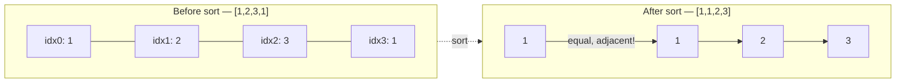

# 217. Contains Duplicate
`Easy` · **Pattern:** Sorting (alt: Hash Set)

> [!question] Problem
> Given an integer array `nums`, return `true` if any value appears **at least twice** in the array, and return `false` if every element is distinct.
>
> **Example 1:**
> ```
> Input: nums = [1,2,3,1]
> Output: true
> Explanation: The element 1 occurs at indices 0 and 3.
> ```
>
> **Example 2:**
> ```
> Input: nums = [1,2,3,4]
> Output: false
> Explanation: All elements are distinct.
> ```
>
> **Example 3:**
> ```
> Input: nums = [1,1,1,3,3,4,3,2,4,2]
> Output: true
> ```
>
> **Constraints:**
> - `1 <= nums.length <= 10^5`
> - `-10^9 <= nums[i] <= 10^9`

---

## 🧩 Pattern this follows

> [!tip] Sort, then scan for neighbors
> If duplicates exist, sorting forces them to sit **next to each other**. So instead of checking every pair (O(n²)), sort once (O(n log n)) and just check adjacent elements (O(n)) — total **O(n log n)**.
> This is the "sort to expose structure" pattern — useful anywhere you care about *equality* or *closeness* between elements, not their original order (also shows up in [[Valid Anagram (Leetcode #242)]] and interval-merging problems).

### 🖼️ Visualizing it

Sorting moves the duplicate value next to itself, so the adjacent-pair scan catches it immediately.



## 💻 My Solution (C++)

```cpp
class Solution {
public:
    bool containsDuplicate(vector<int>& nums) {
        sort(nums.begin(), nums.end());

        for (int i = 0; i < nums.size() - 1; i++) {
            if (nums[i] == nums[i + 1]) {
                return true;
            }
        }

        return false;
    }
};
```

## 🔍 Walkthrough

1. `sort(nums.begin(), nums.end())` — sort the array so equal elements become adjacent.
2. Loop `i` from `0` to `size()-2`, comparing `nums[i]` with its very next neighbor `nums[i+1]`.
3. Any duplicate pair, wherever it originally was in the array, is now guaranteed to be caught by *some* adjacent comparison — the moment two equal values land next to each other, return `true`.
4. If the loop finishes with no match, all elements are distinct → `false`.

## ⏱️ Complexity

| | Complexity | Why |
|---|---|---|
| **Time** | O(n log n) | Dominated by `sort` |
| **Space** | O(1) extra *(or O(n) / O(log n) depending on sort implementation)* | Sorting done in place on `nums` |

> [!bug] Watch out
> `nums.size()` returns an **unsigned** type (`size_t`). If `nums` is empty, `nums.size() - 1` underflows to a huge number — but the loop condition `i < nums.size() - 1` combined with `i` starting at 0 means an empty/1-element array just makes the loop not execute at all in practice here, so it's safe, but this underflow trap is worth remembering for other problems where you subtract from `.size()` directly.

## 🚀 Tricks & Similar Problems

> [!success] Faster alternative (trade space for time)
> A **hash set** solves this in **O(n) time, O(n) space**: insert each element, and if `insert` reports the element was already present, return `true` immediately.
> ```cpp
> unordered_set<int> seen;
> for (int n : nums) {
>     if (!seen.insert(n).second) return true;
> }
> return false;
> ```
> **Rule of thumb for interviews:** sorting trades *time* for *no extra space*; a hash set trades *space* for *better time*. Mention both — knowing the tradeoff is the senior signal here.
> **Similar pattern:** [[Valid Anagram (Leetcode #242)]] (frequency/sorting), [[Longest Consecutive Sequence (LeetCode #128)]] (hash set for O(n) existence checks).
