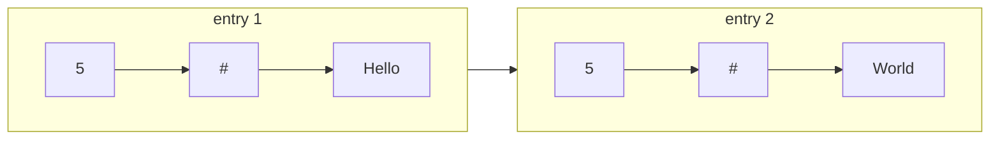

# 271. Encode and Decode Strings
`Medium` · **Pattern:** Length-prefix encoding (delimiter-safe serialization)

> [!question] Problem
> Design an algorithm to **encode** a list of strings into a single string. This encoded string is then sent over a network and **decoded** back to the original list of strings.
> Machine 1 (sender) encodes a list of strings into a single string. Machine 2 (receiver) decodes that single string back into the original list. Implement `encode` and `decode`.
>
> You are **not allowed** to use any serialization method such as `eval`, `JSON.stringify`, language-native serializers, etc. — you must design the encoding scheme yourself.
> Strings may contain **any ASCII characters**, including empty strings and characters like `,`, `#`, or any delimiter you might otherwise think to use.
>
> **Example:**
> ```
> Input: ["Hello","World"]
> encode(["Hello","World"]) → some single string
> decode(that string) → ["Hello","World"]
> ```
>
> **Constraints:**
> - `0 <= strs.length <= 200`
> - `0 <= strs[i].length <= 200`
> - `strs[i]` contains only UTF-8 characters.

---

## 🧩 Pattern this follows

> [!tip] Never split on a delimiter that could be *inside* the data
> The naive idea — join strings with a delimiter like `","` and split on decode — breaks the moment a string itself contains `","`. The fix: **prefix each string with its own length**, so decode always knows exactly how many characters to consume next, regardless of what those characters are. This "length-prefix" scheme is exactly how real network protocols work (HTTP chunked transfer encoding, Protobuf's length-delimited fields, TCP framing) — it's the general answer to "how do I serialize variable-length data safely."

### 🖼️ Visualizing it

`encode(["Hello","World"])` → `"5#Hello5#World"` — each entry is `len#str`, with no delimiter needed between entries since the length prefix tells `decode` exactly how far to read.



## 💻 Solution (C++)

```cpp
class Solution {
public:
    // Encodes a list of strings to a single string.
    string encode(vector<string>& strs) {
        string result;
        for (string& s : strs) {
            result += to_string(s.size()) + '#' + s;
        }
        return result;
    }

    // Decodes a single string to a list of strings.
    vector<string> decode(string s) {
        vector<string> result;
        int i = 0;

        while (i < s.size()) {
            int j = i;
            while (s[j] != '#') {
                j++;
            }

            int length = stoi(s.substr(i, j - i));
            string str = s.substr(j + 1, length);

            result.push_back(str);
            i = j + 1 + length;
        }

        return result;
    }
};
```

## 🔍 Walkthrough

**`encode`:**
1. For every string `s`, write `size()` (its length as digits), then a `'#'` separator, then the raw characters of `s` itself — e.g. `"Hello"` → `"5#Hello"`.
2. Concatenate all of these back to back with **no separator between entries** — the length prefixes make that unnecessary.

**`decode`:**
1. `i` marks the start of the current entry's length prefix.
2. Scan forward with `j` until hitting the `'#'` that ends the length prefix — everything from `i` to `j` is the length, in digit form.
3. `stoi(s.substr(i, j - i))` parses that into `length`.
4. The actual string data starts right after the `'#'`, at `j + 1`, and is exactly `length` characters long — `s.substr(j + 1, length)` extracts it *without needing to search for an end delimiter*, so it's completely safe even if the string itself contains digits, `'#'`, or anything else.
5. Push that string into `result`, then jump `i` past this whole entry (`j + 1 + length`) to start reading the next one.

## ⏱️ Complexity

| | Complexity | Why |
|---|---|---|
| **Time** | O(n) | `n` = total characters across all strings; encode/decode each touch every character once |
| **Space** | O(n) | The single encoded string, and the output list, both proportional to total input size |

## 🚀 Tricks & Similar Problems

> [!bug] Why a plain delimiter (like `","`) fails
> If you instead did `result += s + ","` and split on `","` in decode, then `strs = ["a,b", "c"]` would encode to `"a,b,c,"` — indistinguishable from `["a", "b", "c"]`. **Any** fixed delimiter can appear inside the data unless you either escape it everywhere (fiddly, slow) or sidestep the whole problem with a length prefix (this solution). Always reach for length-prefixing first when a problem says "strings can contain any characters."

> [!success] Why the `'#'` after the length is still safe
> You might ask — "what if the *length digits themselves* could be confused with data?" They can't: `stoi` only reads digit characters, and the scan `while (s[j] != '#')` stops exactly at the first `'#'` it sees, which is guaranteed to be the one *encode* placed right after the length — because at that point in decoding, no string data has been read yet, only the numeric prefix.
> **Similar pattern:** any variable-length serialization/framing problem — TCP message framing, chunked HTTP bodies, Protobuf/Thrift wire formats all use this exact length-prefix idea instead of delimiters.
