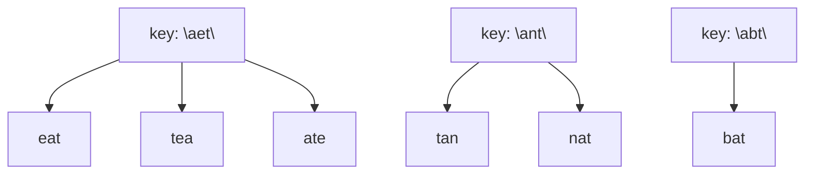

# 49. Group Anagrams
`Medium` · **Pattern:** Hash Map with a canonical key (sorted string)

> [!question] Problem
> Given an array of strings `strs`, group the anagrams together. You can return the answer in **any order**.
> An **Anagram** is a word or phrase formed by rearranging the letters of a different word or phrase, typically using all the original letters exactly once.
>
> **Example 1:**
> ```
> Input: strs = ["eat","tea","tan","ate","nat","bat"]
> Output: [["bat"],["nat","tan"],["ate","eat","tea"]]
> ```
> `"nat"`/`"tan"` are anagrams of each other; `"ate"`/`"eat"`/`"tea"` are anagrams of each other; `"bat"` has no anagram in the list.
>
> **Constraints:**
> - `1 <= strs.length <= 10^4`
> - `0 <= strs[i].length <= 100`
> - `strs[i]` consists of lowercase English letters.

---

## 🧩 Pattern this follows

> [!tip] Canonical key → bucket
> Two strings are anagrams **iff their sorted forms are identical** — sorting "eat" and "tea" both give `"aet"`. So instead of comparing every pair of strings (O(n²) comparisons), give each string a **canonical key** (its sorted version) and let a hash map do the bucketing: strings with the same key land in the same bucket automatically. This "compute a canonical form, group by it" idea reappears anywhere "same up to reordering/rotation" needs grouping.

### 🖼️ Visualizing it

Each string's sorted form becomes a map key; strings that hash to the same key land in the same bucket.



## 💻 My Solution (C++)

```cpp
class Solution {
public:
    vector<vector<string>> groupAnagrams(vector<string>& strs) {
        unordered_map<string, vector<string>> mp;

        for (int i = 0; i < strs.size(); i++) {
            string str = strs[i];
            sort(str.begin(), str.end());
            mp[str].push_back(strs[i]);
        }

        vector<vector<string>> result;
        for (auto& it : mp) {
            result.push_back(it.second);
        }

        return result;
    }
};
```

## 🔍 Walkthrough

1. For each original string `strs[i]`, make a **copy** `str` and sort *the copy* — `strs[i]` itself stays untouched so it can still be pushed into the result later.
2. Use the sorted copy as the map key: `mp[str].push_back(strs[i])` — every original string with the same sorted form lands in the same bucket, in its original (unsorted) form.
3. After processing everything, `mp` holds one bucket per unique anagram group. Walk the map and collect each bucket (`it.second`) into `result`.
4. Order of groups (and order of the map iteration itself) is unspecified — fine, since the problem allows returning groups in any order.

## ⏱️ Complexity

| | Complexity | Why |
|---|---|---|
| **Time** | O(n · k log k) | `n` strings, each of length up to `k`; sorting each string costs `O(k log k)` |
| **Space** | O(n · k) | Map stores every string (as a bucket entry) plus its sorted key |

## 🚀 Tricks & Similar Problems

> [!success] Faster key without sorting
> Since letters are lowercase-only, you can build the key from a **26-count frequency signature** instead of sorting (e.g. `"a1b0c0...z0"` or just the raw `int[26]` turned into a string/tuple key). That drops the per-string cost from `O(k log k)` to `O(k)`, improving overall time to **O(n·k)**. Same frequency-count idea as [[Valid Anagram (Leetcode #242)]] — just used as a *map key* here instead of a direct two-way comparison.
> **Similar pattern:** any "group by structural equivalence" problem — group shifted strings, group by digit-signature, etc.
