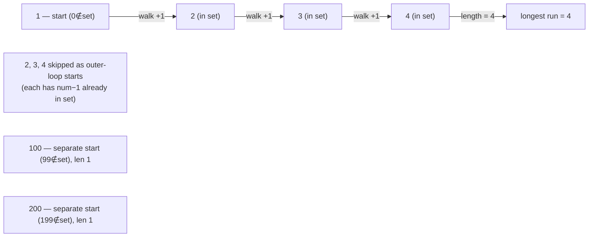

# 128. Longest Consecutive Sequence
`Medium` · **Pattern:** Hash Set — only expand from sequence *starts*

> [!question] Problem
> Given an unsorted array of integers `nums`, return the length of the longest consecutive elements sequence. You must write an algorithm that runs in **O(n) time**.
> A consecutive sequence is a run of elements where each is exactly 1 greater than the previous. Elements don't need to be consecutive **in the original array** — only their *values* need to form a consecutive run.
>
> **Example 1:**
> ```
> Input: nums = [100,4,200,1,3,2]
> Output: 4
> Explanation: The longest run is [1, 2, 3, 4]. Length = 4.
> ```
>
> **Example 2:**
> ```
> Input: nums = [0,3,7,2,5,8,4,6,0,1]
> Output: 9
> ```
>
> **Example 3:**
> ```
> Input: nums = [1,0,1,2]
> Output: 3
> ```

---

## 🧩 Pattern this follows

> [!tip] Only start counting from the beginning of a run
> Sorting first gives `O(n log n)`, but the O(n) trick is: put every number in a **hash set** for O(1) lookups, then for each number, ask **"is this the start of a sequence?"** — i.e., is `num - 1` **not** in the set? If it's not, walk forward (`num+1, num+2, ...`) counting how long the run is. If `num - 1` *is* in the set, skip it entirely — it'll get counted when you reach the true start of that run. This guarantees **every number is only ever walked once across the whole algorithm**, not once per starting point, which is what keeps it O(n) overall.

### 🖼️ Visualizing it

`nums=[100,4,200,1,3,2]` as a hash set — only numbers with no `num-1` in the set are walked; everything else is skipped as an outer-loop start (it gets counted from its true start instead).



## 💻 My Solution (C++)

```cpp
class Solution {
public:
    int longestConsecutive(vector<int>& nums) {
        if (nums.size() == 0) {
            return 0;
        }
        if (nums.size() == 1) {
            return 1;
        }

        unordered_set<int> st(nums.begin(), nums.end());
        int ans = 1;
        for (int num : st) {
            if (st.find(num - 1) == st.end()) {
                int curr = num;
                int length = 1;
                curr++;
                while (st.find(curr) != st.end()) {
                    length++;
                    curr++;
                }

                ans = max(ans, length);
            }
        }

        return ans;
    }
};
```

## 🔍 Walkthrough

1. **Edge cases first:** empty array → `0`; single element → `1` (also handled correctly by the general loop, but returned early here).
2. **Dedupe + O(1) lookups:** `st` is a hash set built from `nums` — duplicates collapse automatically, and `find` is O(1) average.
3. **Iterate every distinct number** in the set. For each `num`, check `st.find(num - 1) == st.end()` — **"is there nothing one-less than me?"** If something one-less *does* exist, `num` can't be the start of its run, so **skip it** (it'll be reached and counted from its own true start instead).
4. **Only for true starts:** walk forward — `curr = num`, then repeatedly check `curr+1, curr+2, ...` are in the set, incrementing `length` each time a consecutive value is found.
5. Track `ans = max(ans, length)` across all starts; that's the longest run found.

## ⏱️ Complexity

| | Complexity | Why |
|---|---|---|
| **Time** | O(n) | Building the set is O(n); the outer loop visits every number once, but the inner `while` only ever runs for numbers that are the *start* of a run — across the whole algorithm, every element is visited by the inner loop **at most once total**, not once per outer iteration |
| **Space** | O(n) | The hash set holding all distinct values |

> [!bug] The "only start from a run's beginning" check is the whole trick
> Skip that `st.find(num - 1) == st.end()` guard and the algorithm still gives the *right answer*, but degrades to **O(n²)** worst case — e.g. for `[1,2,3,...,n]`, every single number would re-walk the entire remaining run. That one `if` is what turns a quadratic brute force into a linear one — call this out explicitly in an interview, it's the whole point of the problem.

## 🚀 Tricks & Similar Problems

> [!success] "Hash set + only process true starts" generalizes
> This pattern — dump everything into a set for O(1) membership, then only do expensive work from *canonical starting points* — reuses well anywhere you're finding runs/islands/connected components over a flat collection instead of a grid.
> **Similar pattern:** [[Contains Duplicate (LeetCode #217)]] (hash set for O(1) existence), Number of Islands (same "don't redo work you'll reach from elsewhere" discipline, applied to grid BFS/DFS instead).
