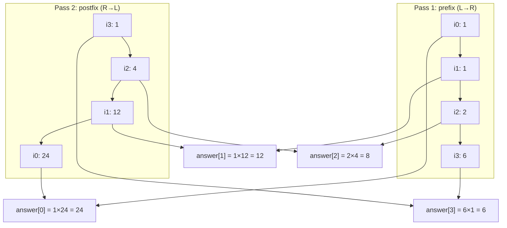

# 238. Product of Array Except Self
`Medium` · **Pattern:** Prefix × Postfix product (no division)

> [!question] Problem
> Given an integer array `nums`, return an array `answer` such that `answer[i]` is equal to the product of **all** the elements of `nums` except `nums[i]`.
> The product of any prefix or suffix of `nums` is guaranteed to fit in a **32-bit integer**. You must write an algorithm that runs in **O(n) time** and **without using the division operation**.
>
> **Example 1:**
> ```
> Input: nums = [1,2,3,4]
> Output: [24,12,8,6]
> ```
>
> **Example 2:**
> ```
> Input: nums = [-1,1,0,-3,3]
> Output: [0,0,9,0,0]
> ```
>
> **Constraints:**
> - `2 <= nums.length <= 10^5`
> - `-30 <= nums[i] <= 30`
> - The input is generated such that `answer[i]` fits in a 32-bit integer.
>
> **Follow-up:** can you do it in `O(1)` *extra* space (output array doesn't count)?

---

## 🧩 Pattern this follows

> [!tip] "Everything except me" = prefix × postfix
> The obvious approach — divide the total product by `nums[i]` — is banned (and breaks on zeros anyway). The trick: `answer[i]` = *(product of everything to i's left)* × *(product of everything to i's right)*. Compute those two halves separately in two linear passes — a **left-to-right prefix pass** and a **right-to-left postfix pass** — and combine them. This "prefix/suffix from both directions" shape shows up constantly (trapping rain water, max product subarray, etc.).

### 🖼️ Visualizing it

`nums=[1,2,3,4]` — the prefix pass (left→right) and postfix pass (right→left) each fill in one half of every answer, then get multiplied together.



## 💻 My Solution (C++)

```cpp
class Solution {
public:
    vector<int> productExceptSelf(vector<int>& nums) {
        vector<int> productList(nums.size());

        int prefix = 1;
        for (int i = 0; i < nums.size(); i++) {
            productList[i] = prefix;
            prefix = prefix * nums[i];
        }

        int postfix = 1;
        for (int i = nums.size() - 1; i >= 0; i--) {
            productList[i] = productList[i] * postfix;
            postfix = postfix * nums[i];
        }

        return productList;
    }
};
```

## 🔍 Walkthrough

**Pass 1 — prefix (left → right):**
- `prefix` tracks the running product of everything **before** index `i`.
- `productList[i] = prefix` stores that — *before* multiplying `nums[i]` into `prefix`, so `nums[i]` itself is correctly excluded.
- Then `prefix *= nums[i]` updates the running product for the *next* index.

**Pass 2 — postfix (right → left):**
- Same idea in reverse: `postfix` tracks the running product of everything **after** index `i`.
- `productList[i] *= postfix` multiplies in the "everything to the right" piece, on top of the prefix piece already stored there from pass 1 — now `productList[i]` = left-product × right-product = everything except `nums[i]`.
- Then `postfix *= nums[i]` updates for the next (leftward) index.

**Why this reuses the output array instead of two separate arrays:** `productList` is written once as pure prefix products in pass 1, then *multiplied in place* by postfix products in pass 2 — one array does double duty, which is also the key to the O(1)-extra-space follow-up (the output array isn't counted as "extra").

## ⏱️ Complexity

| | Complexity | Why |
|---|---|---|
| **Time** | O(n) | Exactly two linear passes over `nums` |
| **Space** | O(1) extra | Only `prefix`/`postfix` scalars beyond the required output array |

## 🚀 Tricks & Similar Problems

> [!success] The zero-handling is automatic
> Notice this solution needs **no special-casing for zeros** (unlike a division-based approach, which would divide by zero). If `nums` contains one zero, every `answer[i]` except the zero's own index becomes `0` naturally, because the running prefix or postfix product will include that zero for every other index. That's a strong point to call out — it shows *why* the prefix/postfix approach is strictly better than "compute total product, then divide."
> **Similar pattern:** any "value at i depends on everything except i" problem — solvable by splitting into an independent left-pass and right-pass.
