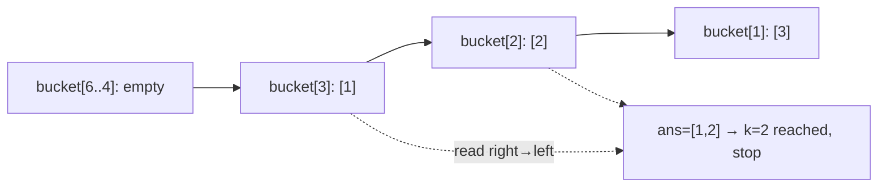

# 347. Top K Frequent Elements
`Medium` · **Pattern:** Bucket Sort by frequency

> [!question] Problem
> Given an integer array `nums` and an integer `k`, return the `k` most frequent elements within the array. The elements in your answer can be returned in **any order**.
>
> **Example 1:**
> ```
> Input: nums = [1,1,1,2,2,3], k = 2
> Output: [1,2]
> ```
>
> **Example 2:**
> ```
> Input: nums = [1], k = 1
> Output: [1]
> ```
>
> **Constraints:**
> - `1 <= nums.length <= 10^5`
> - `-10^4 <= nums[i] <= 10^4`
> - `k` is in the range `[1, number of unique elements]`
> - The answer is guaranteed to be unique.
>
> **Follow-up:** solve it in better than `O(n log n)` time (a plain sort-by-frequency is `O(n log n)`) — aim for `O(n)`.

---

## 🧩 Pattern this follows

> [!tip] Bucket sort — when values are bounded by a known range
> A frequency can never exceed the array's own length (`n`). That bounded range is the signal: instead of sorting frequencies (which needs `O(n log n)`), create **`n+1` buckets indexed by frequency** — `bucket[f]` holds every number that appears exactly `f` times. Fill the buckets in one pass, then walk them **from highest frequency down** and grab elements until you have `k`. Whenever a value you'd normally "sort" is capped by a known small range, bucket sort turns an `O(n log n)` problem into `O(n)`.

### 🖼️ Visualizing it

`nums=[1,1,1,2,2,3], k=2` → freq: `1→3, 2→2, 3→1`. Buckets are indexed by frequency; read from the highest index down until `k` values are collected.



## 💻 My Solution (C++)

```cpp
class Solution {
public:
    vector<int> topKFrequent(vector<int>& nums, int k) {
        unordered_map<int, int> mp;

        for (int i = 0; i < nums.size(); i++) {
            mp[nums[i]]++;
        }

        vector<vector<int>> bucket(nums.size() + 1);

        for (auto& it : mp) {
            bucket[it.second].push_back(it.first);
        }

        vector<int> ans;

        for (int i = bucket.size() - 1; i >= 0; i--) {
            for (int num : bucket[i]) {
                ans.push_back(num);
                if (ans.size() == k) {
                    return ans;
                }
            }
        }

        return ans;
    }
};
```

## 🔍 Walkthrough

1. **Count frequencies:** `mp[nums[i]]++` builds a value → count map in one pass.
2. **Build buckets:** `bucket` has `nums.size() + 1` slots (index `0` to `n`, since a value can appear at most `n` times). For each `(value, count)` pair in `mp`, push `value` into `bucket[count]`.
3. **Walk from the top:** starting at the highest possible frequency (`bucket.size() - 1`) down to `0`, collect every number found in each bucket into `ans`.
4. **Stop early:** the moment `ans` has `k` elements, return immediately — no need to keep scanning lower-frequency buckets.

## ⏱️ Complexity

| | Complexity | Why |
|---|---|---|
| **Time** | O(n) | One pass to count, one pass to bucket, one pass (bounded by `n` total elements across all buckets) to collect |
| **Space** | O(n) | Frequency map + buckets, each proportional to the number of distinct elements |

## 🚀 Tricks & Similar Problems

> [!success] Heap alternative — know the tradeoff
> A **min-heap of size `k`** also solves this in `O(n log k)`: push `(count, value)` pairs, popping the smallest whenever the heap exceeds size `k`. It's slightly worse asymptotically than bucket sort's `O(n)` but uses less auxiliary space when `k` is small relative to `n` — a common interview follow-up is "can you do better than sorting, and can you do it with a heap instead?"
> **Similar pattern:** any "top/bottom K by some bounded score" problem — bucket sort works whenever the *score* (here, frequency) has a small, known range.
