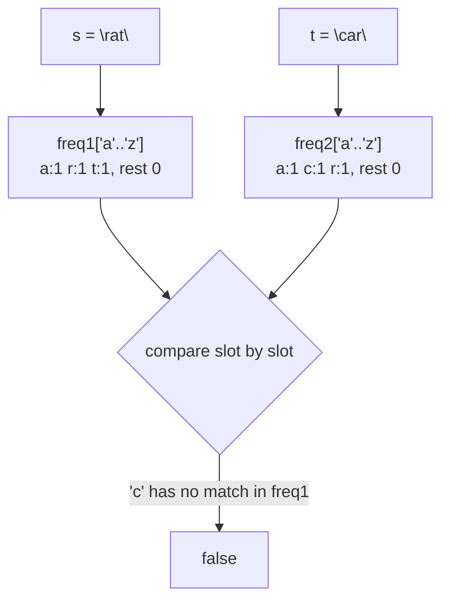

# 242. Valid Anagram
`Easy` · **Pattern:** Frequency Count (fixed-size array as hash map)

> [!question] Problem
> Given two strings `s` and `t`, return `true` if `t` is an anagram of `s`, and `false` otherwise.
> An **Anagram** is a word or phrase formed by rearranging the letters of a different word or phrase, typically using all the original letters exactly once.
>
> **Example 1:**
> ```
> Input: s = "anagram", t = "nagaram"
> Output: true
> ```
>
> **Example 2:**
> ```
> Input: s = "rat", t = "car"
> Output: false
> ```
>
> **Constraints:**
> - `1 <= s.length, t.length <= 5 * 10^4`
> - `s` and `t` consist of lowercase English letters.

---

## 🧩 Pattern this follows

> [!tip] Frequency counting with a fixed-size array
> Since the alphabet is just `'a'`–`'z'` (26 letters), you don't need a full `unordered_map` — a plain `int[26]` array indexed by `c - 'a'` is a cheaper, cache-friendlier "hash map." Two strings are anagrams **iff their letter-frequency signatures are identical**. This exact trick — bucket by `char - 'a'` — reappears constantly (Group Anagrams' key, sliding-window character problems, etc.).

### 🖼️ Visualizing it

Both strings fill the same 26-slot layout independently; a slot-by-slot mismatch means "not an anagram."



## 💻 My Solution (C++)

```cpp
class Solution {
public:
    bool isAnagram(string s, string t) {
        vector<int> freq1(26, 0);
        vector<int> freq2(26, 0);

        for (char c : s) {
            freq1[c - 'a']++;
        }
        for (char c : t) {
            freq2[c - 'a']++;
        }

        for (int i = 0; i < 26; i++) {
            if (freq1[i] != freq2[i]) {
                return false;
            }
        }

        return true;
    }
};
```

## 🔍 Walkthrough

1. Build `freq1`, a 26-slot counter for `s` — `freq1[c - 'a']++` maps `'a'→0, 'b'→1, ... 'z'→25`.
2. Build `freq2` the same way for `t`.
3. Compare the two frequency arrays slot by slot — if every letter count matches, the strings are anagrams.

> [!example] Why no explicit length check is needed
> This solution never checks `s.length() == t.length()` up front — and it doesn't need to. If the lengths differ, some letter's count *must* differ too (the totals across all 26 slots equal each string's length), so the final comparison loop catches it naturally. E.g. `s="a"`, `t="aa"` → `freq1['a']=1`, `freq2['a']=2` → mismatch → `false`. One less edge case to worry about.

## ⏱️ Complexity

| | Complexity | Why |
|---|---|---|
| **Time** | O(n + m) | One pass over `s`, one pass over `t`, then a constant 26-slot comparison |
| **Space** | O(1) | Two fixed-size 26-element arrays, independent of input size |

## 🚀 Tricks & Similar Problems

> [!success] Generalizing beyond lowercase-only
> If the problem allowed Unicode/uppercase, swap the fixed `int[26]` for an `unordered_map<char,int>` — same *pattern* (frequency count + compare), just a different-sized bucket. Recognize: **"same characters, different order" → frequency count**, almost always beats sorting both strings (`O(n log n)`) for pure equality checks.
> **Similar pattern:** [[Group Anagrams (LeetCode #49)]] (same frequency-signature idea, used as a hash-map key instead of a direct comparison), [[Contains Duplicate (LeetCode #217)]] (sorting to expose structure).
