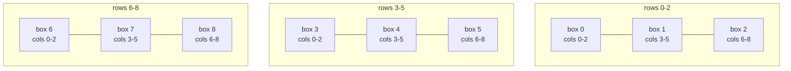

# 36. Valid Sudoku
`Medium` · **Pattern:** Hash Set per row/column/box, single pass

> [!question] Problem
> Determine if a `9 x 9` Sudoku board is valid. Only the **filled cells** need to be validated according to the following rules:
> - Each **row** must contain the digits `1-9` without repetition.
> - Each **column** must contain the digits `1-9` without repetition.
> - Each of the nine `3 x 3` **sub-boxes** of the grid must contain the digits `1-9` without repetition.
>
> A Sudoku board (partially filled) could be valid but not necessarily solvable — you're only checking these three rules, not whether the board can be completed.
>
> **Example:**
> ```
> board =
> [["5","3",".",".","7",".",".",".","."],
>  ["6",".",".","1","9","5",".",".","."],
>  [".","9","8",".",".",".",".","6","."],
>  ["8",".",".",".","6",".",".",".","3"],
>  ["4",".",".","8",".","3",".",".","1"],
>  ["7",".",".",".","2",".",".",".","6"],
>  [".","6",".",".",".",".","2","8","."],
>  [".",".",".","4","1","9",".",".","5"],
>  [".",".",".",".","8",".",".","7","9"]]
> Output: true
> ```
>
> **Constraints:**
> - `board.length == 9`, `board[i].length == 9`
> - `board[i][j]` is a digit `1-9` or `'.'`

---

## 🧩 Pattern this follows

> [!tip] Three hash sets, one pass, one clever box-index formula
> Instead of scanning rows, then columns, then boxes separately (three passes), track "seen digits" for **every row, column, and box simultaneously** in a **single pass** over all 81 cells. The only non-obvious bit is converting a `(row, col)` cell into **which of the 9 boxes it belongs to** — that's `box = (row / 3) * 3 + (col / 3)`, which numbers the boxes `0..8` left-to-right, top-to-bottom.

### 🖼️ Visualizing it

Boxes are numbered `0-8` left-to-right, top-to-bottom via `box = (row/3)*3 + (col/3)`. E.g. cell `(4,7)`: row band `4/3=1`, col band `7/3=2` → `box = 1*3+2 = 5`.



## 💻 My Solution (C++)

```cpp
class Solution {
public:
    bool isValidSudoku(vector<vector<char>>& board) {
        unordered_set<char> boxes[9];
        unordered_set<char> row[9];
        unordered_set<char> col[9];

        for (int i = 0; i < 9; i++) {
            for (int j = 0; j < 9; j++) {
                if (board[i][j] != '.') {
                    int box = i / 3 * 3 + j / 3;
                    if (row[i].count(board[i][j]) || col[j].count(board[i][j]) || boxes[box].count(board[i][j])) {
                        return false;
                    }

                    row[i].insert(board[i][j]);
                    col[j].insert(board[i][j]);
                    boxes[box].insert(board[i][j]);
                }
            }
        }

        return true;
    }
};
```

## 🔍 Walkthrough

1. Three **arrays of hash sets** — `row[9]`, `col[9]`, `boxes[9]` — one set per row index, column index, and box index respectively.
2. Scan every cell `(i, j)`. Skip empty cells (`'.'`).
3. Compute which box `(i, j)` belongs to: `box = i/3*3 + j/3`. Integer division `i/3` groups rows into bands `0,1,2`; `j/3` groups columns into bands `0,1,2`; multiplying the row-band by 3 and adding the column-band gives a unique `0..8` index per 3×3 box.
4. **Check before inserting:** if the digit at `(i,j)` is already in that row's set, that column's set, **or** that box's set, the board is invalid — return `false` immediately.
5. Otherwise, insert the digit into all three sets (`row[i]`, `col[j]`, `boxes[box]`) so later cells can be checked against it.
6. If every cell passes, the board satisfies all three rules → `true`.

## ⏱️ Complexity

| | Complexity | Why |
|---|---|---|
| **Time** | O(1) | Board is always exactly 9×9 = 81 cells — technically O(81), i.e. constant, though commonly written as `O(n²)` for an `n×n` board in general terms |
| **Space** | O(1) | At most 9 sets × 9 sets × 9 sets, each holding at most 9 digits — bounded regardless of input |

## 🚀 Tricks & Similar Problems

> [!success] The box-index formula is the reusable trick
> `box = (row / 3) * 3 + (col / 3)` is the one piece of this problem worth memorizing cold — it's the standard way to map a 2D grid position to "which fixed-size sub-block does this belong to," and shows up in any grid problem partitioned into equal rectangular regions.
> **Similar pattern:** [[Contains Duplicate (LeetCode #217)]] / [[Two Sum (LeetCode #1)]] — same "hash set/map to detect repeats in O(1)" idea, just tracked across three overlapping groupings at once instead of one.
