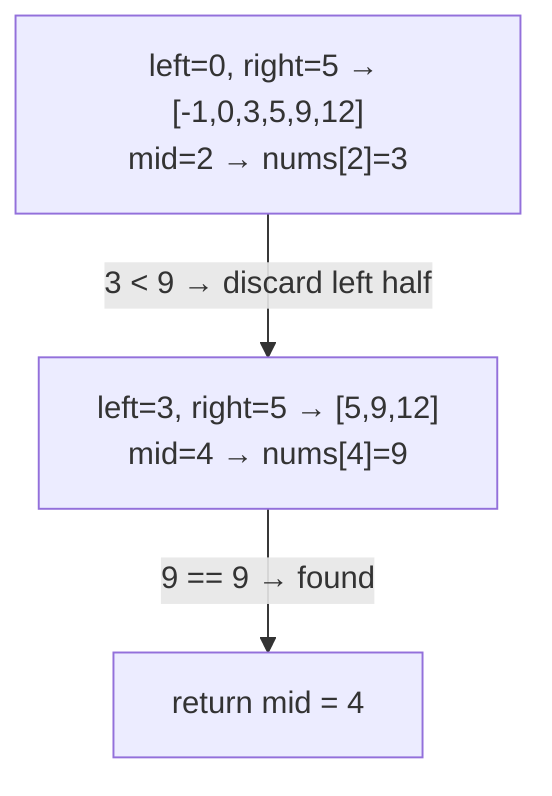

# 704. Binary Search
`Easy` · **Pattern:** The template — binary search on a plain sorted array

> [!question] Problem
> Given an array of integers `nums` sorted in **ascending order**, and an integer `target`, write a function to search `target` in `nums`. If `target` exists, return its index; otherwise return `-1`.
> Must run in **O(log n)** time.
>
> **Example 1:**
> ```
> Input: nums = [-1,0,3,5,9,12], target = 9
> Output: 4
> ```
>
> **Example 2:**
> ```
> Input: nums = [-1,0,3,5,9,12], target = 2
> Output: -1
> ```
>
> **Constraints:**
> - `1 <= nums.length <= 10^4`
> - `-10^4 < nums[i], target < 10^4`
> - All integers in `nums` are unique, sorted ascending.

---

## 🧩 Pattern this follows

> [!tip] The reusable skeleton every other note in this chapter builds on
> This is *the* template: maintain `[left, right]` as the range that could still contain the answer, check the midpoint, and **discard half the search space** based on the comparison. Every other binary search problem — rotated arrays, "search on the answer" problems like Koko, 2D matrices — is this exact skeleton with a different comparison rule or a reshaped search space.

### 🖼️ Visualizing it

`nums = [-1,0,3,5,9,12]`, `target = 9` — each step halves the range until `mid` lands on the target.



## 💻 My Solution (C++)

```cpp
class Solution {
public:
    int search(vector<int>& nums, int target) {
        int left = 0;
        int right = nums.size() - 1;

        while (left <= right) {
            int mid = left + (right - left) / 2;
            if (nums[mid] == target) {
                return mid;
            } else if (nums[mid] < target) {
                left = mid + 1;
            } else {
                right = mid - 1;
            }
        }

        return -1;
    }
};
```

## 🔍 Walkthrough

1. `left`/`right` bound the current search range — initially the whole array.
2. Loop while the range is non-empty (`left <= right`). Compute `mid` — written as `left + (right - left) / 2` rather than `(left + right) / 2` specifically to **avoid integer overflow** on very large index ranges (a habit worth keeping even when constraints here are small).
3. **Found it** → return `mid` immediately.
4. **`nums[mid] < target`** → the target must be somewhere to the right, so discard the left half including `mid`: `left = mid + 1`.
5. **`nums[mid] > target`** → target is to the left, discard the right half including `mid`: `right = mid - 1`.
6. If the loop exits without returning, `left > right` means the range is empty — target isn't present, return `-1`.

## ⏱️ Complexity

| | Complexity | Why |
|---|---|---|
| **Time** | O(log n) | Search space halves every iteration |
| **Space** | O(1) | Iterative, no extra structures |

## 🚀 Tricks & Similar Problems

> [!success] `mid = left + (right - left) / 2` — always write it this way
> `(left + right) / 2` can overflow if both are near `INT_MAX` (rare in LeetCode constraints, common in real systems with large arrays/pointers). `left + (right - left) / 2` never adds two large numbers together, so it's safe by construction — worth making a permanent habit rather than something to remember case-by-case.
> **Similar pattern:** every other note in this chapter is a variant of this same loop — [[Search in Rotated Sorted Array (LeetCode #33)]] and [[Find Minimum in Rotated Sorted Array (LeetCode #153)]] change *what* the comparison checks; [[Koko Eating Bananas (LeetCode #875)]] changes *what the search space represents* (a feasibility answer, not an array index).
