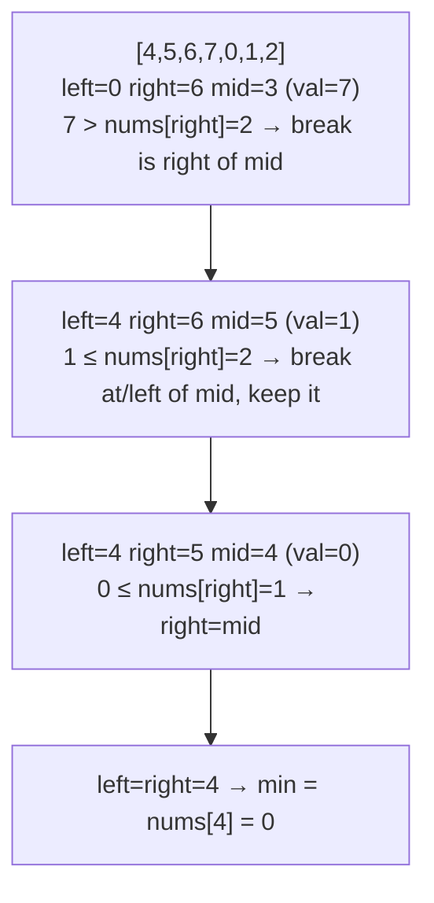

# 153. Find Minimum in Rotated Sorted Array
`Medium` · **Pattern:** Binary Search — converge on the rotation point

> [!question] Problem
> An array of length `n`, originally sorted ascending, was **rotated** between `1` and `n` times. Given the rotated array `nums` (all elements unique), return its **minimum** element. Must run in **O(log n)** time.
>
> **Example 1:**
> ```
> Input: nums = [3,4,5,1,2]
> Output: 1
> Explanation: original array was [1,2,3,4,5], rotated 3 times.
> ```
>
> **Example 2:**
> ```
> Input: nums = [4,5,6,7,0,1,2]
> Output: 0
> ```
>
> **Example 3:**
> ```
> Input: nums = [11,13,15,17]
> Output: 11
> Explanation: rotated 4 times = back to itself (0 net rotations).
> ```

---

## 🧩 Pattern this follows

> [!tip] Compare `mid` against `right`, not `left`, to always know which half to keep
> A rotated sorted array has exactly one "break point" — where a smaller number suddenly follows a bigger one — and the minimum sits **right at** that break. The trick: compare `nums[mid]` to `nums[right]`. If `nums[mid] > nums[right]`, the break (and therefore the minimum) must be **somewhere to the right** of `mid` — the left portion up to `mid` is still part of the "high" ascending run. If `nums[mid] <= nums[right]`, the right half from `mid` onward is already sorted with no break in it, so the minimum is **at or before `mid`**, safe to keep `mid` itself in the search range.

### 🖼️ Visualizing it

`nums = [4,5,6,7,0,1,2]` — break point sits between `7` and `0`; each step compares `nums[mid]` to `nums[right]` to decide which side it's on.



## 💻 My Solution (C++)

```cpp
class Solution {
public:
    int findMin(vector<int>& nums) {
        int left = 0;
        int right = nums.size() - 1;

        while (left < right) {
            int mid = left + (right - left) / 2;

            if (nums[mid] > nums[right]) {
                left = mid + 1;
            } else {
                right = mid;
            }
        }

        return nums[left];
    }
};
```

## 🔍 Walkthrough

1. Loop condition is `left < right` (not `<=`) — the search converges until `left == right`, at which point that single index **is** the answer, so there's no separate "found it" branch needed inside the loop.
2. Compare `nums[mid]` to `nums[right]`:
   - **`nums[mid] > nums[right]`** → `mid` is still on the "high" side of the rotation (e.g. in `[4,5,6,7,0,1,2]`, if `mid` lands on `7`, `nums[right]=2`, and `7 > 2` confirms the break — and therefore the minimum — is somewhere after `mid`. Discard `mid` itself: `left = mid + 1`.
   - **`nums[mid] <= nums[right]`** → the segment from `mid` to `right` is already internally sorted (no break in it), meaning the minimum is somewhere in `[left, mid]` — and `mid` itself **could be** the minimum, so keep it in range: `right = mid` (not `mid - 1`).
3. Each iteration shrinks the range by roughly half, converging `left` and `right` onto the single index holding the smallest value.

## ⏱️ Complexity

| | Complexity | Why |
|---|---|---|
| **Time** | O(log n) | Standard binary-search halving |
| **Space** | O(1) | Iterative |

## 🚀 Tricks & Similar Problems

> [!bug] Why `right = mid` (not `mid - 1`) here, unlike the usual template
> In the standard "find target" binary search, once `mid` is ruled out you always exclude it (`left = mid+1` or `right = mid-1`). Here, when `nums[mid] <= nums[right]`, `mid` is **still a candidate** for being the minimum itself — excluding it with `right = mid - 1` could skip over the correct answer. That asymmetry (`left = mid + 1` excludes `mid`, but `right = mid` keeps it) is the detail most likely to get flipped by mistake when re-deriving this from memory.
> **Similar pattern:** [[Search in Rotated Sorted Array (LeetCode #33)]] (same rotated-array setup, different goal — find a target value instead of the minimum, using the "which half is sorted" reasoning instead).
