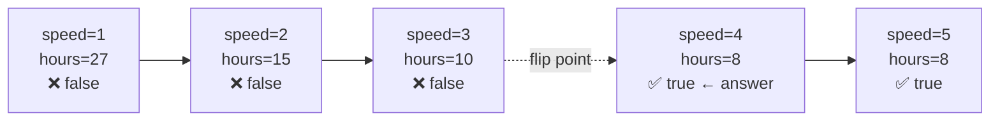

# 875. Koko Eating Bananas
`Medium` · **Pattern:** Binary Search **on the answer** (feasibility check, not array indexing)

> [!question] Problem
> Koko has `n` piles of bananas, the `i`th pile has `piles[i]` bananas. She must eat all bananas before the guards return in `h` hours, eating at a constant speed of `k` bananas/hour.
> Each hour, she picks one pile and eats up to `k` bananas from it — if the pile has fewer than `k`, she finishes that pile and doesn't eat more that hour (no borrowing from another pile).
> Return the **minimum** integer eating speed `k` such that she can finish all piles within `h` hours.
>
> **Example 1:**
> ```
> Input: piles = [3,6,7,11], h = 8
> Output: 4
> ```
>
> **Example 2:**
> ```
> Input: piles = [30,11,23,4,20], h = 5
> Output: 30
> ```
>
> **Example 3:**
> ```
> Input: piles = [30,11,23,4,20], h = 6
> Output: 23
> ```
>
> **Constraints:**
> - `1 <= piles.length <= 10^4`
> - `piles.length <= h <= 10^9`
> - `1 <= piles[i] <= 10^9`

---

## 🧩 Pattern this follows

> [!tip] Binary search doesn't require a sorted array — it requires a monotonic yes/no
> This is a completely different flavor of binary search from array-index problems: there's no array being searched at all. Instead, search over the **space of possible answers** — every integer speed `k` from `1` to `max(piles)`. The key property that makes binary search valid here: **if speed `k` finishes in time, every speed faster than `k` also finishes in time** (monotonic feasibility). That means "can Koko finish at speed `k`?" flips from `false` to `true` exactly once as `k` increases — and binary search finds that flip point in `O(log(max(piles)))` instead of trying every speed one by one.

### 🖼️ Visualizing it

`piles = [3,6,7,11]`, `h = 8` — feasibility is monotonic across the speed axis; binary search homes in on the exact flip point.



## 💻 My Solution (C++)

```cpp
class Solution {
public:
    int minEatingSpeed(vector<int>& piles, int h) {
        int left = 1;
        int right = *max_element(piles.begin(), piles.end());

        while (left <= right) {
            int mid = left + (right - left) / 2;
            long long totalHours = 0;
            for (int i = 0; i < piles.size(); i++) {
                totalHours += (piles[i] + mid - 1) / mid;
            }
            if (totalHours <= h) {
                right = mid - 1;
            } else {
                left = mid + 1;
            }
        }

        return left;
    }
};
```

## 🔍 Walkthrough

1. The search space is `[1, max(piles)]` — speed `1` is the slowest possible; any speed at or above the largest pile finishes every pile in exactly one hour each, so nothing faster than `max(piles)` is ever needed.
2. For each candidate speed `mid`, compute `totalHours`: for every pile, hours needed = `ceil(piles[i] / mid)`, computed without floating point via the integer ceiling-division trick `(piles[i] + mid - 1) / mid`.
3. **Feasibility check:** if `totalHours <= h`, speed `mid` **works** — but since the goal is the *minimum* working speed, don't stop here; instead try to find something even slower that still works, by searching the **left** half: `right = mid - 1`.
4. If `totalHours > h`, speed `mid` is **too slow** — need to search faster speeds: `left = mid + 1`.
5. This is the standard "find the leftmost value where a monotonic condition first becomes true" template. When the loop ends, `left` has converged exactly to that boundary — the minimum feasible speed — which is why the function returns `left`, not something computed separately.

## ⏱️ Complexity

| | Complexity | Why |
|---|---|---|
| **Time** | O(n · log(max(piles))) | Binary search over the speed range (`log(max(piles))` iterations), each doing an `O(n)` feasibility scan over all piles |
| **Space** | O(1) | Just scalar variables |

## 🚀 Tricks & Similar Problems

> [!success] The ceiling-division trick: `(a + b - 1) / b`
> Integer division in C++ truncates, so `piles[i] / mid` alone would undercount hours whenever there's a remainder (e.g. 7 bananas at speed 3 truly takes 3 hours — `ceil(7/3)` — but `7/3` truncates to `2`). Adding `mid - 1` before dividing pushes any remainder over into an extra whole division, giving the correct ceiling **without** floating point or a separate `if (remainder) hours++` branch. This exact trick reappears anywhere "round up an integer division" is needed.
> **Similar pattern:** any "**binary search on the answer**" problem — Minimum Days to Make Bouquets, Capacity to Ship Packages Within D Days, Split Array Largest Sum — all share this exact shape: define a monotonic feasibility check, binary search over the answer space instead of an array.
