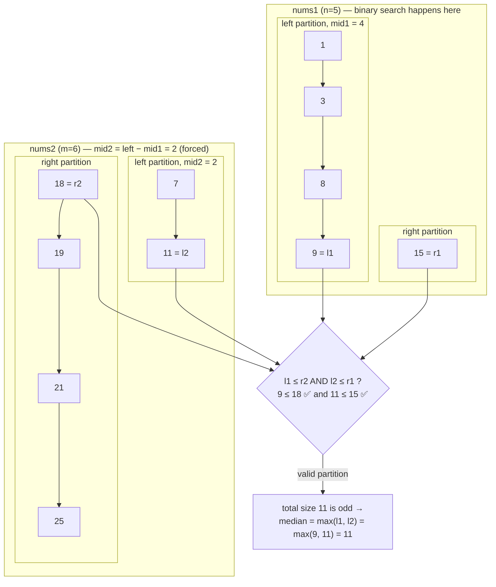

# 4. Median of Two Sorted Arrays
`Hard` · **Pattern:** Binary Search on a **partition point** (not on a value)

> [!question] Problem
> Given two sorted arrays `nums1` and `nums2` of sizes `m` and `n`, return the **median** of the two combined sorted arrays.
> The overall run time complexity must be **O(log(m+n))**.
>
> **Example 1:**
> ```
> Input: nums1 = [1,3], nums2 = [2]
> Output: 2.00000
> Explanation: merged = [1,2,3], median = 2
> ```
>
> **Example 2:**
> ```
> Input: nums1 = [1,2], nums2 = [3,4]
> Output: 2.50000
> Explanation: merged = [1,2,3,4], median = (2+3)/2 = 2.5
> ```
>
> **Constraints:**
> - `nums1.length == m`, `nums2.length == n`
> - `0 <= m, n <= 1000`, `1 <= m + n <= 2000`
> - `-10^6 <= nums1[i], nums2[i] <= 10^6`

---

## 🧩 Pattern this follows

> [!tip] Don't merge the arrays — binary search for the correct *split point*
> Actually merging both arrays and picking the middle is `O(m+n)`, too slow for the required `O(log(m+n))`. The insight: the median only depends on correctly splitting the **combined, virtual sorted array** into a left half and a right half of (near-)equal size, where **every element in the left half is ≤ every element in the right half**. Instead of merging, binary search directly on **how many elements to take from `nums1`** for the left half — the matching count from `nums2` is then forced (`totalLeftSize - countFromNums1`). This is binary search over a *partition index*, not over array values — one of the most conceptually different binary search problems on LeetCode.

### 🖼️ Visualizing it

Worked example: `nums1 = [1,3,8,9,15]` (n=5), `nums2 = [7,11,18,19,21,25]` (m=6). `left = (n+m+1)/2 = 6` total elements belong left of the cut. Binary search runs on `nums1` (the smaller array); a candidate `mid1 = 4` forces `mid2 = left - mid1 = 2`. Merged for reference: `[1,3,7,8,9,11,15,18,19,21,25]` → true median is `11`.



## 💻 My Solution (C++)

```cpp
class Solution {
public:
    double findMedianSortedArrays(vector<int>& nums1, vector<int>& nums2) {
        int n = nums1.size();
        int m = nums2.size();

        if (n > m) {
            return findMedianSortedArrays(nums2, nums1);
        }

        int low = 0;
        int high = n;

        int left = (n + m + 1) / 2;

        int size = n + m;

        while (low <= high) {
            int mid1 = low + (high - low) / 2;

            int mid2 = left - mid1;

            int r1 = INT_MAX;
            int r2 = INT_MAX;

            int l1 = INT_MIN;
            int l2 = INT_MIN;

            if (n > mid1) r1 = nums1[mid1];
            if (m > mid2) r2 = nums2[mid2];

            if (mid1 - 1 >= 0) l1 = nums1[mid1 - 1];
            if (mid2 - 1 >= 0) l2 = nums2[mid2 - 1];

            if (l1 <= r2 && l2 <= r1) {
                if (size % 2 == 1) return max(l1, l2);

                return (max(l1, l2) + min(r1, r2)) / 2.0;
            }

            if (l1 > r2) {
                high = mid1 - 1;
            } else {
                low = mid1 + 1;
            }
        }

        return 0;
    }
};
```

## 🔍 Walkthrough

**Setup:**
1. **Always binary search on the smaller array.** If `nums1` is bigger than `nums2`, swap roles by recursing with arguments flipped — this bounds the binary search range (`[0, n]`) to the smaller array's size, and guarantees `mid2` (computed below) never goes negative or out of bounds.
2. `left` = how many total elements belong in the **combined left half** — `(n+m+1)/2`. Using `+1` before the integer division handles both parities uniformly: for odd total size, the left half gets the one extra "middle" element; for even total size, left and right end up exactly equal in count.

**The search — binary search on `mid1`, the count taken from `nums1`:**
3. `mid1` = candidate number of elements from `nums1` in the left half. `mid2 = left - mid1` = the **forced** matching count from `nums2` — the two must always sum to `left`.
4. Identify the four "boundary" values around this proposed split:
   - `l1` = last element of `nums1`'s left portion (`nums1[mid1-1]`, or `INT_MIN` if `mid1 = 0`, meaning nothing taken from `nums1`'s left).
   - `r1` = first element of `nums1`'s right portion (`nums1[mid1]`, or `INT_MAX` if `mid1 = n`, meaning nothing left over on `nums1`'s right).
   - `l2`, `r2` = the same, mirrored for `nums2` and `mid2`.
5. **Valid partition found when `l1 <= r2 && l2 <= r1`** — this says: everything in `nums1`'s left portion is `≤` everything in `nums2`'s right portion, and vice versa. That's exactly the condition for "every element in the combined left half is `≤` every element in the combined right half," which is what makes this a valid median split.
   - **Odd total size:** the median is simply the largest of the two left-boundary values: `max(l1, l2)`.
   - **Even total size:** the median is the average of the largest left-boundary value and the smallest right-boundary value: `(max(l1,l2) + min(r1,r2)) / 2.0`.
6. **Not valid yet — adjust the search:**
   - `l1 > r2` means `nums1`'s left portion reaches too far (took too many elements from `nums1`) — shrink `mid1`: `high = mid1 - 1`.
   - Otherwise (`l2 > r1`, implicitly), `nums1`'s left portion isn't taking enough — grow `mid1`: `low = mid1 + 1`.

## ⏱️ Complexity

| | Complexity | Why |
|---|---|---|
| **Time** | O(log(min(m, n))) | Binary search runs over the smaller array's index range only |
| **Space** | O(1) | (Or O(log(min(m,n))) if counting the recursive call stack for the swap, which recurses at most once) |

## 🚀 Tricks & Similar Problems

> [!bug] Why binary searching on the smaller array isn't optional
> If you binary searched on the **larger** array instead, `mid2 = left - mid1` could go negative (there might not be enough "left budget" left over once a large `mid1` is chosen from the bigger array), causing an out-of-bounds access on `nums2[mid2 - 1]`. Swapping to guarantee `n <= m` up front is what keeps `mid2` always within `[0, m]` — this single `if (n > m) return findMedianSortedArrays(nums2, nums1);` line is the difference between a working solution and one that crashes on certain inputs.

> [!success] The four sentinel values are the whole trick
> Using `INT_MIN`/`INT_MAX` as sentinels for "this side of the partition took zero elements" or "this side took *all* elements" avoids writing separate edge-case branches for empty partitions — a partition that takes 0 elements from an array just naturally has `l = -∞`, which trivially satisfies `l <= anything`; a partition taking *all* elements has `r = +∞`, trivially satisfying `anything <= r`. This sentinel trick is broadly reusable in any "compare boundary elements" partition-search problem.
> **Similar pattern:** [[Koko Eating Bananas (LeetCode #875)]] (binary search over a derived space, not raw array values — same *category* of binary search as this problem, though far simpler). This is widely regarded as one of the hardest standard binary search problems — if this one is solid, essentially every other binary search problem will feel more approachable by comparison.
