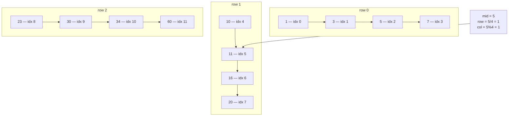

# 74. Search a 2D Matrix
`Medium` · **Pattern:** Binary Search on a flattened index (`row = mid/n`, `col = mid%n`)

> [!question] Problem
> You are given an `m x n` integer matrix with two properties: each row is sorted in **non-decreasing order**, and the first integer of each row is **greater than** the last integer of the previous row.
> Return `true` if `target` is in the matrix, `false` otherwise. Must run in **O(log(m·n))** time.
>
> **Example 1:**
> ```
> Input: matrix = [[1,3,5,7],[10,11,16,20],[23,30,34,60]], target = 3
> Output: true
> ```
>
> **Example 2:**
> ```
> Input: matrix = [[1,3,5,7],[10,11,16,20],[23,30,34,60]], target = 13
> Output: false
> ```
>
> **Constraints:**
> - `1 <= m, n <= 100`
> - `-10^4 <= matrix[i][j], target <= 10^4`

---

## 🧩 Pattern this follows

> [!tip] The whole matrix is secretly one sorted array
> Because every row is sorted **and** each row starts strictly after the previous row ends, reading the matrix row by row, left to right, produces one continuous **sorted sequence** of `m * n` numbers. That means you don't need nested binary search (search rows, then search within a row) — a **single** binary search over a virtual 1D index `[0, m*n)` works directly, converting each virtual index back to `(row, col)` on the fly with simple division/modulo.

### 🖼️ Visualizing it

The matrix `[[1,3,5,7],[10,11,16,20],[23,30,34,60]]` overlaid with its virtual flattened index — `mid=5` converts to `row=5/4=1, col=5%4=1`, landing on `11`.



## 💻 My Solution (C++)

```cpp
class Solution {
public:
    bool searchMatrix(vector<vector<int>>& matrix, int target) {
        int m = matrix.size();
        int n = matrix[0].size();

        int left = 0;
        int right = m * n - 1;

        while (left <= right) {
            int mid = left + (right - left) / 2;

            int row = mid / n;
            int col = mid % n;

            int temp = matrix[row][col];

            if (temp == target) {
                return true;
            } else if (temp < target) {
                left = mid + 1;
            } else {
                right = mid - 1;
            }
        }

        return false;
    }
};
```

## 🔍 Walkthrough

1. Treat the matrix as if it were flattened into a single array of length `m * n`, indexed `0` to `m*n - 1`.
2. Standard binary search over that virtual range: `left = 0`, `right = m*n - 1`.
3. At each step, convert the virtual `mid` index back into real matrix coordinates: `row = mid / n` (integer division — how many full rows of width `n` fit before this index), `col = mid % n` (the remainder — position within that row). This is the exact inverse of how a 2D array is stored as flattened memory.
4. Compare `matrix[row][col]` against `target` and narrow `left`/`right` exactly like a normal 1D binary search.

## ⏱️ Complexity

| | Complexity | Why |
|---|---|---|
| **Time** | O(log(m·n)) | One binary search over the full virtual range |
| **Space** | O(1) | Just a few scalar variables |

## 🚀 Tricks & Similar Problems

> [!success] `row = mid / n`, `col = mid % n` is the reusable conversion
> Whenever a problem lets you treat a 2D grid as one logical sorted sequence, this index-flattening trick avoids writing (and reasoning about) two nested binary searches. It only works because of this problem's specific guarantee — rows link end-to-start; **without** that guarantee (e.g. Search a 2D Matrix II, where only rows *and* columns are individually sorted but rows don't chain), a different approach (start from a corner, eliminate a row/column at a time) is needed instead.
> **Similar pattern:** [[Binary Search (LeetCode #704)]] (the exact same loop, just with an index-conversion step layered on top).
