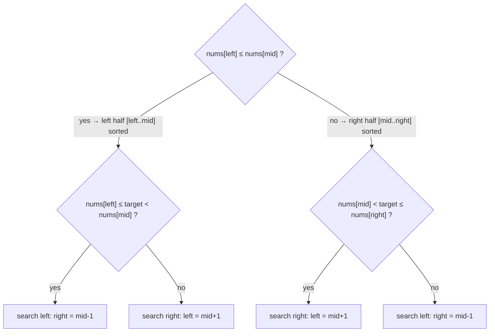

# 33. Search in Rotated Sorted Array
`Medium` · **Pattern:** Binary Search — identify which half is "normally sorted," then check if target is in it

> [!question] Problem
> An integer array `nums`, sorted ascending with **distinct** values, was rotated at an unknown pivot `k`. Given the rotated `nums` and a `target`, return the index of `target`, or `-1` if not present. Must run in **O(log n)** time.
>
> **Example 1:**
> ```
> Input: nums = [4,5,6,7,0,1,2], target = 0
> Output: 4
> ```
>
> **Example 2:**
> ```
> Input: nums = [4,5,6,7,0,1,2], target = 3
> Output: -1
> ```
>
> **Example 3:**
> ```
> Input: nums = [1], target = 0
> Output: -1
> ```

---

## 🧩 Pattern this follows

> [!tip] One half of any split is always normally sorted — check that half first
> No matter where you split a rotated sorted array, **at least one of the two halves is always a normal, un-rotated ascending run** (the rotation "break" can only be in one half at a time). At each step: figure out *which* half `[left, mid]` or `[mid, right]` is the sorted one (by comparing `nums[left]` and `nums[mid]`), then check whether `target` falls within that sorted half's value range. If it does, search there; if not, the target — if it exists at all — must be in the other, still-rotated half.

### 🖼️ Visualizing it

The two-question decision tree every step reduces to: which half is sorted, then does `target` fall in that half's range?



## 💻 My Solution (C++)

```cpp
class Solution {
public:
    int search(vector<int>& nums, int target) {
        int left = 0;
        int right = nums.size() - 1;

        while (left <= right) {
            int mid = left + (right - left) / 2;

            if (nums[mid] == target) {
                return mid;
            }

            if (nums[left] <= nums[mid]) {
                if (target < nums[mid] && target >= nums[left]) {
                    right = mid - 1;
                } else {
                    left = mid + 1;
                }
            } else {
                if (target > nums[mid] && target <= nums[right]) {
                    left = mid + 1;
                } else {
                    right = mid - 1;
                }
            }
        }

        return -1;
    }
};
```

## 🔍 Walkthrough

1. Standard binary search shell — check `nums[mid] == target` first, return immediately if found.
2. **Determine which half is normally sorted:** `nums[left] <= nums[mid]` means the **left** half `[left, mid]` has no rotation break in it (values only increase from `left` to `mid`). Otherwise, the break must be in the left half, meaning the **right** half `[mid, right]` is the clean, sorted one instead.
3. **Left half is sorted** (`nums[left] <= nums[mid]`): check if `target` falls inside that sorted range — `nums[left] <= target < nums[mid]`. If yes, the target (if present) must be there: `right = mid - 1`. If not, it must be in the other (right, still-rotated) half: `left = mid + 1`.
4. **Right half is sorted** (the `else` branch): symmetric logic — check if `target` falls inside `nums[mid] < target <= nums[right]`. If yes, search right: `left = mid + 1`. If not, search left: `right = mid - 1`.
5. Loop continues, each step still guaranteeing one half is cleanly sorted, until `target` is found or the range is exhausted (`-1`).

## ⏱️ Complexity

| | Complexity | Why |
|---|---|---|
| **Time** | O(log n) | Still one half discarded per iteration, despite the extra branching logic |
| **Space** | O(1) | Iterative |

## 🚀 Tricks & Similar Problems

> [!success] The four-way branch is really just "two if-checks, each with two outcomes"
> It looks intimidating with four nested conditions, but it decomposes cleanly: **(1)** which half is sorted? **(2)** does `target` belong in that sorted half's range? Answering those two yes/no questions picks exactly one of four actions. Practicing saying those two questions out loud is the fastest way to re-derive this code from scratch under interview pressure, rather than memorizing the branches directly.
> **Similar pattern:** [[Find Minimum in Rotated Sorted Array (LeetCode #153)]] (same rotated-array structure, simpler goal). If this problem allowed **duplicate** values, this exact strategy can degrade to `O(n)` in the worst case (`nums[left] == nums[mid]` no longer proves the left half is sorted) — that's the follow-up variant, "Search in Rotated Sorted Array II."
