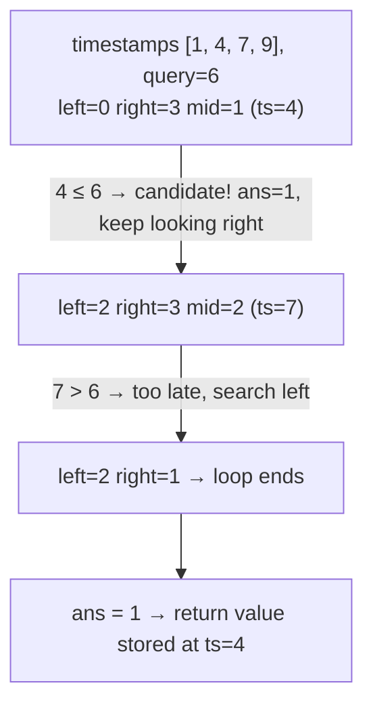

# 981. Time Based Key-Value Store
`Medium` · **Pattern:** Binary Search for "largest value ≤ target" (lower-bound variant)

> [!question] Problem
> Design a time-based key-value store that can store multiple values for the same key at different timestamps, and retrieve the key's value at (or just before) a certain timestamp.
> Implement `TimeMap`:
> - `TimeMap()` initializes the object.
> - `void set(String key, String value, int timestamp)` stores the key with the value at the given time.
> - `String get(String key, int timestamp)` returns the value associated with `key` at the **largest timestamp `≤`** the given `timestamp`. If there are no values, or all stored timestamps are greater than the given one, return `""`.
>
> **Example:**
> ```
> TimeMap tm = new TimeMap();
> tm.set("foo", "bar", 1);
> tm.get("foo", 1);  // "bar"
> tm.get("foo", 3);  // "bar" — latest timestamp ≤ 3 is 1
> tm.set("foo", "bar2", 4);
> tm.get("foo", 4);  // "bar2"
> tm.get("foo", 5);  // "bar2" — latest timestamp ≤ 5 is 4
> ```
>
> **Constraints:**
> - `1 <= key.length, value.length <= 100`
> - `1 <= timestamp <= 10^7`
> - All `set` calls for a given key are made with **strictly increasing** timestamps.
> - At most `2 * 10^5` calls total to `set` and `get`.

---

## 🧩 Pattern this follows

> [!tip] Strictly increasing timestamps ⇒ each key's history is already sorted
> The problem guarantees `set` is always called with a **larger** timestamp than any previous `set` for that same key — meaning each key's list of `(timestamp, value)` entries is built up **already in sorted order**, with zero extra work. `get` then becomes a classic binary search problem: "find the largest timestamp in this sorted list that is `≤` the query timestamp" — a variant of the standard search, looking for the rightmost qualifying element instead of an exact match.

### 🖼️ Visualizing it

One key's timeline `[(ts=1), (ts=4), (ts=7), (ts=9)]`, query `timestamp = 6` — binary search converges on the rightmost entry that doesn't exceed the query.



## 💻 My Solution (C++)

```cpp
class TimeMapData {
public:
    string value;
    int timestamp;

    TimeMapData(string value, int timestamp) {
        this->value = value;
        this->timestamp = timestamp;
    }
};

class TimeMap {
    unordered_map<string, vector<TimeMapData>> mp;

public:
    TimeMap() {
    }

    string binarySearch(vector<TimeMapData>& tm, int targetTime) {
        int n = tm.size() - 1;
        int left = 0;
        int right = n;
        int ans = -1;

        while (left <= right) {
            int mid = left + (right - left) / 2;

            if (tm[mid].timestamp <= targetTime) {
                ans = mid;
                left = mid + 1;
            } else {
                right = mid - 1;
            }
        }

        if (ans == -1) {
            return "";
        }

        return tm[ans].value;
    }

    void set(string key, string value, int timestamp) {
        mp[key].emplace_back(value, timestamp);
    }

    string get(string key, int timestamp) {
        if (mp.find(key) == mp.end()) {
            return "";
        }

        return binarySearch(mp[key], timestamp);
    }
};
```

## 🔍 Walkthrough

**`set`:** simply appends a new `TimeMapData{value, timestamp}` to that key's vector — `emplace_back` constructs it in place. No sorting needed, since the problem's guarantee means entries arrive in timestamp order automatically.

**`get`:** looks up the key's vector (returning `""` immediately if the key was never set), then delegates to `binarySearch`.

**`binarySearch` — finding the rightmost entry with `timestamp <= targetTime`:**
1. `ans` starts at `-1`, meaning "no valid entry found yet."
2. Standard binary search loop, but the branch logic is different from an exact-match search: whenever `tm[mid].timestamp <= targetTime` (this entry **qualifies**), don't stop — record it as the *current best* candidate (`ans = mid`), then keep searching **further right** (`left = mid + 1`) in case an even later timestamp also still qualifies.
3. Whenever `tm[mid].timestamp > targetTime`, this entry is too late — search left instead (`right = mid - 1`).
4. When the loop ends, `ans` holds the index of the **largest** timestamp that didn't exceed the target — exactly what the problem asks for. If nothing ever qualified (every stored timestamp is later than the query), `ans` stays `-1`, returning `""`.

## ⏱️ Complexity

| | Complexity | Why |
|---|---|---|
| **`set`** | O(1) amortized | Append to the end of a vector |
| **`get`** | O(log m) | `m` = number of timestamps stored for that key; binary search over them |
| **Space** | O(n) | `n` = total number of `set` calls across all keys |

## 🚀 Tricks & Similar Problems

> [!success] This is the "find rightmost element satisfying a condition" template
> Unlike [[Binary Search (LeetCode #704)]]'s exact-match search, this keeps a running "best answer so far" (`ans`) and **continues searching** even after finding a qualifying element — because there might be an even better one further in that direction. This shape — track the best candidate found, keep narrowing toward "could there be something even better?" — is the general template for "find the largest/smallest value satisfying X" problems, distinct from "find this exact value."
> **Similar pattern:** [[Koko Eating Bananas (LeetCode #875)]] (same "keep narrowing toward the best boundary" idea, applied to a feasibility condition on speed instead of a stored, sorted list).
