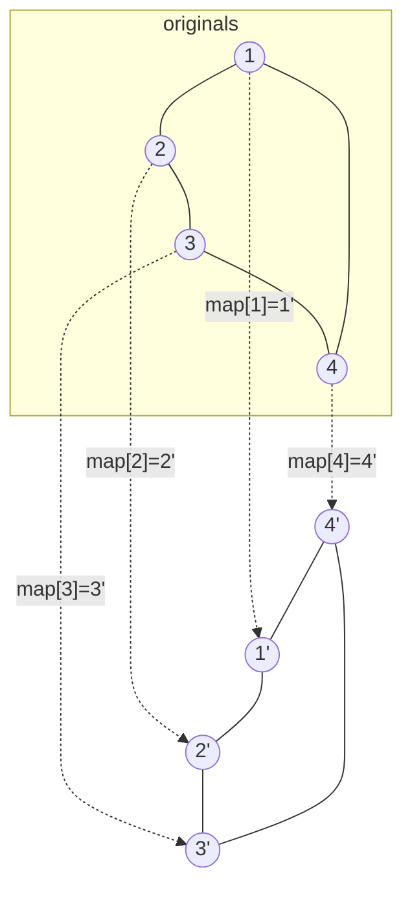

# 133. Clone Graph
`Medium` · **Pattern:** DFS + `old → new` hashmap (deep copy, break cycles)

> [!question] Problem
> Given a reference of a node in a **connected undirected** graph, return a **deep copy** (clone) of the graph. Each node contains a value (`int`) and a list (`List[Node]`) of its neighbours.
>
> ```
> class Node {
>     public int val;
>     public List<Node> neighbors;
> }
> ```
>
> **Example 1:**
> ```
> Input: adjList = [[2,4],[1,3],[2,4],[1,3]]
> Output: [[2,4],[1,3],[2,4],[1,3]]
> Explanation: 4 nodes; node 1's neighbours are 2 and 4, etc.
> ```
>
> **Example 2:**
> ```
> Input: adjList = []
> Output: []   (empty graph → null node)
> ```
>
> **Constraints:**
> - Number of nodes is in `[0, 100]`.
> - `1 <= Node.val <= 100`, `Node.val` is unique.
> - No repeated edges, no self-loops. The graph is connected.

---

## 🧩 Pattern this follows

> [!tip] A hashmap from *original node → its clone* is the whole solution
> Deep-copying a graph is a **traversal** (DFS or BFS) where you must (a) create each clone exactly once and (b) wire clones to *clones*, not to originals. The `unordered_map<Node*, Node*>` does both jobs: it's your **visited set** *and* your lookup of "which clone corresponds to this original." First time you see a node, make its clone and record it **before** recursing (so cycles don't loop forever); every later encounter just returns the already-made clone from the map.

### 🖼️ Visualizing it

Square graph `1-2-3-4-1`. The map stops the recursion from cycling forever.



## 💻 My Solution (C++)

```cpp
/*
// Definition for a Node.
class Node {
public:
    int val;
    vector<Node*> neighbors;
    Node() {
        val = 0;
        neighbors = vector<Node*>();
    }
    Node(int _val) {
        val = _val;
        neighbors = vector<Node*>();
    }
    Node(int _val, vector<Node*> _neighbors) {
        val = _val;
        neighbors = _neighbors;
    }
};
*/

class Solution {
public:

    Node* dfs(Node* node,unordered_map<Node*,Node*> &mp){

        if(mp.count(node)){
            return mp[node];
        }

        Node* cloneNode=new Node(node->val);
        mp[node]=cloneNode;

        for(Node* neighbour:node->neighbors){
            cloneNode->neighbors.push_back(dfs(neighbour,mp));
        }

        return cloneNode;

    }

    Node* cloneGraph(Node* node) {
        if(!node){
            return node;
        }
        unordered_map<Node*,Node*> mp;

        return dfs(node,mp);


    }
};
```

## 🔍 Walkthrough

1. **Empty graph guard:** `node == nullptr` → return `nullptr`.
2. `dfs(node)`: if `mp` already holds `node`, the clone exists → return it (this is the **cycle / revisit** short-circuit).
3. Otherwise `new Node(node->val)`, and **immediately** store `mp[node] = cloneNode` — *before* touching neighbours. Registering early is critical: when the recursion loops back to `node` via a cycle, step 2 finds it and stops.
4. Recurse into each original neighbour; the returned value is that neighbour's **clone**, which we push into `cloneNode->neighbors`. This wires clones to clones.
5. Return `cloneNode`. Top-level call returns the clone of the entry node — the deep copy's root.

## ⏱️ Complexity

| | Complexity | Why |
|---|---|---|
| **Time** | O(V + E) | Each node cloned once; each edge walked once when copying neighbour lists |
| **Space** | O(V) | The map holds one entry per node; recursion stack up to `O(V)` deep |

## 🚀 Tricks & Similar Problems

> [!success] Insert into the map *before* recursing — not after
> The single most common bug: creating the clone, recursing into neighbours, then storing in the map. In a cyclic graph the recursion re-enters `node` before the map ever recorded it → infinite loop / duplicate nodes. Register the clone the instant you make it.
> **BFS variant:** create the root clone, queue originals, and for each dequeued node create-or-lookup each neighbour's clone in the map and link — same map, iterative.
> **Similar pattern:** [[Number of Connected Components in an Undirected Graph (LeetCode #323)]] (same DFS-over-adjacency traversal), and the `old→new` map mirrors "Copy List with Random Pointer."
