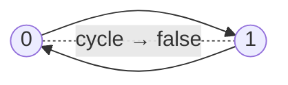

# 207. Course Schedule
`Medium` · **Pattern:** Cycle detection in a directed graph (3-color DFS)

> [!question] Problem
> There are a total of `numCourses` courses you have to take, labeled from `0` to `numCourses - 1`. You are given an array `prerequisites` where `prerequisites[i] = [aᵢ, bᵢ]` indicates that you **must** take course `bᵢ` first if you want to take course `aᵢ`.
>
> Return `true` if you can finish all courses. Otherwise, return `false`.
>
> **Example 1:**
> ```
> Input: numCourses = 2, prerequisites = [[1,0]]
> Output: true
> Explanation: To take course 1 you should finish course 0. So it is possible.
> ```
>
> **Example 2:**
> ```
> Input: numCourses = 2, prerequisites = [[1,0],[0,1]]
> Output: false
> Explanation: 0 needs 1 and 1 needs 0 — impossible (cycle).
> ```
>
> **Constraints:**
> - `1 <= numCourses <= 2000`
> - `0 <= prerequisites.length <= 5000`
> - `prerequisites[i].length == 2`
> - `0 <= aᵢ, bᵢ < numCourses`
> - All the pairs `prerequisites[i]` are **unique**.

---

## 🧩 Pattern this follows

> [!tip] "Can I finish?" ⇔ "Is the prerequisite graph acyclic?"
> Build a directed graph `prereq → course`. You can finish **iff** there's **no cycle** — a cycle means a set of courses each waiting on another forever. This is the exact same DFS + **3-state** machinery as [[Course Schedule II (LeetCode #210)]], minus the bookkeeping of the actual order. If DFS ever re-enters a node marked `1` (currently on the recursion stack), you've closed a loop → return `false`.

### 🖼️ Visualizing it

Example 2 is a 2-cycle → unschedulable.



## 💻 My Solution (C++)

```cpp
class Solution {
public:

    bool dfs(int i,vector<vector<int>> &adj,vector<int> &state ){
        if(state[i]==1){
            return false;
        }

        if(state[i]==2){
            return true;
        }

        state[i]=1;

        for(int x:adj[i]){
            if(!dfs(x,adj,state)){
                return false;
            }
        }

        state[i]=2;

        return true;

    }

    bool canFinish(int numCourses, vector<vector<int>>& prerequisites) {
        
        vector<vector<int>> adj(numCourses);

        for (auto &it : prerequisites) {
            adj[it[1]].push_back(it[0]);
        }

        vector<int> state(numCourses);

        for(int i=0;i<numCourses;i++){
            if(state[i]==0){
                if(!dfs(i,adj,state)){
                    return false;
                }
            }
        }

        return true;

    }
};
```

## 🔍 Walkthrough

1. **Build `prereq → course`:** for `[a, b]` push `a` into `adj[b]`.
2. `state[i]`: `0` unvisited, `1` on current DFS path, `2` fully explored & proven safe.
3. `dfs(i)`:
   - hits `1` → node is on the path we're currently exploring → **cycle** → `false`.
   - hits `2` → already cleared → `true`.
   - else mark `1`, recurse into all `adj[i]`; if any recursion returns `false`, bubble it up.
4. Finished exploring `i` → mark `2` (safe), return `true`.
5. Outer loop launches DFS from every unvisited node (graph may be disconnected). No cycle anywhere → `true`.

## ⏱️ Complexity

| | Complexity | Why |
|---|---|---|
| **Time** | O(V + E) | Each node entered once (states prevent re-work); each edge followed once |
| **Space** | O(V + E) | Adjacency list `O(E)`, `state` `O(V)`, recursion stack up to `O(V)` |

## 🚀 Tricks & Similar Problems

> [!success] Same skeleton, drop the `result` vector
> This is literally [[Course Schedule II (LeetCode #210)]] with the ordering thrown away — if you can produce a topological order, you can finish; if a cycle blocks the order, you can't. Learn one, get the other free.
> **Kahn's BFS alternative:** peel off in-degree-`0` nodes; if you process fewer than `numCourses`, a cycle remains → `false`.
> **Similar pattern:** any "detect a cycle in a directed graph" question (deadlock detection, build-dependency resolution).
