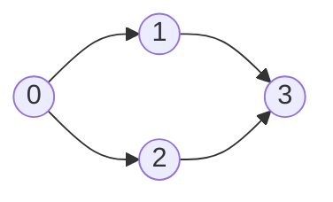

# 210. Course Schedule II
`Medium` · **Pattern:** Topological Sort via DFS + 3-color cycle detection

> [!question] Problem
> There are a total of `numCourses` courses you have to take, labeled from `0` to `numCourses - 1`. You are given an array `prerequisites` where `prerequisites[i] = [aᵢ, bᵢ]` indicates that you **must** take course `bᵢ` first if you want to take course `aᵢ`.
>
> Return the **ordering** of courses you should take to finish all courses. If there are many valid answers, return any of them. If it is impossible to finish all courses, return an **empty array**.
>
> **Example 1:**
> ```
> Input: numCourses = 2, prerequisites = [[1,0]]
> Output: [0,1]
> ```
>
> **Example 2:**
> ```
> Input: numCourses = 4, prerequisites = [[1,0],[2,0],[3,1],[3,2]]
> Output: [0,1,2,3]   (or [0,2,1,3])
> ```
>
> **Example 3:**
> ```
> Input: numCourses = 1, prerequisites = []
> Output: [0]
> ```
>
> **Constraints:**
> - `1 <= numCourses <= 2000`
> - `0 <= prerequisites.length <= numCourses * (numCourses - 1)`
> - `prerequisites[i].length == 2`
> - `0 <= aᵢ, bᵢ < numCourses`
> - `aᵢ != bᵢ`
> - All the pairs `[aᵢ, bᵢ]` are distinct.

---

## 🧩 Pattern this follows

> [!tip] Topological order = "post-order DFS, reversed"
> Model courses as a **directed** graph: edge `b → a` means "b unlocks a" (take `b` before `a`). A valid schedule is a **topological ordering** — every prerequisite appears before the course it unlocks. The trick: run DFS and push a node into `result` **only after** all its dependents are done (post-order); then **reverse** the list. If DFS ever meets a node currently *on the recursion stack*, there's a **cycle** → the courses are mutually dependent → impossible → return `{}`.
>
> The **3 colors / states** are the whole game:
> - `0` = **unvisited** (white)
> - `1` = **in progress**, sitting on the current DFS path (grey) → seeing this again = **cycle**
> - `2` = **fully done** (black) → safe, already placed in the order

### 🖼️ Visualizing it

Edges built as `prereq → course`. Post-order finish times, reversed, give a legal order.


> Finish order (post-order): `3, 1, 2, 0` → reverse → `0, 2, 1, 3` ✔

## 💻 My Solution (C++)

```cpp
class Solution {
public:

    bool dfs(int i,vector<vector<int>>& adj,vector<int>& state,vector<int>& result){
        if(state[i]==1){
            return false;
        }

        if(state[i]==2){
            return true;
        }

        state[i]=1;

        for(int x:adj[i]){
            if(!dfs(x,adj,state,result)){
                return false;
            }
        }

        result.push_back(i);
        state[i]=2;
        return true;
    }

    vector<int> findOrder(int numCourses, vector<vector<int>>& prerequisites) {
        vector<vector<int>> adj(numCourses);

        vector<int> state(numCourses);
        vector<int> result;

        for(auto& it:prerequisites){
            adj[it[1]].push_back(it[0]);
        }

        for(int i=0;i<numCourses;i++){
            if(state[i]==0){
                if(!dfs(i,adj,state,result)){
                    return {};
                }
            }
        }

        reverse(result.begin(),result.end());

        return result;

    }
};
```

## 🔍 Walkthrough

1. **Build the directed graph** `prereq → course`: for `[a, b]` (take `b` before `a`) push `a` into `adj[b]`. Now `adj[b]` lists everything `b` unlocks.
2. `state` starts all `0` (unvisited). DFS from every course not yet finished.
3. Inside `dfs(i)`:
   - `state[i] == 1` → node is on the **current path** → **cycle** → return `false` (propagates up, `findOrder` bails with `{}`).
   - `state[i] == 2` → already fully processed → return `true`, nothing to redo.
   - Otherwise mark `state[i] = 1` (grey / on path) and recurse into every course `i` unlocks.
4. Once **all** descendants finish, `push_back(i)` (post-order) and mark `state[i] = 2` (black / done).
5. Post-order gives *dependents before prerequisites*; `reverse` flips it to *prerequisites before dependents* — the schedule.

## ⏱️ Complexity

| | Complexity | Why |
|---|---|---|
| **Time** | O(V + E) | Each course visited once; each prerequisite edge traversed once |
| **Space** | O(V + E) | Adjacency list `O(E)`, `state` + `result` `O(V)`, recursion stack up to `O(V)` |

## 🚀 Tricks & Similar Problems

> [!success] The 3-state trick is what separates this from plain DFS
> A simple `visited` boolean **cannot** detect a cycle in a directed graph — a node can be legitimately re-reached via a different path without being a cycle. You need the middle "grey / on the current stack" state (`1`) to know you looped back onto *yourself*. Memorize the three states; it's reused everywhere in directed-graph problems.
> **Alternative — Kahn's algorithm (BFS):** compute in-degrees, repeatedly pop nodes with in-degree `0`; if you can't empty the queue, a cycle exists. No reversal needed.
> **Similar pattern:** [[Course Schedule (LeetCode #207)]] (identical graph, only asks *can you finish?* — the boolean version of this).
