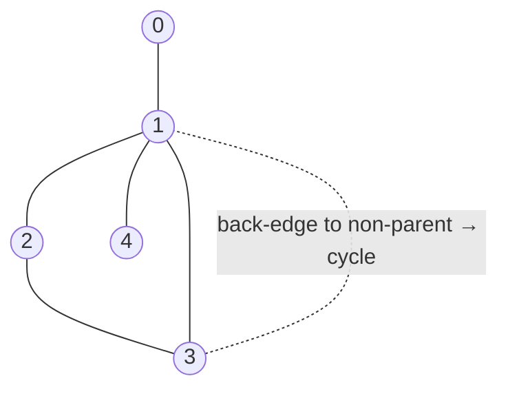

# 261. Graph Valid Tree
`Medium` · **Pattern:** "Connected + no cycle" check (`n-1` edges + DFS)

> [!question] Problem
> You have a graph of `n` nodes labeled from `0` to `n - 1`. You are given an integer `n` and a list of `edges` where `edges[i] = [aᵢ, bᵢ]` indicates an **undirected** edge between `aᵢ` and `bᵢ`.
>
> Return `true` **if and only if** these edges make up a **valid tree**.
>
> **Example 1:**
> ```
> Input: n = 5, edges = [[0,1],[0,2],[0,3],[1,4]]
> Output: true
> ```
>
> **Example 2:**
> ```
> Input: n = 5, edges = [[0,1],[1,2],[2,3],[1,3],[1,4]]
> Output: false   (edge [1,3] closes a cycle)
> ```
>
> **Constraints:**
> - `1 <= n <= 2000`
> - `0 <= edges.length <= 5000`
> - `edges[i].length == 2`, `0 <= aᵢ, bᵢ < n`, `aᵢ != bᵢ`
> - No self-loops, no duplicate edges.

---

## 🧩 Pattern this follows

> [!tip] A tree = exactly two conditions, and one shortcut kills half the work
> An undirected graph is a valid tree **iff** it is (1) **fully connected** and (2) **acyclic**. There's a neat counting shortcut: a tree on `n` nodes has **exactly `n-1` edges**. So:
> - If `edges.size() != n-1` → **not** a tree (too few = disconnected, too many = must contain a cycle). Reject instantly.
> - Given exactly `n-1` edges, "connected" and "acyclic" become **equivalent** — proving either one proves both. Do a single DFS from node 0: if it detects **no cycle** *and* reaches **all `n` nodes**, it's a tree.
>
> Cycle detection in an **undirected** graph: track the `parent` you came from; if DFS meets an already-visited neighbour that **isn't** the parent, you've found a back-edge → cycle.

### 🖼️ Visualizing it

Example 2 has 5 edges on 5 nodes (`> n-1`) → the extra edge `[1,3]` forms a cycle `1-2-3-1`.



## 💻 My Solution (C++)

```cpp
#include<iostream>
using namespace std;

class Solution {
public:


    bool dfs(int node,int parent,vector<vector<int>>& adj,vector<bool>& visited){
        
        visited[node]=true;

        for(int i:adj[node]){
            if(!visited[i]){
                if(!dfs(i,node,adj,visited)){
                    return false;
                }
            }else if(i!=parent){
                return false;
            }

            
        }

        return true;
        
    }
    

    bool validTree(int n, vector<vector<int>>& edges) {

        if (edges.size() != n - 1) return false;

        vector<vector<int>> adj(n);

        for(auto& it:edges){
            adj[it[0]].push_back(it[1]);
            adj[it[1]].push_back(it[0]);
        }

        vector<bool> visited(n);


        if(!dfs(0,0,adj,visited)) return false;

        for(int i=0;i<n;i++){
            if(!visited[i]){
                return false;
            }
        }
        
        return true;
        

    }
};

int main() {

    int n = 5;

    vector<vector<int>> edges = {
        {0,1},
        {0,2},
        {0,3},
        {1,4}
    };

    Solution obj;

    cout << boolalpha << obj.validTree(n, edges);

    return 0;
}
```

## 🔍 Walkthrough

1. **Edge-count gate:** `edges.size() != n-1` → return `false` immediately. This one line rejects every disconnected *and* every over-connected input up front.
2. **Build undirected adjacency list** — each edge added both ways.
3. **DFS from node 0** carrying `parent`:
   - Mark `node` visited.
   - For neighbour `i`: if unvisited, recurse with `parent = node`; a `false` from below bubbles up.
   - If `i` **is** already visited **and** `i != parent`, that's a back-edge to a non-parent → **cycle** → `false`. (The `i == parent` case is just the edge we just came across, harmless in an undirected graph.)
4. **Connectivity check:** after DFS, scan `visited`; any `false` means a node was unreachable → disconnected → `false`.
5. Passed all gates → it's a valid tree → `true`.

## ⏱️ Complexity

| | Complexity | Why |
|---|---|---|
| **Time** | O(V + E) | One DFS over all vertices and edges (and `E` is capped at `n-1` after the gate) |
| **Space** | O(V + E) | Adjacency list + `visited` + recursion stack |

## 🚀 Tricks & Similar Problems

> [!success] The `n-1` edge count does half the proof for you
> With exactly `n-1` edges, *connected ⇔ acyclic*, so technically you only need **one** of the two DFS checks — but keeping both (no-cycle *and* all-visited) is a safe, readable belt-and-suspenders. Also remember the **parent** parameter: without it, every undirected edge `u-v` looks like a cycle (`v` sees `u` already visited).
> **Union-Find alternative:** union each edge; if an edge ever joins two nodes **already** in the same set → cycle → `false`. After processing, exactly `n-1` successful unions ⇒ one component ⇒ tree.
> **Similar pattern:** [[Number of Connected Components in an Undirected Graph (LeetCode #323)]] (a tree is one component; this adds the acyclic constraint), [[Course Schedule (LeetCode #207)]] (cycle detection, but *directed*).
