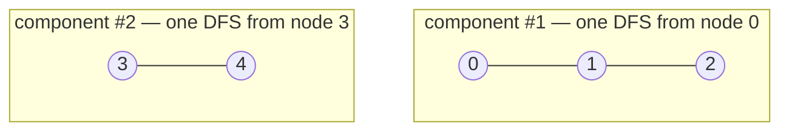

# 323. Number of Connected Components in an Undirected Graph
`Medium` · **Pattern:** DFS flood-fill over an adjacency list — count the "starts"

> [!question] Problem
> You have a graph of `n` nodes labeled from `0` to `n - 1`. You are given an integer `n` and a list of `edges` where `edges[i] = [aᵢ, bᵢ]` indicates that there is an **undirected** edge between `aᵢ` and `bᵢ` in the graph.
>
> Return the **number of connected components** in the graph.
>
> **Example 1:**
> ```
> Input: n = 5, edges = [[0,1],[1,2],[3,4]]
> Output: 2
> ```
>
> **Example 2:**
> ```
> Input: n = 5, edges = [[0,1],[1,2],[2,3],[3,4]]
> Output: 1
> ```
>
> **Constraints:**
> - `1 <= n <= 2000`
> - `0 <= edges.length <= 5000`
> - `edges[i].length == 2`
> - `0 <= aᵢ <= bᵢ < n`
> - `aᵢ != bᵢ`
> - There are no repeated edges.

---

## 🧩 Pattern this follows

> [!tip] Count how many times you have to *start* a fresh DFS
> A **connected component** is a maximal set of nodes all reachable from each other. One DFS from any node paints that node's **entire** component `visited`. So loop over every node — each time you hit an *unvisited* one, you've discovered a brand-new component (increment the counter) and then DFS to mark all of its members visited so you never re-count them. The answer is simply **how many DFS launches** it took to cover the whole graph.

### 🖼️ Visualizing it

Example 1: `{0,1,2}` is one blob, `{3,4}` is another. Two launches → answer `2`.



## 💻 My Solution (C++)

```cpp
#include <iostream>
#include <vector>
using namespace std;

class Solution {
public:

    void dfs(int node,  vector<vector<int>>& adj, vector<bool>& visited){
        
        if(visited[node]){
            return;
        }

        visited[node]=true;

        for(int i:adj[node]){
            if(!visited[i]){
                dfs(i,adj,visited);
            }
        }

    }

    int countComponents(int n, vector<vector<int>>& edges) {

        vector<vector<int>> adj(n);

        for(auto& it:edges){
            adj[it[0]].push_back(it[1]);
            adj[it[1]].push_back(it[0]);
        }

        vector<bool> visited(n);
        int component=0;
        for(int i=0;i<n;i++){
            if(!visited[i]){
                component++;
                dfs(i,adj,visited);
            }
        }

        return component;


    }
};

int main() {

    int n = 5;

    vector<vector<int>> edges = {
        {0,1},
        {1,2},
        {3,4}
    };

    Solution obj;

    cout << obj.countComponents(n, edges);

    return 0;
}
```

## 🔍 Walkthrough

1. **Build an undirected adjacency list.** For every edge `[u, v]`, push `v` into `adj[u]` **and** `u` into `adj[v]` — undirected means the edge goes both ways.
2. **Sweep all nodes `0..n-1`.** Keep a `visited` array so each node is processed once.
3. When node `i` is **not yet visited**, it belongs to a component nobody has explored → `component++`, then `dfs(i, ...)` floods and marks the whole component.
4. `dfs` marks `node` visited and recurses into each unvisited neighbour — this reaches every node in that connected blob, so the outer loop skips them all afterward.
5. Return `component` — the number of DFS launches, i.e. the number of connected components.

## ⏱️ Complexity

| | Complexity | Why |
|---|---|---|
| **Time** | O(V + E) | Building the list touches every edge once; DFS visits every vertex once and traverses every edge twice (both directions) |
| **Space** | O(V + E) | Adjacency list stores `2E` entries; `visited` is `O(V)`; recursion stack up to `O(V)` deep |

## 🚀 Tricks & Similar Problems

> [!success] Union-Find is the classic alternate solution
> This is *the* textbook problem for **Disjoint Set Union (Union-Find)**: start with `n` components, and every time an edge unites two *previously separate* sets, decrement the count. Same answer, and it shines when edges arrive incrementally. DFS/BFS is simpler to write when the whole graph is given up front.
> **Similar pattern:** [[Graph Valid Tree (LeetCode #261)]] (a valid tree is exactly *one* component with `n-1` edges and no cycle), [[Clone Graph (LeetCode #133)]] (same DFS-over-adjacency traversal skeleton).
