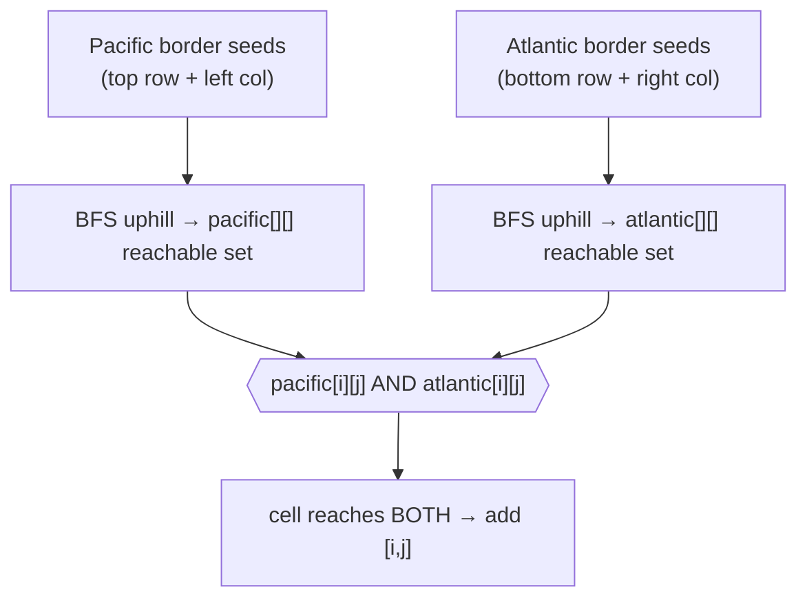

# 417. Pacific Atlantic Water Flow
`Medium` · **Pattern:** Multi-source BFS *from the borders inward* (reverse the flow)

> [!question] Problem
> There is an `m x n` rectangular island that borders both the **Pacific Ocean** (top & left edges) and the **Atlantic Ocean** (right & bottom edges). You are given `m x n` matrix `heights` where `heights[r][c]` is the height above sea level.
>
> Water can flow from a cell to a neighbouring cell (up/down/left/right) **only if** the neighbour's height is **less than or equal to** the current cell's height. Water reaches an ocean if it can flow to any cell adjacent to that ocean.
>
> Return a list of grid coordinates `[r, c]` where rain water can flow to **both** the Pacific and Atlantic oceans.
>
> **Example 1:**
> ```
> Input: heights = [[1,2,2,3,5],
>                   [3,2,3,4,4],
>                   [2,4,5,3,1],
>                   [6,7,1,4,5],
>                   [5,1,1,2,4]]
> Output: [[0,4],[1,3],[1,4],[2,2],[3,0],[3,1],[4,0]]
> ```
>
> **Constraints:**
> - `m == heights.length`, `n == heights[r].length`
> - `1 <= m, n <= 200`
> - `0 <= heights[r][c] <= 10^5`

---

## 🧩 Pattern this follows

> [!tip] Don't flow *out* from every cell — flow *in* from each ocean
> Testing "can this cell reach the ocean?" for all `m·n` cells is expensive. **Reverse it:** start at the ocean-border cells and ask "which cells can water reach *me* from?" — i.e. climb to neighbours that are **equal or higher**. Run one **multi-source BFS** seeded with the whole Pacific border, another seeded with the whole Atlantic border. A cell reachable in **both** floods to both oceans → it's in the answer (set **intersection**).
>
> Key inversion: forward flow goes to **lower-or-equal** neighbours; going backward from the ocean, you move to **higher-or-equal** neighbours (`heights[cur] <= heights[next]` allowed, `heights[cur] > heights[next]` blocked).

### 🖼️ Visualizing it

Two independent floods; the overlap is the result.



## 💻 My Solution (C++)

```cpp
class Solution {
public:
    vector<vector<int>> pacificAtlantic(vector<vector<int>>& heights) {
        vector<vector<int>> ans;
        int n=heights.size();
        int m=heights[0].size();
        vector<vector<bool>> atlantic(n,vector<bool>(m,false));

        int rows[]={1,-1,0,0};
        int cols[]={0,0,1,-1};

        queue<pair<int,int>> q;

        for(int i=0;i<n;i++){
            q.push({i,m-1});
            atlantic[i][m-1]=true;
        }

        for(int i=0;i<m;i++){
            q.push({n-1,i});
            atlantic[n-1][i]=true;

        }

        while(!q.empty()){
            int x=q.front().first;
            int y=q.front().second;
            q.pop();
            for(int i=0;i<4;i++){
                int nx=x+rows[i];
                int ny=y+cols[i];

                if(nx<0 || ny<0 || nx>=n || ny>=m){
                    continue;
                }

                if(heights[x][y]>heights[nx][ny] || atlantic[nx][ny]){
                    continue;
                }

                atlantic[nx][ny]=true;
                q.push({nx,ny});

            }
        }

        vector<vector<bool>> pacific(n,vector<bool>(m,false));


        for(int i=0;i<n;i++){
            q.push({i,0});
            pacific[i][0]=true;
        }

        for(int i=0;i<m;i++){
            q.push({0,i});
            pacific[0][i]=true;

        }

        while(!q.empty()){
            int x=q.front().first;
            int y=q.front().second;
            q.pop();

            for(int i=0;i<4;i++){
                int nx=x+rows[i];
                int ny=y+cols[i];

                if(nx<0 || ny<0 || nx>=n || ny>=m){
                    continue;
                }

                if(heights[x][y]>heights[nx][ny] || pacific[nx][ny]){
                    continue;
                }
                pacific[nx][ny]=true;
                q.push({nx,ny});
            }
        }

        for(int i=0;i<n;i++){
            for(int j=0;j<m;j++){
                if(pacific[i][j] && atlantic[i][j]){
                    ans.push_back({i,j});
                }
            }
        }

        return ans;

    }
};
```

## 🔍 Walkthrough

1. **Atlantic flood.** Seed the queue with the whole **right column** and **bottom row** (Atlantic-adjacent cells), marking them `atlantic = true`.
2. BFS outward: from `(x,y)` step to `(nx,ny)` only if in-bounds, not already marked, and **`heights[x][y] <= heights[nx][ny]`** — i.e. the neighbour is at least as high (water could have flowed *down* from it to us). Mark and enqueue.
3. **Pacific flood.** Reuse the (now-empty) queue, seed with the **left column** and **top row**, mark `pacific = true`, run the identical uphill BFS into `pacific[][]`.
4. **Intersect.** Any cell with `pacific[i][j] && atlantic[i][j]` drains to both oceans → push `[i, j]` into `ans`.
5. The guard `heights[x][y] > heights[nx][ny] || visited` bundles both "too low to climb to" and "already seen" into one skip.

## ⏱️ Complexity

| | Complexity | Why |
|---|---|---|
| **Time** | O(m·n) | Each cell enqueued at most once per ocean → two full grid sweeps |
| **Space** | O(m·n) | Two `bool` grids + the BFS queue |

## 🚀 Tricks & Similar Problems

> [!success] "Reverse the direction" is the whole insight
> Naively simulating flow from every cell is `O((m·n)²)`. Flooding **backwards from the sinks** (the oceans) collapses it to two linear passes. Whenever a problem asks "which sources reach a target," consider searching *from the target outward* instead. BFS and DFS both work here — the queue vs. stack choice doesn't change the reachable set.
> **Similar pattern:** [[Rotting Oranges (LeetCode #994)]] (multi-source BFS from all rotten cells at once), [[Walls and Gates (LeetCode #286)]] (multi-source BFS from all gates).
