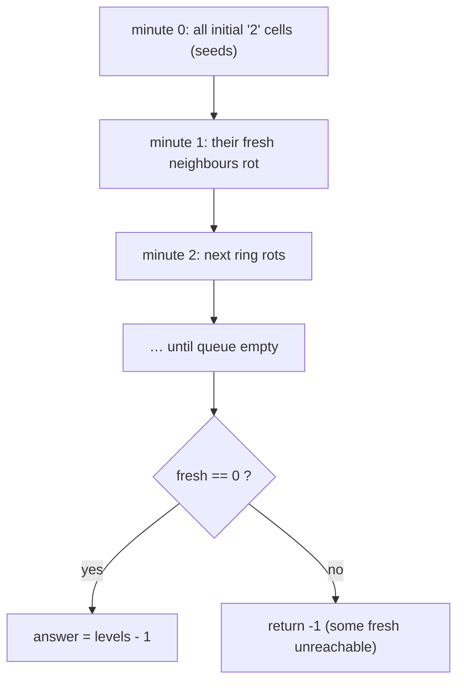

# 994. Rotting Oranges
`Medium` · **Pattern:** Multi-source BFS, count the levels (= minutes)

> [!question] Problem
> You are given an `m x n` grid where each cell can have one of three values:
> - `0` — an empty cell,
> - `1` — a **fresh** orange,
> - `2` — a **rotten** orange.
>
> Every minute, any fresh orange that is **4-directionally adjacent** to a rotten orange becomes rotten. Return the **minimum number of minutes** that must elapse until no cell has a fresh orange. If this is impossible, return `-1`.
>
> **Example 1:**
> ```
> Input: grid = [[2,1,1],[1,1,0],[0,1,1]]
> Output: 4
> ```
>
> **Example 2:**
> ```
> Input: grid = [[2,1,1],[0,1,1],[1,0,1]]
> Output: -1
> Explanation: The bottom-left orange (2,0) is never reached.
> ```
>
> **Example 3:**
> ```
> Input: grid = [[0,2]]
> Output: 0
> Explanation: No fresh oranges at minute 0, so answer is 0.
> ```
>
> **Constraints:**
> - `m == grid.length`, `n == grid[i].length`
> - `1 <= m, n <= 10`
> - `grid[i][j]` is `0`, `1`, or `2`.

---

## 🧩 Pattern this follows

> [!tip] All rotten oranges spread *simultaneously* → level-order BFS
> Rot spreads one ring outward every minute, from **every** rotten orange **at once**. That's textbook **multi-source BFS**: seed the queue with *all* initial rotten cells, then process the queue **one level at a time** — each completed level is one minute ticking by. The minimum minutes to rot everything = the number of BFS levels. Track `fresh` count; if any fresh orange survives (unreachable), return `-1`.

### 🖼️ Visualizing it

Each colour ring = one minute; the deepest ring reached is the answer.



## 💻 My Solution (C++)

```cpp
class Solution {
public:

    int orangesRotting(vector<vector<int>>& grid) {
        int n=grid.size();
        int m=grid[0].size();

        queue<pair<int,int>> q;
        int fresh=0;
        int rotten=0;
        for(int i=0;i<n;i++){
            for(int j=0;j<m;j++){
                if(grid[i][j]==1){
                    fresh++;
                }else if(grid[i][j]==2){
                    rotten++;
                    q.push({i,j});
                }
            }
        }
        int ans=0;
        int row[]={1,-1,0,0};
        int col[]={0,0,1,-1};

        while(!q.empty()){
            int qSize=q.size();

            for(int i=0;i<qSize;i++){
                int x=q.front().first;
                int y=q.front().second;
                q.pop();
                for(int k=0;k<4;k++){
                    int nx=x+row[k];
                    int ny=y+col[k];

                    if(nx<0 || ny<0 || nx>=n || ny>=m){
                        continue;
                    }

                    if(grid[nx][ny]!=1){
                        continue;
                    }

                    fresh--;
                    grid[nx][ny]=2;
                    q.push({nx,ny});


                }
            }
            ans++;
        }

        if(rotten==0 && fresh==0){
            return 0;
        }

        if(fresh!=0){
            return -1;
        }


        return ans-1;

    }
};
```

## 🔍 Walkthrough

1. **First pass:** count `fresh` (all `1`s) and enqueue **every** rotten cell (`2`) as a BFS seed; count `rotten` too.
2. **Level-by-level BFS.** Snapshot `qSize = q.size()` = all cells rotting *this* minute. Process exactly that many, then `ans++` — one minute elapsed.
3. For each cell, rot its 4 neighbours **only if fresh** (`grid[nx][ny] == 1`): decrement `fresh`, set it to `2`, enqueue it for next minute. Marking `2` in place doubles as the `visited` set.
4. **Edge cases after the loop:**
   - `rotten == 0 && fresh == 0` → empty/all-empty grid, nothing to do → `0`.
   - `fresh != 0` → some orange was never reached → `-1`.
5. **Return `ans - 1`.** The last `ans++` fires on an empty final expansion that rots nothing, so it over-counts by exactly one minute.

## ⏱️ Complexity

| | Complexity | Why |
|---|---|---|
| **Time** | O(m·n) | Every cell is enqueued/visited at most once; the initial scan is `O(m·n)` |
| **Space** | O(m·n) | Worst case the queue holds every cell (all oranges rotten at once) |

## 🚀 Tricks & Similar Problems

> [!success] The `qSize` snapshot is what makes levels = minutes
> Grabbing `q.size()` **before** the inner loop freezes "this minute's" frontier so newly-rotted oranges wait until the next iteration. Without it you'd blur all minutes into one. This "process a whole level, then tick a counter" is the standard BFS trick for shortest-time / shortest-distance on unweighted grids.
> **The `ans - 1` gotcha:** the final level adds nothing, so subtract one — or increment `ans` only when you actually rot something.
> **Similar pattern:** [[Pacific Atlantic Water Flow (LeetCode #417)]] and [[Walls and Gates (LeetCode #286)]] — both multi-source BFS from many seeds at once.
