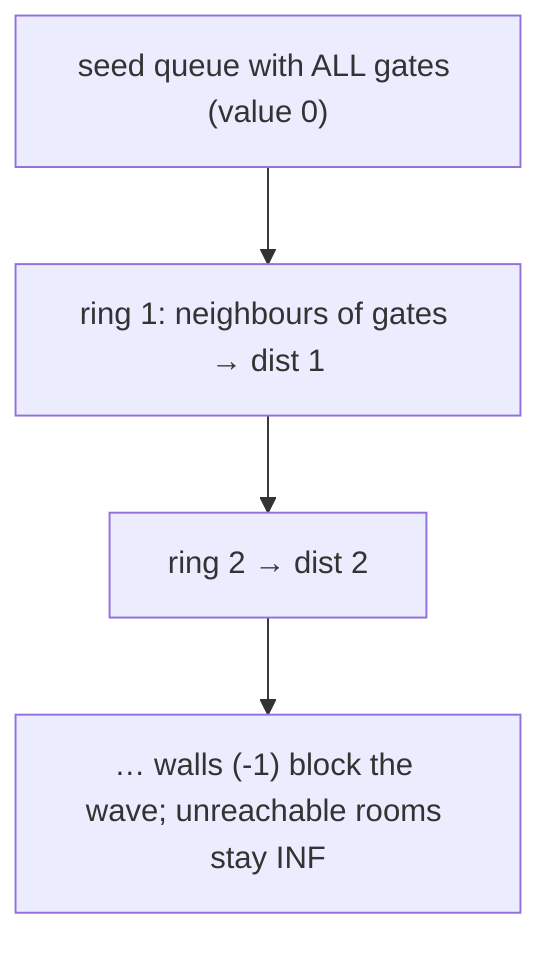

# 286. Walls and Gates
`Medium` · **Pattern:** Multi-source BFS from every gate at once

> [!question] Problem
> You are given an `m x n` grid `rooms` initialized with these three possible values:
> - `-1` — a **wall** or obstacle.
> - `0` — a **gate**.
> - `INF` (`2147483647`) — an **empty room**.
>
> Fill each empty room with the distance to its **nearest gate**. If it is impossible to reach a gate, leave `INF`.
>
> **Example:**
> ```
> Input:
> [[INF, -1,  0, INF],
>  [INF, INF, INF, -1],
>  [INF, -1, INF, -1],
>  [  0, -1, INF, INF]]
>
> Output:
> [[3, -1, 0, 1],
>  [2, 2, 1, -1],
>  [1, -1, 2, -1],
>  [0, -1, 3, 4]]
> ```
>
> **Constraints:**
> - `m == rooms.length`, `n == rooms[0].length`
> - `1 <= m, n <= 250`
> - `rooms[i][j]` is `-1`, `0`, or `2^31 - 1`.

---

## 🧩 Pattern this follows

> [!tip] Push *all* gates first, then BFS once — distances come out sorted
> Running a separate BFS from each empty room would be `O((m·n)²)`. Instead do **one multi-source BFS seeded with every gate (`0`) simultaneously**. Because BFS expands in rings, the **first** time a room is reached is guaranteed to be via its **nearest** gate — set `rooms[next] = rooms[cur] + 1` and never overwrite. The still-`INF` check doubles as the visited guard, so each room is filled exactly once.

### 🖼️ Visualizing it

All gates enter the queue at distance 0; the wavefront fills nearest-first.



## 💻 My Solution (C++)

```cpp
#include <iostream>
using namespace std;

class Solution {
public:

    

    int bfs(vector<vector<int>>& rooms){

        queue<pair<int,int>> q;

        for(int i=0;i<rooms.size();i++){
            for(int j=0;j<rooms[0].size();j++){
                if(rooms[i][j]==0){
                    q.push({i,j});
                }
            }
        }

        int dist=0;
        while(!q.empty()){
        
            int x= q.front().first;
            int y= q.front().second;
            q.pop();

            int row[]={1,-1,0,0};
            int col[]={0,0,1,-1};

            for(int k=0;k<4;k++){

                int i=x+row[k];
                int j=y+col[k];

                if(i<0 || j<0 || i>=rooms.size() || j>=rooms[0].size()){
                    continue;
                }

                if(rooms[i][j]!=INT_MAX){
                    continue;
                }

                rooms[i][j]=rooms[x][y]+1;
                q.push({i,j});

            }
            
        }

    }

    void wallsAndGates(vector<vector<int>>& rooms) {
        vector<vector<int>> visited(rooms.size(),vector<int> (rooms[0].size()));

        for(int i=0;i<rooms.size();i++){
            for(int j=0;j<rooms[0].size();j++){
                if(visited[i][j]==0 && rooms[i][j]==INT_MAX){
                    rooms[i][j]=dfs(rooms,visited,i,j);
                }
            }
        }
    }
};

int main() {

    const int INF = 2147483647;

    vector<vector<int>> rooms = {
        {INF, -1, 0, INF},
        {INF, INF, INF, -1},
        {INF, -1, INF, -1},
        {0, -1, INF, INF}
    };

    Solution obj;
    obj.wallsAndGates(rooms);

    for (auto &row : rooms) {
        for (int x : row)
            cout << x << " ";
        cout << endl;
    }

    return 0;
}
```

## 🔍 Walkthrough

The intended approach is the `bfs` helper — a single multi-source BFS:

1. **Seed:** scan the grid, push every gate (`rooms[i][j] == 0`) into the queue. All gates start at distance 0.
2. **Expand:** pop `(x, y)`, look at its 4 neighbours `(i, j)`.
3. Skip out-of-bounds. Skip anything that isn't `INT_MAX` — that catches **walls** (`-1`), **gates** (`0`), and **already-filled** rooms in one condition, so it's the visited guard too.
4. A fresh `INF` room gets `rooms[i][j] = rooms[x][y] + 1` (one step farther than the cell that reached it) and is enqueued. First touch = nearest gate, so it's never revisited.
5. Rooms no gate can reach are never enqueued → they keep `INF`, exactly as required.

> [!warning] Code wiring won't compile as pasted
> The working logic lives in `bfs`, but `wallsAndGates` calls `rooms[i][j] = dfs(rooms, visited, i, j)` — there is **no** `dfs` defined here, and `bfs` is declared `int` yet returns nothing. To run it: call `bfs(rooms);` directly inside `wallsAndGates` (drop the per-cell loop and the `visited` grid — the `!= INT_MAX` check already handles visited). Kept as-you-wrote-it for your revision; fix the two lines before submitting.

## ⏱️ Complexity

| | Complexity | Why |
|---|---|---|
| **Time** | O(m·n) | Each room enqueued at most once; the seed scan is `O(m·n)` |
| **Space** | O(m·n) | Queue holds the current wavefront, up to the whole grid |

## 🚀 Tricks & Similar Problems

> [!success] "Nearest source among many" ⇒ seed them all, BFS once
> The moment a problem asks for distance to the *nearest* of several sources, resist per-cell searches — push **all** sources into the queue first and let one BFS ripple outward. `!= INT_MAX` neatly folds "wall / source / visited" into a single skip. The `dist` variable here is vestigial; the distance is carried in the cell value (`parent + 1`).
> **Similar pattern:** [[Rotting Oranges (LeetCode #994)]] (multi-source, minutes = BFS levels), [[Pacific Atlantic Water Flow (LeetCode #417)]] (multi-source from each ocean border).
