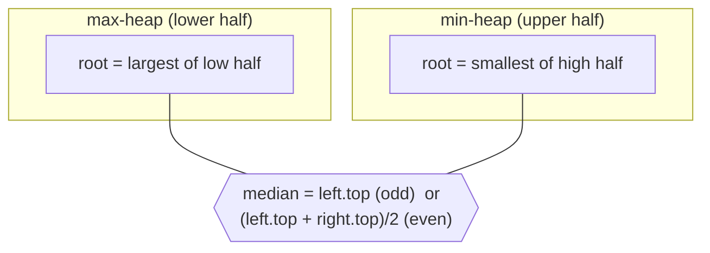

# 295. Find Median from Data Stream
`Hard` · **Pattern:** Two heaps — max-heap (lower half) + min-heap (upper half)

> [!question] Problem
> The **median** is the middle value in an ordered list; with an even count it's the average of the two middle values. Design a data structure supporting a stream:
> - `MedianFinder()` initializes the object.
> - `void addNum(int num)` adds an integer to the data structure.
> - `double findMedian()` returns the median of all elements so far.
>
> **Example:**
> ```
> addNum(1); addNum(2); findMedian();  // 1.5
> addNum(3);            findMedian();  // 2.0
> ```
>
> **Constraints:**
> - `-10^5 <= num <= 10^5`
> - At most `5 * 10^4` calls; `findMedian` called only after ≥1 `addNum`.

---

## 🧩 Pattern this follows

> [!tip] Split the data at the median: a max-heap below, a min-heap above
> Keep the **smaller half** in a **max-heap** (`left` — its root is the largest of the low values) and the **larger half** in a **min-heap** (`right` — its root is the smallest of the high values). The two roots are exactly the two values straddling the median. Keep the sizes balanced (`left` equal to or one bigger than `right`). Then:
> - **Odd total** → median = `left.top()`.
> - **Even total** → median = average of the two roots.
>
> Both roots are `O(1)` to read and each insert is `O(log n)` — far better than re-sorting.

### 🖼️ Visualizing it

The two heaps meet at the median; roots are the middle element(s).



## 💻 My Solution (C++)

```cpp
class MedianFinder {
public:

     // Max heap -> stores the smaller half
    priority_queue<int> left;

    // Min heap -> stores the larger half
    priority_queue<int, vector<int>, greater<int>> right;

    MedianFinder() {
        
    }
    
    void addNum(int num) {
        // Step 1: Always push into left (max heap)
        left.push(num);

        // Step 2: Move the largest element from left to right
        right.push(left.top());
        left.pop();

        // Step 3: Keep left having equal or one extra element
        if (right.size() > left.size()) {
            left.push(right.top());
            right.pop();
        }
    }
    
    double findMedian() {
        if (left.size() > right.size()) {
            return left.top();
        }

        return (left.top() + right.top()) / 2.0;

    }
};
```

## 🔍 Walkthrough

1. `left` = max-heap (lower half), `right` = min-heap (upper half).
2. **`addNum`** with a clean balancing trick:
   - **Step 1:** push `num` into `left`.
   - **Step 2:** move `left.top()` (its current max) over to `right`. This guarantees every element in `left` is ≤ every element in `right` (the two halves stay correctly ordered).
   - **Step 3:** if `right` now has more elements than `left`, move `right.top()` back to `left` — keeping `left` equal to, or one larger than, `right`.
3. **`findMedian`:**
   - `left` bigger → odd count → the extra element `left.top()` is the median.
   - Equal sizes → even count → average the two roots `(left.top() + right.top()) / 2.0`.

## ⏱️ Complexity

| | Complexity | Why |
|---|---|---|
| **`addNum`** | O(log n) | A few heap push/pop operations |
| **`findMedian`** | O(1) | Just reads one or two roots |
| **Space** | O(n) | All elements stored across the two heaps |

## 🚀 Tricks & Similar Problems

> [!success] The push→shift→rebalance dance keeps both order *and* size invariant automatically
> Rather than manually deciding which heap a number belongs to, this code always routes it `left → right`, then corrects the size — guaranteeing (a) `max(left) <= min(right)` and (b) `|sizes|` differ by ≤1, in a handful of `O(log n)` ops. That's the whole two-heap median pattern.
> **Similar pattern:** "Sliding Window Median" (two heaps + lazy deletion), "IPO" (two heaps). This is the capstone of the [[0 — Heap Study Roadmap]].
