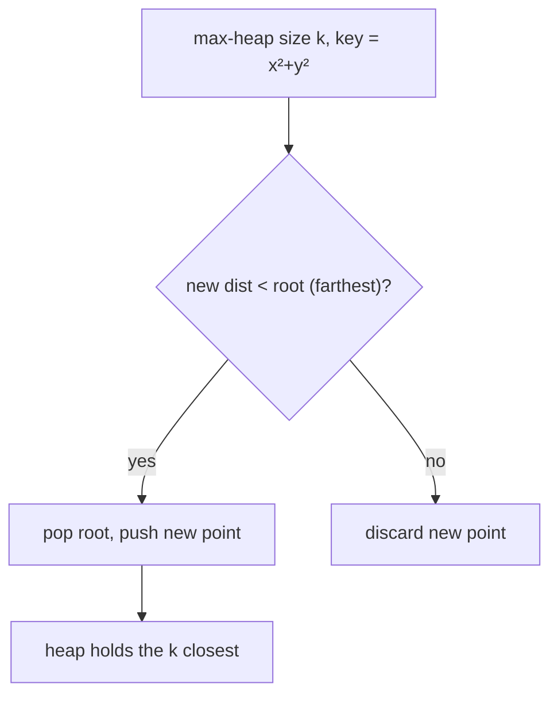

# 973. K Closest Points to Origin
`Medium` · **Pattern:** Fixed-size **max-heap** of size `k` (keep the `k` smallest distances)

> [!question] Problem
> Given an array of `points` where `points[i] = [xᵢ, yᵢ]` on the 2-D plane and an integer `k`, return the `k` **closest** points to the origin `(0, 0)`. The distance is the Euclidean distance. You may return the answer in **any order**.
>
> **Example 1:**
> ```
> Input: points = [[1,3],[-2,2]], k = 1
> Output: [[-2,2]]
> ```
>
> **Example 2:**
> ```
> Input: points = [[3,3],[5,-1],[-2,4]], k = 2
> Output: [[3,3],[-2,4]]
> ```
>
> **Constraints:**
> - `1 <= k <= points.length <= 10^4`
> - `-10^4 <= xᵢ, yᵢ <= 10^4`

---

## 🧩 Pattern this follows

> [!tip] To keep the `k` SMALLEST, use a MAX-heap of size `k`
> Mirror image of the "k largest" rule: for the `k` **closest** (smallest distances) hold a **max-heap** capped at `k`, keyed by distance. Its root is the *worst* (farthest) of the current best `k`. When a new point is closer than the root, evict the root and insert it. Compare **squared** distances (`x² + y²`) — no `sqrt` needed since it's monotonic.

### 🖼️ Visualizing it

Max-heap of size `k` on distance; root = current farthest kept, replaced when beaten.



## 💻 My Solution (C++)

```cpp
class Solution {
public:
    vector<vector<int>> kClosest(vector<vector<int>>& points, int k) {
        
        vector<vector<int>> ans;
        priority_queue<pair<int,int>> pq;

        for(int i=0;i< points.size();i++){
            long long x=points[i][0];
            long long y=points[i][1];

            long long distance = x*x + y*y;
            if(pq.size()>=k){
                if(pq.top().first>distance){
                    pq.pop();   
                    pq.push({distance,i});
                }
            }else{
                pq.push({distance,i});
            }

            
        }

        while(!pq.empty()){
            vector<int> v;
            v.push_back(points[pq.top().second][0]);
            v.push_back(points[pq.top().second][1]);
            ans.push_back(v);
            pq.pop();
        }

        return ans;

    }
};
```

## 🔍 Walkthrough

1. `pq` is a **max-heap** of `{distance, index}` — `priority_queue<pair<int,int>>` orders by `first` (distance) descending, so the root is the **farthest** kept point.
2. For each point compute the **squared** distance `x*x + y*y` (cast to `long long` to avoid overflow at the coordinate extremes).
3. If the heap is full (`size >= k`) **and** the new distance beats the root (`pq.top().first > distance`), pop the farthest and push the new point. Otherwise, if not yet full, just push.
4. After the scan, the heap holds the `k` closest by index; drain it, mapping each stored index back to its `[x, y]` into `ans`.

## ⏱️ Complexity

| | Complexity | Why |
|---|---|---|
| **Time** | O(n log k) | Each of `n` points does `O(log k)` heap work |
| **Space** | O(k) | Heap capped at `k` |

## 🚀 Tricks & Similar Problems

> [!success] Squared distance + `long long` = no sqrt, no overflow
> Skip `sqrt` — comparing `x²+y²` gives the same ordering and stays integer. But `x²+y²` can exceed `int` range (`10⁴² · 2`), so compute in `long long`. Storing the **index** (not the point) keeps the heap payload tiny.
> **Alternative:** Quickselect partitions to the `k` closest in `O(n)` average.
> **Similar pattern:** [[Kth Largest Element in an Array (LeetCode #215)]] & [[Kth Largest Element in a Stream (LeetCode #703)]] (mirror: min-heap for k-largest). See the [[0 — Heap Study Roadmap]].
