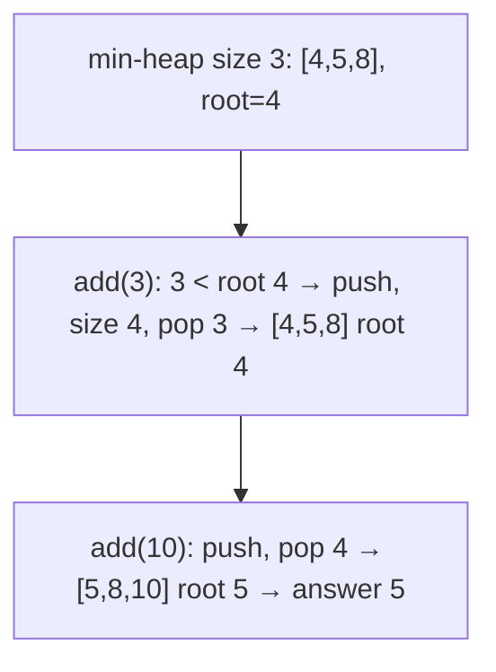

# 703. Kth Largest Element in a Stream
`Easy` · **Pattern:** Fixed-size **min-heap** of size `k` — the top is the answer

> [!question] Problem
> Design a class to find the `k`th largest element in a stream. It is the `k`th largest in **sorted order**, not the `k`th distinct element.
> - `KthLargest(int k, int[] nums)` initializes with `k` and the initial stream `nums`.
> - `int add(int val)` appends `val` to the stream and returns the `k`th largest element so far.
>
> **Example:**
> ```
> KthLargest kth = new KthLargest(3, [4,5,8,2]);
> kth.add(3);   // 4
> kth.add(5);   // 5
> kth.add(10);  // 5
> kth.add(9);   // 8
> kth.add(4);   // 8
> ```
>
> **Constraints:**
> - `1 <= k <= 10^4`, `0 <= nums.length <= 10^4`
> - `-10^4 <= nums[i], val <= 10^4`, at least `k` elements when `add` is called.

---

## 🧩 Pattern this follows

> [!tip] Keep exactly the `k` largest in a MIN-heap — its root is the `k`th largest
> Counter-intuitive but key: to track the `k` **largest**, use a **min**-heap capped at size `k`. The heap holds the top-`k` values, and its **smallest** (the root) is precisely the `k`th largest. On each `add`, push, then pop while `size > k` — that evicts the current smallest, keeping only the `k` biggest. Answer = `pq.top()`.

### 🖼️ Visualizing it

`k=3`, stream `4,5,8,2` → heap keeps `{4,5,8}`; root `4` = 3rd largest. add(3) < 4 so nothing changes → still 4.



## 💻 My Solution (C++)

```cpp
class KthLargest {
public:

    priority_queue<int,vector<int>,greater<int>> pq;
    int cap=0;

    KthLargest(int k, vector<int>& nums) {
       cap=k;
       for(int i=0;i<nums.size();i++){
            pq.push(nums[i]);
            if(pq.size()>k){
                pq.pop();
            }
            
        }

    }
    
    int add(int val) {
        if(pq.empty() || pq.size()<cap || pq.top()<val){
            pq.push(val);
        }
        while(pq.size()>cap){
            pq.pop();
        }
        return pq.top();
    }
};
```

## 🔍 Walkthrough

1. `pq` is a **min-heap** (`greater<int>` comparator); `cap = k` is the target size.
2. **Constructor:** push each initial number, and whenever `size > k`, pop the smallest — so `pq` ends holding the `k` largest of `nums`.
3. **`add(val):`** push `val` if the heap isn't yet full **or** `val` beats the current smallest (`pq.top() < val`) — a value smaller than the root can't be in the top `k` anyway.
4. Trim back to size `k` with the `while` pop.
5. Return `pq.top()` — the smallest of the `k` largest = the `k`th largest.

## ⏱️ Complexity

| | Complexity | Why |
|---|---|---|
| **Constructor** | O(n log k) | Each of `n` inserts is `O(log k)` (heap capped at `k`) |
| **`add`** | O(log k) | One push + at most one pop |
| **Space** | O(k) | Heap never exceeds `k` elements |

## 🚀 Tricks & Similar Problems

> [!success] "k largest ⇒ min-heap of size k" (and vice-versa)
> The heap type is the opposite of what your gut says: **min**-heap for **largest**-k, **max**-heap for **smallest**-k. Cap it at `k` and the root is your answer in `O(log k)` — far better than re-sorting the whole stream each query.
> **Similar pattern:** [[Kth Largest Element in an Array (LeetCode #215)]] (same size-`k` min-heap, static input), [[K Closest Points to Origin (LeetCode #973)]] (size-`k` heap on distance). See the [[0 — Heap Study Roadmap]].
