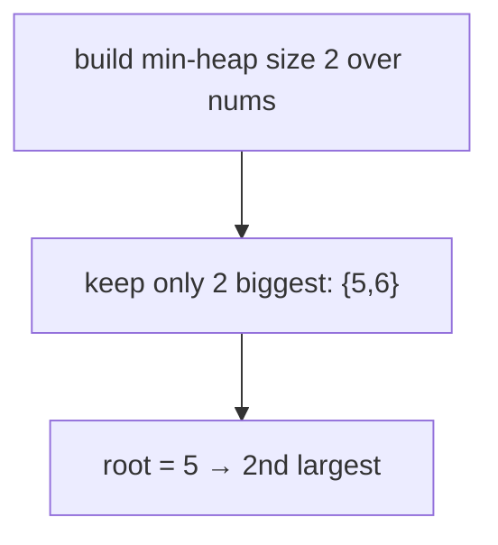

# 215. Kth Largest Element in an Array
`Medium` · **Pattern:** Fixed-size min-heap of size `k` (top-K)

> [!question] Problem
> Given an integer array `nums` and an integer `k`, return the `k`th **largest** element in the array. It is the `k`th largest in **sorted order**, not the `k`th distinct element. Can you solve it without sorting?
>
> **Example 1:**
> ```
> Input: nums = [3,2,1,5,6,4], k = 2
> Output: 5
> ```
>
> **Example 2:**
> ```
> Input: nums = [3,2,3,1,2,4,5,5,6], k = 4
> Output: 4
> ```
>
> **Constraints:**
> - `1 <= k <= nums.length <= 10^5`
> - `-10^4 <= nums[i] <= 10^4`

---

## 🧩 Pattern this follows

> [!tip] Same size-`k` min-heap as the streaming version — the root is the answer
> Maintain a **min-heap holding the `k` largest values seen**. Iterate `nums`: if the heap has `< k` items, push; otherwise, if the current number beats the smallest of the top-k (`pq.top() < n`), evict the root and push the newcomer. After one pass, `pq.top()` is the `k`th largest. Identical idea to [[Kth Largest Element in a Stream (LeetCode #703)]], just over a static array.

### 🖼️ Visualizing it

`k=2`, `[3,2,1,5,6,4]` → heap ends `{5,6}`, root `5` = 2nd largest.



## 💻 My Solution (C++)

```cpp
class Solution {
public:
    int findKthLargest(vector<int>& nums, int k) {
        
        priority_queue<int,vector<int>,greater<int>> pq;

        for(int n: nums){
            if(pq.size()<k){
                pq.push(n);
            }else{
                if(pq.top()<n){
                    pq.pop();
                    pq.push(n);
                }
            }
        }

        
            return pq.top();
        


    }
};
```

## 🔍 Walkthrough

1. `pq` is a **min-heap** of capacity `k`.
2. For each `n`: if fewer than `k` elements, just push. Otherwise compare with the root — if `n` is bigger than the smallest in the top-k (`pq.top() < n`), pop the root and push `n`.
3. Numbers smaller than the current root are ignored — they can't be among the `k` largest.
4. After the pass, `pq.top()` (the smallest of the retained `k` largest) is the `k`th largest overall.

## ⏱️ Complexity

| | Complexity | Why |
|---|---|---|
| **Time** | O(n log k) | `n` elements, each `O(log k)` heap op — beats `O(n log n)` full sort |
| **Space** | O(k) | Heap capped at `k` |

## 🚀 Tricks & Similar Problems

> [!success] Heap gives O(n log k); Quickselect gives O(n) average
> The heap is the clean, safe answer. For the theoretical optimum, **Quickselect** (partition around a pivot, like quicksort but recurse into only one side) finds the `k`th largest in **O(n) average** (`O(n²)` worst). Mention both in interviews; code the heap.
> **Similar pattern:** [[Kth Largest Element in a Stream (LeetCode #703)]] (same heap, streaming), [[K Closest Points to Origin (LeetCode #973)]] (top-k by distance). See the [[0 — Heap Study Roadmap]].
