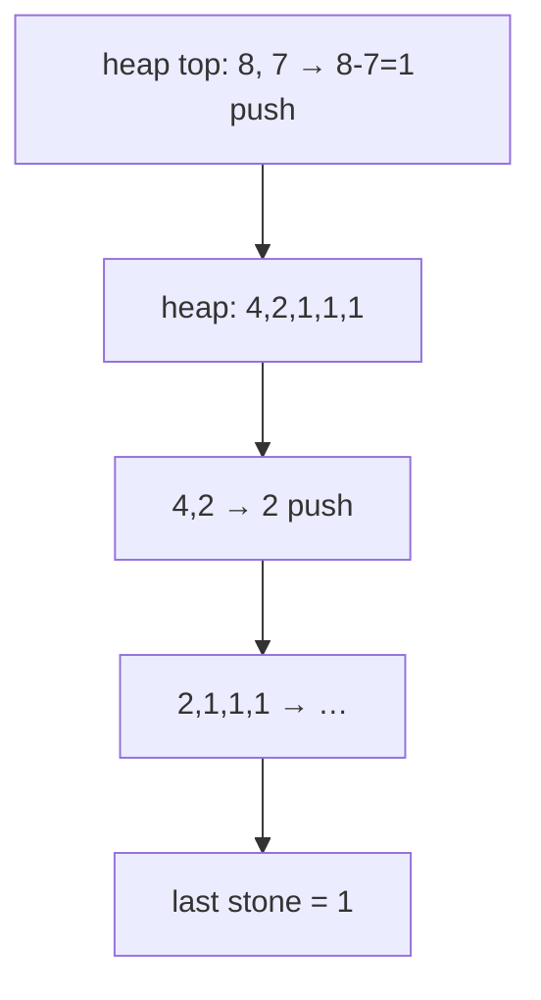

# 1046. Last Stone Weight
`Easy` · **Pattern:** Max-heap — repeatedly smash the two heaviest

> [!question] Problem
> You are given an array of integers `stones` where `stones[i]` is the weight of the `i`th stone. Each turn, pick the **two heaviest** stones and smash them together:
> - If `x == y`, both are destroyed.
> - If `x != y`, the lighter is destroyed and the heavier becomes `y - x`.
>
> At the end there is **at most one** stone left. Return its weight (or `0` if none remain).
>
> **Example 1:**
> ```
> Input: stones = [2,7,4,1,8,1]
> Output: 1
> ```
>
> **Example 2:**
> ```
> Input: stones = [1]
> Output: 1
> ```
>
> **Constraints:**
> - `1 <= stones.length <= 30`
> - `1 <= stones[i] <= 1000`

---

## 🧩 Pattern this follows

> [!tip] "Always grab the current max" ⇒ max-heap
> Every turn needs the two **largest** stones, and the smash result re-enters the pool and may again be a max later. A **max-heap** (`priority_queue<int>` in C++, which is a max-heap by default) gives `O(log n)` access to the top and `O(log n)` reinsertion. Pop two, push back the difference if non-zero, repeat until ≤1 stone remains.

### 🖼️ Visualizing it

`[8,7,4,2,1,1]` → smash 8,7 → push 1 → `[4,2,1,1,1]` → … → `1`.



## 💻 My Solution (C++)

```cpp
class Solution {
public:
    int lastStoneWeight(vector<int>& stones) {
        priority_queue<int> pq;

        if(stones.size()==1){
            return stones[0];
        }

        for(int i=0;i<stones.size();i++){
            pq.push(stones[i]);
        }

        while(pq.size()>1){
            int a=pq.top();
            pq.pop();
            int b=pq.top();
            pq.pop();
            if(a!=b){
                pq.push(a-b);
            }
            
        }
        if(!pq.empty()){
           return pq.top();
        }
        return 0;
    }
};
```

## 🔍 Walkthrough

1. Single-stone shortcut returns it directly.
2. Push all stones into a **max-heap** (`priority_queue<int>` is max by default).
3. While ≥2 stones remain: pop `a` (heaviest) and `b` (2nd heaviest). Since `a >= b`, the survivor is `a - b`; push it back **only if non-zero** (`a != b`).
4. After the loop: return the lone survivor, or `0` if the heap emptied.

## ⏱️ Complexity

| | Complexity | Why |
|---|---|---|
| **Time** | O(n log n) | Up to `n` smashes, each doing `O(log n)` heap ops |
| **Space** | O(n) | The heap holds all stones |

## 🚀 Tricks & Similar Problems

> [!success] `priority_queue<int>` is a MAX-heap by default in C++
> Remember the default is max-heap; for a **min**-heap you write `priority_queue<int, vector<int>, greater<int>>`. This "repeatedly take the extreme, process, reinsert" loop is the core heap-simulation shape.
> **Similar pattern:** [[Kth Largest Element in a Stream (LeetCode #703)]] (streaming heap), [[Kth Largest Element in an Array (LeetCode #215)]]. See the [[0 — Heap Study Roadmap]].
