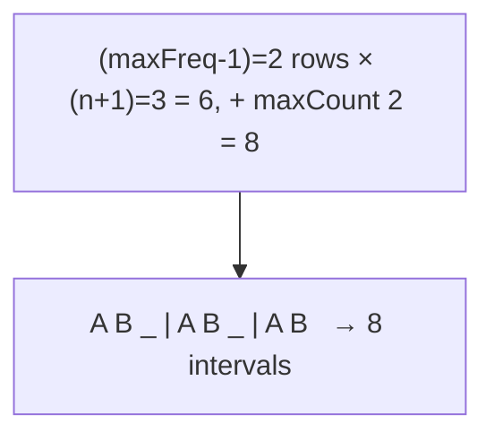

# 621. Task Scheduler
`Medium` · **Pattern:** Greedy — fill the cooldown around the most-frequent task (math formula)

> [!question] Problem
> Given a characters array `tasks` (each a task labeled `A`–`Z`) and a non-negative integer `n`, each task takes one unit of time. In each unit you either run a task or stay idle. The **same** task must be separated by **at least `n`** intervals of cooldown. Return the **minimum** number of intervals to finish all tasks.
>
> **Example 1:**
> ```
> Input: tasks = ["A","A","A","B","B","B"], n = 2
> Output: 8
> Explanation: A → B → idle → A → B → idle → A → B
> ```
>
> **Example 2:**
> ```
> Input: tasks = ["A","C","A","B","D","B"], n = 1
> Output: 6
> ```
>
> **Example 3:**
> ```
> Input: tasks = ["A","A","A","B","B","B"], n = 3
> Output: 10
> ```
>
> **Constraints:**
> - `1 <= tasks.length <= 10^4`, tasks are uppercase letters.
> - `0 <= n <= 100`

---

## 🧩 Pattern this follows

> [!tip] The most-frequent task sets a rigid skeleton; everything else slots into the gaps
> Two ways to see this problem:
> - **Heap way (the topic):** repeatedly run the currently most-frequent available task, park it on cooldown, and cycle a max-heap `n+1` slots at a time.
> - **Greedy math way (your solution):** the task with max frequency `maxFreq` forces `(maxFreq - 1)` full blocks of length `(n + 1)`, plus a final block holding every task that *ties* the max frequency (`maxCount`). That gives `slots = (maxFreq - 1) * (n + 1) + maxCount`. If there are so many *distinct* tasks that no idling is ever needed, the answer is simply `tasks.size()` — hence `max(tasks.size(), slots)`.

### 🖼️ Visualizing it

`AAABBB, n=2`: `maxFreq=3`, `maxCount=2` (A and B tie). Rows of width `n+1=3`:



## 💻 My Solution (C++)

```cpp
class Solution {
public:
    int leastInterval(vector<char>& tasks, int n) {
        
        vector<int> freq(26,0);

        for(char c:tasks){
            freq[c-'A']++;
        }

        int maxFreq=0;
        for(int i=0;i<26;i++){
            maxFreq=max(maxFreq,freq[i]);
        }

        int maxCount=0;

        for(int i=0;i<26;i++){
            if(freq[i]==maxFreq){
                maxCount++;
            }
        }

        int slots=(maxFreq-1)*(n+1)+maxCount;

        return max((int)tasks.size(),slots);

    }
};
```

## 🔍 Walkthrough

1. **Count frequencies** of all 26 letters.
2. `maxFreq` = the highest frequency — this task is the bottleneck that dictates the layout.
3. `maxCount` = how many tasks **share** that max frequency (they all need a spot in the final partial block).
4. **Formula:** `slots = (maxFreq - 1) * (n + 1) + maxCount`:
   - `(maxFreq - 1)` complete rows, each of width `(n + 1)` (one run of the hot task + `n` cooldown units),
   - `+ maxCount` for the last row that just places each max-frequency task once (no trailing idle needed).
5. **`max(tasks.size(), slots)`** — when there are enough distinct tasks to fill every gap, no idling occurs and the true answer is just the task count. The formula can *undercount* in that case, so take the larger.

## ⏱️ Complexity

| | Complexity | Why |
|---|---|---|
| **Time** | O(N + 26) = O(N) | One pass to count, constant work over 26 letters |
| **Space** | O(26) = O(1) | Fixed frequency array |

## 🚀 Tricks & Similar Problems

> [!success] The `max(tasks.size(), slots)` guard is the subtle part
> The formula assumes idle time is needed to honor cooldown. But if there are **many distinct tasks**, the gaps fill with real work and there are *zero* idles — then the answer is simply `tasks.size()`. Forgetting this guard fails cases like Example 2. This math approach is `O(n)` and `O(1)` space; the **heap approach** (max-heap + a cooldown queue) reaches the same answer while actually producing a schedule.
> **Similar pattern:** greedy "spread out the most frequent" also appears in "Reorganize String" (#767) and "Rearrange String k Distance Apart". See the [[0 — Heap Study Roadmap]].
