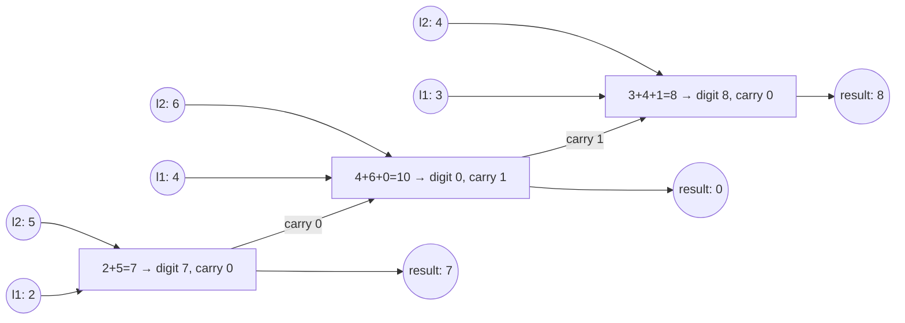

# 2. Add Two Numbers
`Medium` · **Pattern:** Simulate grade-school addition, digit by digit, with a carry

> [!question] Problem
> You are given two non-empty linked lists representing two non-negative integers, with digits stored in **reverse order** (least significant digit first), each node holding a single digit.
> Add the two numbers and return the sum as a linked list, in the same reverse-digit format.
> Assume no leading zeros, except the number `0` itself.
>
> **Example:**
> ```
> Input: l1 = [2,4,3], l2 = [5,6,4]
> Output: [7,0,8]
> Explanation: 342 + 465 = 807.
> ```
>
> **Constraints:**
> - Each list has `[1, 100]` nodes
> - `0 <= Node.val <= 9`

---

## 🧩 Pattern this follows

> [!tip] Reverse-digit storage is a gift — it matches how addition actually works
> Normally you'd add two numbers starting from the **least significant digit**, which is annoying with numbers stored most-significant-digit-first (you'd need to reverse first). Here, the digits are already stored **least-significant-first**, so walking both lists head-to-tail *is* walking the numbers from ones-place upward — exactly the order grade-school column addition needs. Just track a running `carry`, same as adding on paper.

### 🖼️ Visualizing it

`l1 = [2,4,3]`, `l2 = [5,6,4]` (i.e. `342 + 465`), with the carry flowing left to right between digit sums:



## 💻 My Solution (C++)

```cpp
class Solution {
public:
    ListNode* addTwoNumbers(ListNode* l1, ListNode* l2) {
        ListNode* head = new ListNode();
        ListNode* current = head;

        int carry = 0;

        while (l1 != nullptr || l2 != nullptr || carry) {
            int sum = 0;
            if (l1 != nullptr) {
                sum += l1->val;
                l1 = l1->next;
            }
            if (l2 != nullptr) {
                sum += l2->val;
                l2 = l2->next;
            }

            sum += carry;
            current->next = new ListNode(sum % 10);
            current = current->next;

            carry = sum / 10;
        }

        return head->next;
    }
};
```

## 🔍 Walkthrough

1. `head` is a **dummy node** — a throwaway placeholder that makes building the result list simpler, since there's no special-casing needed for "attach the very first real node." `current` tracks the tail of the result being built.
2. **Loop condition:** keep going while either list still has digits **or** there's a leftover `carry` — that third condition is what correctly handles a final carry-out (e.g. `5 + 5 = 10` needs one more digit than either input list has).
3. Each iteration: start `sum` at `0`, add `l1`'s current digit if it exists (and advance `l1`), add `l2`'s current digit if it exists (and advance `l2`) — this naturally handles lists of **different lengths**, since a shorter list just stops contributing once exhausted.
4. Add in the `carry` from the previous digit.
5. The new digit to store is `sum % 10`; the new carry for the *next* iteration is `sum / 10` (always `0` or `1`, since the max possible `sum` is `9+9+1=19`).
6. Return `head->next` — skipping over the dummy node to the real first digit.

## ⏱️ Complexity

| | Complexity | Why |
|---|---|---|
| **Time** | O(max(n, m)) | `n`, `m` = lengths of `l1`, `l2` — one pass, bounded by the longer list (plus at most one extra step for a final carry) |
| **Space** | O(max(n, m)) | The output list's length is at most one more than the longer input |

## 🚀 Tricks & Similar Problems

> [!success] The dummy-head trick generalizes to almost every "build a new list" problem
> Allocating a throwaway `ListNode head` up front and returning `head->next` at the end avoids writing separate logic for "is this the first node I'm adding?" — every node, including the first, gets attached via the exact same `current->next = ...; current = current->next;` line. This shows up constantly: [[Merge k Sorted Lists (LeetCode #23)]] uses the identical pattern.
> **Similar pattern:** any "combine two sequences digit/element by element with a running state" problem — this is essentially the linked-list version of the "carry" logic in Add Binary / Multiply Strings.
