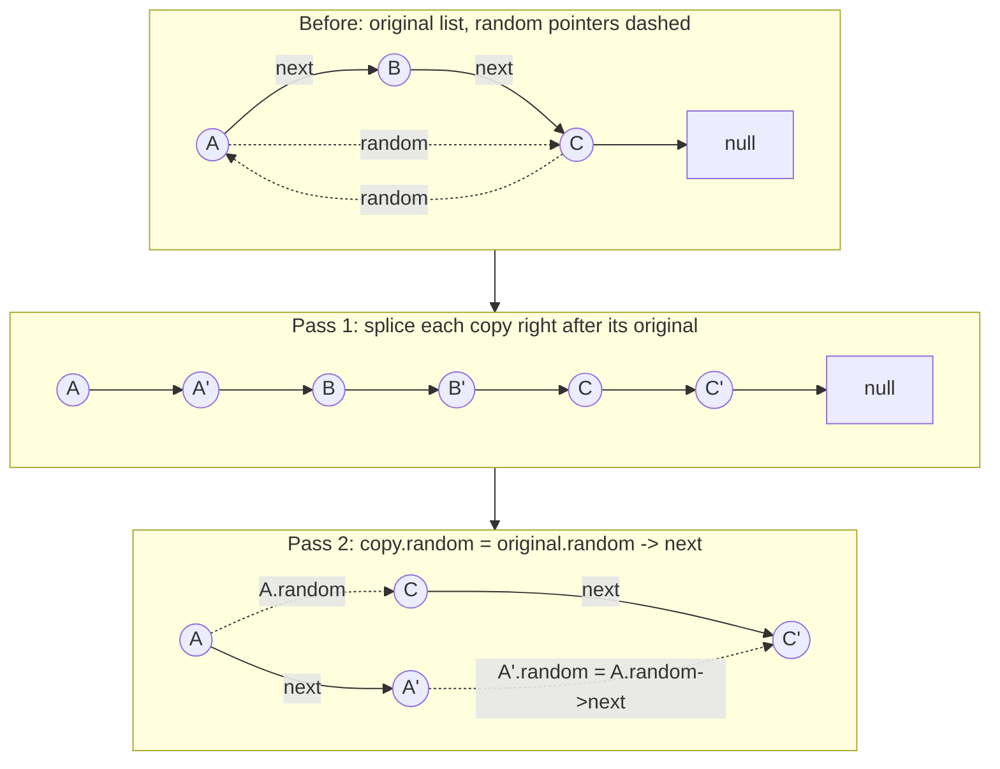

# 138. Copy List with Random Pointer
`Medium` · **Pattern:** Weave copies into the original list (O(1) space, no hash map)

> [!question] Problem
> You're given the head of a linked list where each node has an extra `random` pointer, which may point to **any** node in the list, or `null`.
> Create a **deep copy** of the list: every new node's `val` matches the original, and both `next` and `random` on the copy must point to nodes **within the copied list**, not the original.
>
> **Example:**
> ```
> Input: head = [[7,null],[13,0],[11,4],[10,2],[1,0]]
> Output: [[7,null],[13,0],[11,4],[10,2],[1,0]]
> ```
> Each pair is `[val, random_index]` — the index (0-based) of the node its `random` pointer targets, or `null`.
>
> 
>
> 
>
> **Constraints:**
> - Number of nodes in `[0, 1000]`
> - `-10^4 <= Node.val <= 10^4`
> - `random` is `null` or points to some node in the list.

---

## 🧩 Pattern this follows

> [!tip] The hard part isn't copying `next` — it's copying `random` before the copies even exist
> Copying `next` pointers is trivial (same order as the original list). The real problem: when you're building the copy of node `A` and need to set its `random` pointer, the node `A.random` points to **might not have a copy yet** (it could be anywhere in the list, forward or backward). A hash map (original node → copy node) solves this in `O(n)` space. The `O(1)`-space trick used here instead: **splice each copy directly next to its original** (`A → A' → B → B' → ...`), so at any point, "the copy of node X" is always reachable as simply `X->next` — no map needed.

### 🖼️ Visualizing it

The existing problem images show the input/output structure — this shows the **mechanics of the three-pass algorithm itself**: `A.random = C`, `C.random = A`, `B.random = null`.



## 💻 My Solution (C++)

```cpp
class Solution {
public:
    Node* copyRandomList(Node* head) {
        Node* temp = head;

        if (head == nullptr) {
            return nullptr;
        }

        while (temp != nullptr) {
            Node* newNode = new Node(temp->val);
            newNode->next = temp->next;
            temp->next = newNode;
            temp = newNode->next;
        }

        temp = head;

        while (temp != nullptr) {
            Node* randomDummy = temp->random;
            if (randomDummy == nullptr) {
                temp->next->random = nullptr;
            } else {
                temp->next->random = randomDummy->next;
            }
            temp = temp->next->next;
        }

        temp = head;
        Node* copyNode = temp->next;
        Node* dummyNode = copyNode;

        while (temp) {
            temp->next = temp->next->next;
            if (dummyNode->next) {
                dummyNode->next = dummyNode->next->next;
            }

            temp = temp->next;
            dummyNode = dummyNode->next;
        }

        return copyNode;
    }
};
```

## 🔍 Walkthrough — three passes over the list

**Pass 1 — interleave a copy after every original node:**
For each original node `temp`, create `newNode` with the same value, insert it **immediately after** `temp` (`newNode->next = temp->next; temp->next = newNode;`), then jump `temp` past both (`temp = newNode->next`) to reach the next *original* node. After this pass, the list looks like `A → A' → B → B' → C → C' → ...`.

**Pass 2 — set each copy's `random` pointer:**
For each original node `temp`, its `random` pointer (`temp->random`) points to some original node — call it `randomDummy`. That original node's **copy** is, by construction from pass 1, always `randomDummy->next`. So: `temp->next->random = randomDummy->next` (or `nullptr` if `temp->random` was `nullptr`). This is *why* the interleaving in pass 1 matters — it turns "find the copy of an arbitrary node" into an `O(1)` lookup (`->next`) instead of needing a hash map.

**Pass 3 — unweave the two lists apart:**
Walk both the original chain (`temp`) and the copy chain (`dummyNode`, starting at `copyNode = head->next`) simultaneously, restoring each to skip over the other: `temp->next = temp->next->next` (relinks originals to originals), `dummyNode->next = dummyNode->next->next` (relinks copies to copies) — undoing the interleaving from pass 1, leaving two clean, separate lists.

Return `copyNode` — the head of the fully deep-copied list.

## ⏱️ Complexity

| | Complexity | Why |
|---|---|---|
| **Time** | O(n) | Three linear passes over the list |
| **Space** | O(1) extra | No hash map — only the new nodes themselves, which are the required output, not "extra" space |

## 🚀 Tricks & Similar Problems

> [!success] "Splice the copy next to the original" as a stand-in for a hash map
> This interleaving trick is a broadly useful pattern whenever you need `O(1)`-space "given an original, find its copy" lookups without extra storage — the structure of the data itself temporarily becomes the lookup table. The hash-map version (`unordered_map<Node*, Node*>`) is simpler to write and worth mentioning as the natural first approach — this three-pass version is the follow-up "can you do it in O(1) space" optimization.
> **Similar pattern:** any deep-copy-with-cross-references problem (copying a graph, for instance, uses the hash-map version of this same idea since graphs don't have a convenient "splice next to" structure like a list does).
