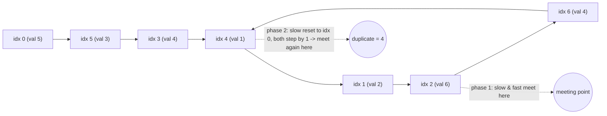

# 287. Find the Duplicate Number
`Medium` · **Pattern:** Floyd's Cycle Detection (Tortoise & Hare) — on an array treated as an implicit linked list

> [!question] Problem
> Given an array `nums` containing `n + 1` integers, each in the range `[1, n]`, there is exactly **one** number that repeats (possibly more than twice). Return that repeated number.
> You must solve it **without modifying** `nums` and using only **constant extra space**.
>
> **Example 1:**
> ```
> Input: nums = [1,3,4,2,2]
> Output: 2
> ```
>
> **Constraints:**
> - `1 <= n <= 10^5`
> - `nums.length == n + 1`
> - `1 <= nums[i] <= n`
> - Exactly one value repeats (two or more times); every other value appears exactly once.

---

## 🧩 Pattern this follows

> [!tip] Reframe the array as a linked list: `index → nums[index]` is a "next" pointer
> This is the trick that makes an *array* problem belong in the Linked List chapter: think of every index `i` as a node, and `nums[i]` as that node's pointer to the **next** node (index `nums[i]`). Because there are `n+1` values but only `n` possible slots `[1,n]`, by the pigeonhole principle, **at least two indices must point to the same place** — which means this implicit "linked list" necessarily contains a **cycle**, and the duplicate number is exactly the **entry point** of that cycle. That turns "find the duplicate" into the classic **Linked List Cycle II** problem (find where a cycle begins), solved with Floyd's Tortoise and Hare — no extra space, no modifying the array, because you're never actually building a list, just walking indices.

### 🖼️ Visualizing it

Worked example: `nums = [5,2,6,4,1,3,4]` (`n=6`, duplicate `4`). Reading `i → nums[i]` as a "next" pointer gives a tail `0→5→3` feeding into a cycle `4→1→2→6→4`. Floyd's phase 1 meets *inside* the cycle (not necessarily at the entry) — phase 2 resets one pointer to the head and walks both one step at a time, guaranteed to meet exactly at the entry, which **is** the duplicate:



## 💻 My Solution (C++)

```cpp
class Solution {
public:
    int findDuplicate(vector<int>& nums) {
        int slow = nums[0];
        int fast = nums[0];

        do {
            slow = nums[slow];
            fast = nums[nums[fast]];
        } while (slow != fast);

        slow = nums[0];

        while (slow != fast) {
            slow = nums[slow];
            fast = nums[fast];
        }

        return slow;
    }
};
```

## 🔍 Walkthrough

**Phase 1 — detect that a cycle exists, and find *a* meeting point inside it:**
1. `slow` and `fast` both start at `nums[0]` (equivalent to starting a linked-list walk from a virtual head that points to index `0`... more precisely, both start by taking one step from index `0`).
2. Each iteration: `slow` moves one step (`slow = nums[slow]`), `fast` moves two steps (`fast = nums[nums[fast]]`) — same speeds as the classic tortoise/hare.
3. Because a cycle is **guaranteed** to exist (pigeonhole, explained above), `fast` will eventually lap `slow` inside the cycle, and they meet (`slow == fast`). This meeting point is *some* node inside the cycle — not necessarily the entry point.

**Phase 2 — find the actual cycle entry point (the duplicate):**
4. Reset `slow` back to the start (`nums[0]`), but leave `fast` right where it met `slow` in phase 1. **Now move both one step at a time.**
5. This is the classical Floyd's-algorithm guarantee: the distance from the start to the cycle's entry equals the distance from the phase-1 meeting point to the entry, when both are walked at the *same* speed — so `slow` and `fast` are mathematically guaranteed to meet again **exactly at the cycle's entry point**.
6. Return `slow` (or `fast` — they're equal) — that shared index **is** the duplicate value (since the "value" and the "index it points to" are the same number in this problem's setup).

## ⏱️ Complexity

| | Complexity | Why |
|---|---|---|
| **Time** | O(n) | Both phases are linear walks; total steps bounded by a small constant multiple of `n` |
| **Space** | O(1) | Only `slow`/`fast` scalars — no hash set, no sorting, no modifying `nums` |

## 🚀 Tricks & Similar Problems

> [!success] Why this is the *only* approach satisfying both constraints at once
> A hash set finds the duplicate in `O(n)` time but breaks the `O(1)` space rule. Sorting satisfies the space rule but breaks the `O(n log n)`-is-too-slow spirit and would require **modifying** `nums` (violating the "don't modify" constraint) unless copied first (which is `O(n)` space again). Floyd's cycle detection is the one technique threading all three needles — worth explicitly naming *why* the obvious approaches fail when explaining this solution in an interview.
> **Similar pattern:** Linked List Cycle II (LeetCode 142) is the "textbook" version of this exact two-phase algorithm on a real linked list — solving that one first, then recognizing this problem as "the same algorithm, but the list is implicit in an array," is the cleanest path to deriving this solution from scratch.
