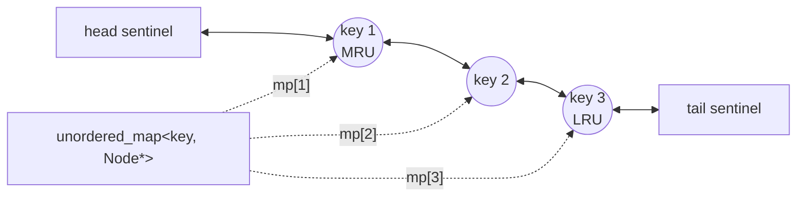

# 146. LRU Cache
`Medium` · **Pattern:** Hash Map + Doubly Linked List (O(1) access *and* O(1) reordering)

> [!question] Problem
> Design a data structure implementing a **Least Recently Used (LRU) cache**:
> - `LRUCache(int capacity)` — initialize with positive size `capacity`.
> - `int get(int key)` — return the value if `key` exists, else `-1`. Counts as a "use" of that key.
> - `void put(int key, int value)` — insert or update. If this exceeds `capacity`, evict the **least recently used** key first.
> Both `get` and `put` must run in **O(1) average time**.
>
> **Example:**
> ```
> LRUCache cache = new LRUCache(2);
> cache.put(1, 1);
> cache.put(2, 2);
> cache.get(1);       // returns 1
> cache.put(3, 3);    // evicts key 2
> cache.get(2);       // returns -1 (not found)
> cache.put(4, 4);    // evicts key 1
> cache.get(1);       // returns -1 (not found)
> cache.get(3);       // returns 3
> cache.get(4);       // returns 4
> ```

---

## 🧩 Pattern this follows

> [!tip] Two data structures, each covering the other's weakness
> Need **O(1) lookup by key** → that's what a hash map gives. Need **O(1) "move this to most-recently-used" and O(1) "evict the least-recently-used"** → a plain hash map can't do that (no ordering); an array/vector can't reorder in O(1) either (shifting is O(n)). A **doubly linked list** solves the reordering: moving a node to the front, or removing a node from wherever it sits, is O(1) *if you already have a pointer to it* — which the hash map supplies. `unordered_map<key, Node*>` + doubly linked list (ordered most-recent → least-recent) together give O(1) on everything.

### 🖼️ Visualizing it

Doubly linked list ordered MRU (front) → LRU (back), with the hash map jumping straight to any node:



## 💻 My Solution (C++)

```cpp
class LRUCache {
public:
    class Node {
    public:
        int val, key;
        Node* next;
        Node* prev;
        Node(int v, int k) {
            val = v;
            key = k;
            next = prev = nullptr;
        }
    };

    int limit;
    unordered_map<int, Node*> mp;

    Node* head;
    Node* tail;

    LRUCache(int capacity) {
        limit = capacity;

        head = new Node(-1, -1);
        tail = new Node(-1, -1);

        head->next = tail;
        tail->prev = head;
    }

    void addNewNode(Node* newNode) {
        Node* temp = head->next;
        head->next = newNode;
        newNode->next = temp;
        newNode->prev = head;
        temp->prev = newNode;

        return;
    }

    void deleteNode(Node* deletedNode) {
        Node* temp = deletedNode->prev;
        temp->next = deletedNode->next;
        deletedNode->next->prev = temp;
    }

    int get(int key) {
        if (mp.find(key) == mp.end()) {
            return -1;
        }
        Node* displayNode = mp[key];
        deleteNode(displayNode);
        addNewNode(displayNode);
        return displayNode->val;
    }

    void put(int key, int value) {
        if (mp.find(key) != mp.end()) {
            Node* displayNode = mp[key];
            displayNode->val = value;
            deleteNode(displayNode);
            addNewNode(displayNode);
            return;
        }

        if (mp.size() == limit) {
            Node* oldNode = tail->prev;
            mp.erase(oldNode->key);
            deleteNode(oldNode);
            delete (oldNode);
        }

        Node* newNode = new Node(value, key);
        addNewNode(newNode);
        mp[key] = newNode;
    }
};
```

## 🔍 Walkthrough

**Structure:** a doubly linked list ordered **most-recently-used (right after `head`) → least-recently-used (right before `tail`)**, using two **sentinel** nodes (`head`, `tail`) that hold no real data — they exist purely so every real node always has a genuine `prev` and `next`, eliminating null-checks for "is this the first/last real node." `mp` maps `key → Node*` for O(1) lookup of any node by key.

**`addNewNode(newNode)`:** always inserts `newNode` **right after `head`** — i.e., marks it as the most-recently-used. Standard 4-pointer doubly-linked-list insertion: splice `newNode` between `head` and whatever `head->next` currently is.

**`deleteNode(deletedNode)`:** standard doubly-linked-list removal — stitch `deletedNode`'s neighbors together, bypassing it. Works for a node anywhere in the list, not just the ends, because it's a *doubly* linked list (each node knows its own `prev`).

**`get(key)`:**
1. Not in `mp` → `-1`.
2. Found → this key was just **used**, so it must become most-recently-used: `deleteNode` (remove from its current position) then `addNewNode` (reinsert at the front). Return its value.

**`put(key, value)`:**
1. **Key already exists:** update its value, then move it to the front (same delete+re-add as `get`, marking it as just-used) — return.
2. **Key is new, cache is full** (`mp.size() == limit`): evict the least-recently-used node, which is always `tail->prev` (the real node right before the tail sentinel). Erase it from `mp`, unlink it, and `delete` it (freeing the heap memory — this is C++, not garbage collected).
3. **Insert the new node:** create it, add it at the front (most-recently-used), and record it in `mp`.

## ⏱️ Complexity

| | Complexity | Why |
|---|---|---|
| **`get` / `put`** | O(1) average | Hash map gives O(1) node lookup; doubly linked list gives O(1) insert/remove/move given a node pointer |
| **Space** | O(capacity) | One map entry + one list node per cached key |

## 🚀 Tricks & Similar Problems

> [!success] Sentinel `head`/`tail` nodes eliminate an entire class of edge cases
> Without dummy `head`/`tail` nodes, inserting into an empty list or removing the only remaining node would need special-case branches (`if (list is empty) ...`). With sentinels, `head->next` and `tail->prev` are **always** valid pointers to real nodes (or to each other, if the cache is empty) — `addNewNode`/`deleteNode` never need to check for edge-of-list conditions at all. This sentinel-node trick generalizes to any doubly-linked-list-based design problem.
> **Similar pattern:** LFU Cache (same hash-map + linked-list idea, with an added frequency dimension), Design Browser History / Design Twitter Feed — any "need O(1) access *and* O(1) reordering by recency" design problem reaches for this exact combo.
