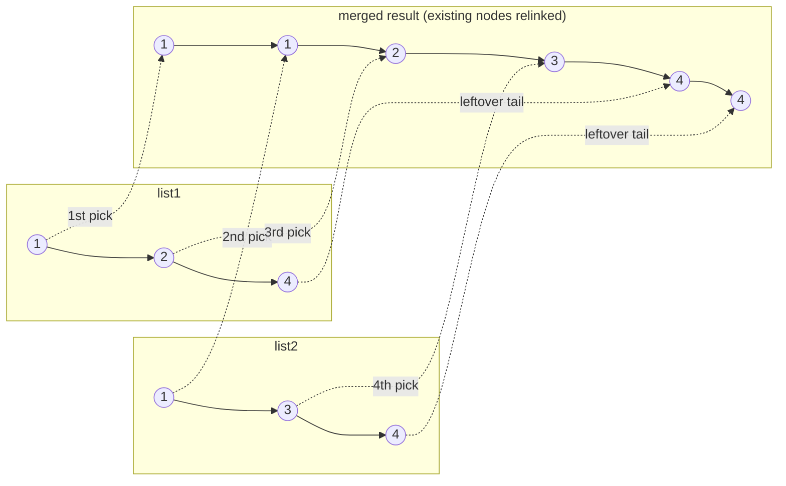

# 21. Merge Two Sorted Lists
`Easy` · **Pattern:** Two-pointer walk, splicing existing nodes (no new nodes allocated)

> [!question] Problem
> Given the heads of two sorted linked lists `list1` and `list2`, merge them into **one sorted list** by splicing together the existing nodes, and return the head of the merged list.
>
> **Example 1:**
> ```
> Input: list1 = [1,2,4], list2 = [1,3,4]
> Output: [1,1,2,3,4,4]
> ```
>
> **Example 2:**
> ```
> Input: list1 = [], list2 = []
> Output: []
> ```
>
> **Example 3:**
> ```
> Input: list1 = [], list2 = [0]
> Output: [0]
> ```
>
> **Constraints:**
> - Combined node count in `[0, 50]`
> - `-100 <= Node.val <= 100`
> - Both lists sorted non-decreasing.

---

## 🧩 Pattern this follows

> [!tip] Same idea as merging two sorted arrays — just relink instead of copy
> This is the "merge" step of merge sort, applied to linked lists instead of arrays. Walk both lists simultaneously with one pointer each; at every step, whichever list's current node is smaller gets **relinked** onto the result, and that list's pointer advances. Because it's a linked list (not an array), there's no need to allocate new nodes or shift anything — just repoint `next`.

### 🖼️ Visualizing it

Each dashed arrow shows which source node gets relinked into the result, in the order it's picked:



## 💻 My Solution (C++)

```cpp
class Solution {
public:
    ListNode* mergeTwoLists(ListNode* list1, ListNode* list2) {
        if (list1 == nullptr) {
            return list2;
        } else if (list2 == nullptr) {
            return list1;
        }

        ListNode* head = nullptr;

        if (list1->val < list2->val) {
            head = list1;
            list1 = list1->next;
        } else {
            head = list2;
            list2 = list2->next;
        }
        ListNode* temp = head;

        while (list1 && list2) {
            if (list1->val < list2->val) {
                temp->next = list1;
                temp = temp->next;
                list1 = list1->next;
            } else {
                temp->next = list2;
                temp = temp->next;
                list2 = list2->next;
            }
        }

        if (list1) {
            temp->next = list1;
        }

        if (list2) {
            temp->next = list2;
        }

        return head;
    }
};
```

## 🔍 Walkthrough

1. **Base cases:** either list being empty means the answer is trivially the other list — no merging needed.
2. **Pick the starting `head`:** whichever of `list1`/`list2` has the smaller first value becomes the head of the result, and that list's pointer advances past it. `temp` tracks the tail of the result being built so far.
3. **Main merge loop:** while both lists still have nodes, compare their current values — relink the smaller one onto `temp->next`, advance `temp` to follow it, and advance that source list's pointer.
4. **Leftover tail:** the loop stops the moment **either** list runs out — at that point, the *other* list's remaining nodes are already sorted and all guaranteed to be `≥` everything merged so far (since both input lists were individually sorted). So just attach whichever one is non-null directly: `temp->next = list1` (or `list2`) — no need to walk it node by node.
5. Return `head`.

## ⏱️ Complexity

| | Complexity | Why |
|---|---|---|
| **Time** | O(n + m) | Each node from both lists visited once |
| **Space** | O(1) | No new nodes allocated — existing nodes are just relinked |

## 🚀 Tricks & Similar Problems

> [!success] The "attach the leftover tail directly" step is the key efficiency insight
> A common mistake is looping node-by-node even after one list is exhausted — unnecessary, since a sorted list's remaining suffix is already exactly where it needs to be relative to what's already merged. Recognizing when a loop can stop early because the rest is "already correct" is a broadly useful instinct beyond just this problem.
> **Similar pattern:** [[Merge k Sorted Lists (LeetCode #23)]] generalizes this exact two-list merge to `k` lists using a heap instead of a plain two-pointer walk. A common **dummy-head** variant of this solution (`ListNode dummy; ListNode* temp = &dummy;`) avoids the special-casing in step 2 — worth knowing as a cleaner alternative (see [[Merge k Sorted Lists (LeetCode #23)]] and [[Add Two Numbers (LeetCode #2)]] for that pattern in action).
