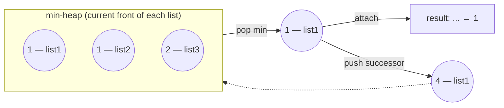

# 23. Merge k Sorted Lists
`Hard` · **Pattern:** Min-heap over the current "front" of each list

> [!question] Problem
> You are given an array of `k` linked lists `lists`, each sorted in ascending order. Merge all of them into **one** sorted linked list, and return it.
>
> **Example 1:**
> ```
> Input: lists = [[1,4,5],[1,3,4],[2,6]]
> Output: [1,1,2,3,4,4,5,6]
> ```
>
> **Example 2:**
> ```
> Input: lists = []
> Output: []
> ```
>
> **Example 3:**
> ```
> Input: lists = [[]]
> Output: []
> ```
>
> **Constraints:**
> - `k == lists.length`, `0 <= k <= 10^4`
> - Sum of all list lengths `<= 10^4`

---

## 🧩 Pattern this follows

> [!tip] Generalize the two-list merge with a min-heap instead of two pointers
> [[Merge Two Sorted Lists (LeetCode #21)]] compares exactly 2 candidates at each step — trivial with an `if`. With `k` lists, you need to repeatedly find the **smallest of up to `k` current front-nodes** — a job a **min-heap** does in `O(log k)` per extraction, instead of scanning all `k` fronts every time (`O(k)` per step, `O(nk)` overall). Push each list's head in initially; repeatedly pop the smallest, attach it to the result, and push whatever came after it in *that* list.

### 🖼️ Visualizing it

`lists = [[1,4,5],[1,3,4],[2,6]]` — the heap always holds exactly one "front" node per list; popping the min and pushing its successor keeps the heap size at `k`:



## 💻 My Solution (C++)

```cpp
struct Compare {
    bool operator()(ListNode* a, ListNode* b) {
        return a->val > b->val;
    }
};

class Solution {
public:
    ListNode* mergeKLists(vector<ListNode*>& lists) {
        if (lists.size() == 0) {
            return nullptr;
        }

        priority_queue<ListNode*, vector<ListNode*>, Compare> pq;

        for (ListNode* ll : lists) {
            if (ll) {
                pq.push(ll);
            }
        }

        ListNode dummy(0);
        ListNode* temp = &dummy;

        while (!pq.empty()) {
            ListNode* topNode = pq.top();
            pq.pop();
            temp->next = topNode;
            temp = temp->next;
            if (topNode->next) {
                pq.push(topNode->next);
            }
        }

        return dummy.next;
    }
};
```

## 🔍 Walkthrough

1. **`Compare`** flips C++'s default max-heap behavior into a **min-heap**: `priority_queue` normally puts the "greatest" element on top; `a->val > b->val` inverts the ordering so the node with the **smallest** value ends up on top instead.
2. Seed the heap with every list's **head node** — one entry per non-empty input list (skipping any `nullptr` lists, which `lists = [[]]` can contain).
3. `dummy`/`temp` — the same dummy-head trick from [[Add Two Numbers (LeetCode #2)]] and [[Merge Two Sorted Lists (LeetCode #21)]], avoiding special-casing the first node of the result.
4. **Main loop:** pop the globally smallest node currently at the front of any list (`topNode`), attach it to the result (`temp->next = topNode; temp = temp->next;`). Then — critically — if that node had a `next`, push **that** onto the heap, since it's now the new "front" of whichever list `topNode` came from and needs to be back in contention.
5. Repeat until the heap is empty (every node from every list has been consumed exactly once). Return `dummy.next`.

## ⏱️ Complexity

| | Complexity | Why |
|---|---|---|
| **Time** | O(N log k) | `N` = total nodes across all lists, `k` = number of lists; each node is pushed and popped once, each heap operation costs `O(log k)` since the heap never holds more than `k` elements at a time |
| **Space** | O(k) | The heap holds at most one node per input list at any given moment |

## 🚀 Tricks & Similar Problems

> [!success] Why the heap never grows past size `k`
> Each `pop` removes exactly one node, and each iteration pushes **at most one** node back (the popped node's successor, if it exists) — so the heap size never exceeds the initial count of non-empty lists. This is what keeps each operation at `O(log k)` rather than `O(log N)`, and is worth stating explicitly if asked to justify the complexity.
> **Similar pattern:** [[Merge Two Sorted Lists (LeetCode #21)]] is the `k=2` special case of this exact problem (simple enough there that two pointers beat the overhead of a heap). A **divide-and-conquer** alternative also solves this in `O(N log k)` — repeatedly merge pairs of lists (like merge sort's merge step) until one remains — worth knowing as an alternative if asked "can you avoid a heap."
