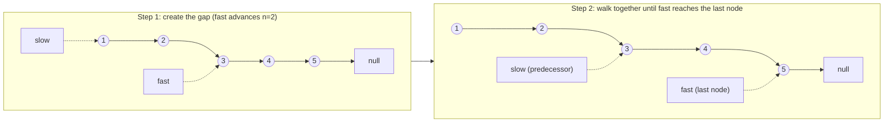

# 19. Remove Nth Node From End of List
`Medium` · **Pattern:** Two pointers with a fixed gap ("runner" technique)

> [!question] Problem
> Given the head of a linked list, remove the `n`th node **from the end** of the list, and return its head.
>
> **Example 1:**
> ```
> Input: head = [1,2,3,4,5], n = 2
> Output: [1,2,3,5]
> ```
>
> **Example 2:**
> ```
> Input: head = [1], n = 1
> Output: []
> ```
>
> **Example 3:**
> ```
> Input: head = [1,2], n = 1
> Output: [1]
> ```
>
> **Constraints:**
> - `1 <= sz <= 30`, `1 <= n <= sz`
>
> **Follow-up:** can you do this in **one pass**?

---

## 🧩 Pattern this follows

> [!tip] A singly linked list can't be walked backward — so create the gap up front instead
> The naive approach needs the list's total length first (one pass to count, one pass to find the `(length - n)`th node) — two passes. The one-pass trick: **advance a `fast` pointer `n` steps ahead first**, creating a fixed gap of `n` nodes between `fast` and a `slow` pointer that hasn't moved yet. Then walk both forward together — by the time `fast` reaches the end, `slow` is *automatically* sitting exactly `n` nodes from the end, because that fixed gap was preserved the whole way. This "runner with a head start" idea is the standard way to convert "distance from the end" into a single forward pass.

### 🖼️ Visualizing it

`n = 2` on `[1,2,3,4,5]`: `fast` starts 2 nodes ahead, then both walk together until `fast` hits the last node — `slow` ends up exactly on the predecessor of the node to remove.



## 💻 My Solution (C++)

```cpp
class Solution {
public:
    ListNode* removeNthFromEnd(ListNode* head, int n) {
        if (head == nullptr || head->next == nullptr) {
            return nullptr;
        }

        ListNode* fastptr = head;
        ListNode* slowptr = head;
        int i = 0;
        while (i < n) {
            fastptr = fastptr->next;
            i++;
        }
        if (fastptr == nullptr) {
            return head->next;
        }

        while (fastptr && fastptr->next) {
            fastptr = fastptr->next;
            slowptr = slowptr->next;
        }

        slowptr->next = slowptr->next->next;

        return head;
    }
};
```

## 🔍 Walkthrough

1. **Edge case:** a list with 0 or 1 nodes, being asked to remove a node, always ends up empty (given the constraints guarantee `n <= sz`) — return `nullptr` directly.
2. **Create the gap:** advance `fastptr` exactly `n` steps from `head`, while `slowptr` stays put at `head`. Now there's a gap of `n` nodes between them.
3. **Special case — removing the head itself:** if `fastptr` becomes `nullptr` right after this gap-creation loop, that means `n` equals the list's total length — the node to remove is the **head** itself (there's no "predecessor" to relink). Return `head->next` directly.
4. **Walk together:** advance both `fastptr` and `slowptr` one step at a time, until `fastptr->next` is `nullptr` — meaning `fastptr` is now sitting on the **last node**. Because the gap between them stayed fixed at `n` the whole time, `slowptr` is now sitting exactly on the node **just before** the one that needs removing.
5. **Unlink:** `slowptr->next = slowptr->next->next` skips over the target node, removing it from the list.
6. Return `head` — unchanged (the head only changes in the special case handled in step 3).

## ⏱️ Complexity

| | Complexity | Why |
|---|---|---|
| **Time** | O(L) | `L` = list length; a single forward pass (the initial `n`-step advance plus the joint walk together add up to at most `L` total steps) |
| **Space** | O(1) | Two pointers, no extra structures |

## 🚀 Tricks & Similar Problems

> [!bug] Why the "removing the head" case needs special handling
> Step 5's unlink logic (`slowptr->next = ...`) assumes `slowptr` is sitting on a **real predecessor** node. If the node to remove *is* the head, there is no predecessor to stand on — `slowptr` would still be at `head` itself when `fastptr` runs off the list early. That's exactly what the `fastptr == nullptr` check in step 3 catches, **before** the main walk even starts. A common cleaner alternative is prepending a **dummy node** before `head` — that guarantees every node, including the real head, always has a non-null predecessor, eliminating this special case entirely (worth knowing as the "textbook" version).
> **Similar pattern:** [[Find Minimum in Rotated Sorted Array (LeetCode #153)]] and other fast/slow-pointer problems in this vault share the "two pointers, fixed relationship, single pass" shape — see also [[Reorder List (LeetCode #143)]]'s fast/slow midpoint-finding step.
