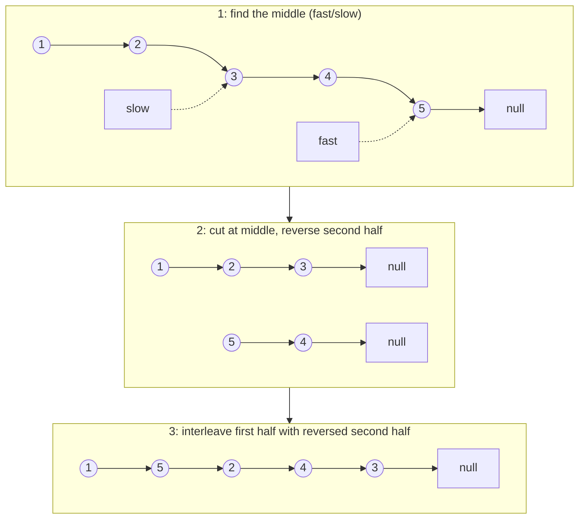

# 143. Reorder List
`Medium` · **Pattern:** Find middle (fast/slow) → reverse second half → interleave merge

> [!question] Problem
> Given the head of a singly linked list `L0 → L1 → … → Ln-1 → Ln`, reorder it in place to: `L0 → Ln → L1 → Ln-1 → L2 → Ln-2 → …`
> You may not modify node **values** — only rearrange the nodes themselves.
>
> **Example 1:**
> ```
> Input: head = [1,2,3,4]
> Output: [1,4,2,3]
> ```
>
> **Example 2:**
> ```
> Input: head = [1,2,3,4,5]
> Output: [1,5,2,4,3]
> ```
>
> **Constraints:**
> - Number of nodes in `[1, 5 * 10^4]`
> - `1 <= Node.val <= 1000`

---

## 🧩 Pattern this follows

> [!tip] A three-step combo, each step a well-known subroutine on its own
> This problem is a great "combine what you already know" exercise — it's not one new trick, it's **three previously-solved problems chained together**: **(1)** find the middle of the list (fast/slow pointers), **(2)** reverse the second half (the standard reversal from [[Reverse Linked List (LeetCode #206)]]), **(3)** merge the first half and the *reversed* second half by alternating nodes one-by-one from each. Recognizing "this is find-middle + reverse + interleave" is the whole battle — each individual step is simple once isolated.

### 🖼️ Visualizing it

All three steps traced on `[1,2,3,4,5]` (expected output `[1,5,2,4,3]`):



## 💻 My Solution (C++)

```cpp
class Solution {
public:
    ListNode* reverseList(ListNode* node) {
        if (node == nullptr || node->next == nullptr) {
            return node;
        }
        ListNode* curr = node;
        ListNode* prev = nullptr;

        while (curr != nullptr) {
            ListNode* temp = curr->next;
            curr->next = prev;
            prev = curr;
            curr = temp;
        }

        return prev;
    }

    void reorderList(ListNode* head) {
        if (!head || !head->next) {
            return;
        }
        ListNode* fastptr = head;
        ListNode* slowptr = head;

        while (fastptr != nullptr && fastptr->next != nullptr) {
            fastptr = fastptr->next->next;
            slowptr = slowptr->next;
        }

        ListNode* revlist1 = head;
        ListNode* revlist2 = reverseList(slowptr->next);
        slowptr->next = nullptr;

        while (revlist2 != nullptr) {
            ListNode* temp1 = revlist1->next;
            ListNode* temp2 = revlist2->next;

            revlist1->next = revlist2;
            revlist2->next = temp1;
            revlist1 = temp1;
            revlist2 = temp2;
        }
    }
};
```

## 🔍 Walkthrough

**Step 1 — find the middle (`fastptr`/`slowptr`):** `fastptr` moves two steps for every one step of `slowptr`. When `fastptr` reaches the end, `slowptr` is at the middle. (For an even-length list, this lands `slowptr` on the **first** node of the second half — consistent with `[1,2,3,4]`'s expected split into `[1,2]` and `[3,4]`.)

**Step 2 — reverse the second half:** `revlist2 = reverseList(slowptr->next)` reverses everything **after** the middle, using the exact subroutine from [[Reverse Linked List (LeetCode #206)]]. `slowptr->next = nullptr` then **cuts** the first half off from the second — without this, the first half's list would still (incorrectly) chain into the now-reversed second half's old structure.

**Step 3 — interleave-merge the two halves:** `revlist1` walks the first half, `revlist2` walks the (now-reversed) second half. Each loop iteration:
1. Save both halves' "next" nodes first (`temp1`, `temp2`) — same reason as in reversal: overwriting `next` would lose the reference to what comes after.
2. Splice `revlist2`'s current node right after `revlist1`'s current node (`revlist1->next = revlist2`), then have that spliced-in node point to what `revlist1` originally pointed to (`revlist2->next = temp1`) — this correctly weaves one node from each list, alternating.
3. Advance both pointers to their saved "next" nodes and repeat.
4. The loop is driven by `revlist2 != nullptr` — the second half (reversed) is always the same length or one shorter than the first half, so it naturally runs out first, leaving the first half's own internal links (already correctly pointing to the next alternating node from step 2) to finish the list correctly.

## ⏱️ Complexity

| | Complexity | Why |
|---|---|---|
| **Time** | O(n) | Each of the three steps (find middle, reverse, merge) is a single linear pass |
| **Space** | O(1) | All done via pointer rewiring — no extra data structures, no new nodes |

## 🚀 Tricks & Similar Problems

> [!bug] Forgetting to cut the list at the middle
> Skipping `slowptr->next = nullptr` is a common bug — without it, the first half's original tail is still silently pointing into the second half's *old* (pre-reversal) structure, and the interleaving loop can end up creating a cycle or duplicating nodes. Always sever the two halves explicitly before treating them as independent lists.
> **Similar pattern:** this problem is a checklist of earlier patterns — [[Reverse Linked List (LeetCode #206)]] (step 2, verbatim), fast/slow midpoint-finding (also used in cycle-detection style problems), and a manual two-list interleave (structurally similar to, but distinct from, the sorted-merge in [[Merge Two Sorted Lists (LeetCode #21)]]).
