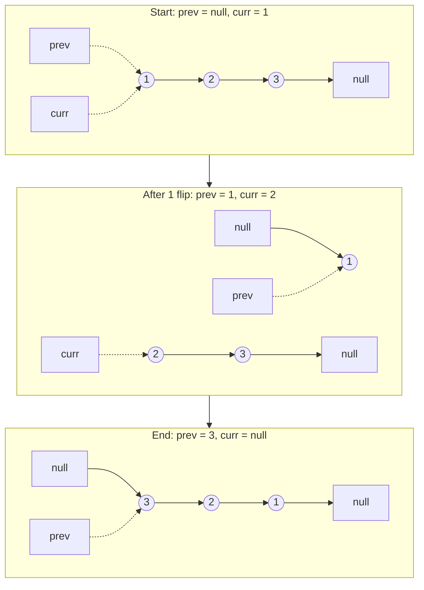

# 206. Reverse Linked List
`Easy` · **Pattern:** The template — three-pointer in-place reversal

> [!question] Problem
> Given the head of a singly linked list, reverse the list, and return the reversed list.
>
> **Example 1:**
> ```
> Input: head = [1,2,3,4,5]
> Output: [5,4,3,2,1]
> ```
>
> **Example 2:**
> ```
> Input: head = [1,2]
> Output: [2,1]
> ```
>
> **Example 3:**
> ```
> Input: head = []
> Output: []
> ```
>
> **Constraints:**
> - Number of nodes in `[0, 5000]`
> - `-5000 <= Node.val <= 5000`

---

## 🧩 Pattern this follows

> [!tip] Flip each `next` pointer as you walk, one node at a time
> Reversing a linked list in place means every node's `next` pointer needs to point **backward** instead of forward. Doing that safely requires tracking **three** things at once as you walk forward: the node you're currently processing, the node that comes before it (which it should now point to), and — before you overwrite `next` — a saved reference to what used to come after it (or you'd lose the rest of the list). This three-pointer walk (`prev`, `curr`, `temp`/`next`) is the single most reused skeleton in linked-list problems.

### 🖼️ Visualizing it

Three snapshots of the same list `1 → 2 → 3` as the walk progresses — note how after one flip, the list is temporarily **two disconnected pieces** (`1 → null` and `2 → 3 → null`) until `curr` catches up to reconnect them backward.



## 💻 My Solution (C++)

```cpp
class Solution {
public:
    ListNode* reverseList(ListNode* head) {
        if (head == nullptr || head->next == nullptr) {
            return head;
        }

        ListNode* curr = head;
        ListNode* prev = nullptr;
        while (curr != nullptr) {
            ListNode* temp = curr->next;
            curr->next = prev;
            prev = curr;
            curr = temp;
        }

        return prev;
    }
};
```

## 🔍 Walkthrough

1. **Edge case:** empty list or single node — already "reversed," return as-is.
2. `prev` starts as `nullptr` (what the *original head* should point to once reversed — the new end of the list). `curr` starts at `head`.
3. Each loop iteration, in strict order:
   - Save `curr->next` into `temp` **before** touching anything — this is the only reference to "the rest of the list," and it would be lost the instant `curr->next` gets overwritten.
   - Flip the pointer: `curr->next = prev` — `curr` now points backward.
   - Advance both trackers: `prev = curr` (this node is now fully reversed, becomes the new "previous" for the next node), `curr = temp` (move on to what used to be next).
4. When `curr` becomes `nullptr`, every node has been flipped. `prev` is sitting on the **last** node processed — which is the original list's tail, now the new head. Return `prev`.

## ⏱️ Complexity

| | Complexity | Why |
|---|---|---|
| **Time** | O(n) | Visit each node exactly once |
| **Space** | O(1) | Iterative, in place — no new nodes allocated |

## 🚀 Tricks & Similar Problems

> [!success] Save-then-overwrite-then-advance is the whole trick
> The three-line loop body — `save next`, `overwrite next`, `advance both pointers` — is worth being able to write blind. Getting the **order** wrong (e.g. advancing `curr` before saving `temp`) is the single most common way this goes wrong under interview pressure.
> **Similar pattern:** [[Reorder List (LeetCode #143)]] reuses this exact reversal as a subroutine on half a list. Recursive reversal exists too (reverse the rest, then fix up the current node) — worth knowing both since interviewers sometimes explicitly ask for the recursive version as a follow-up.
