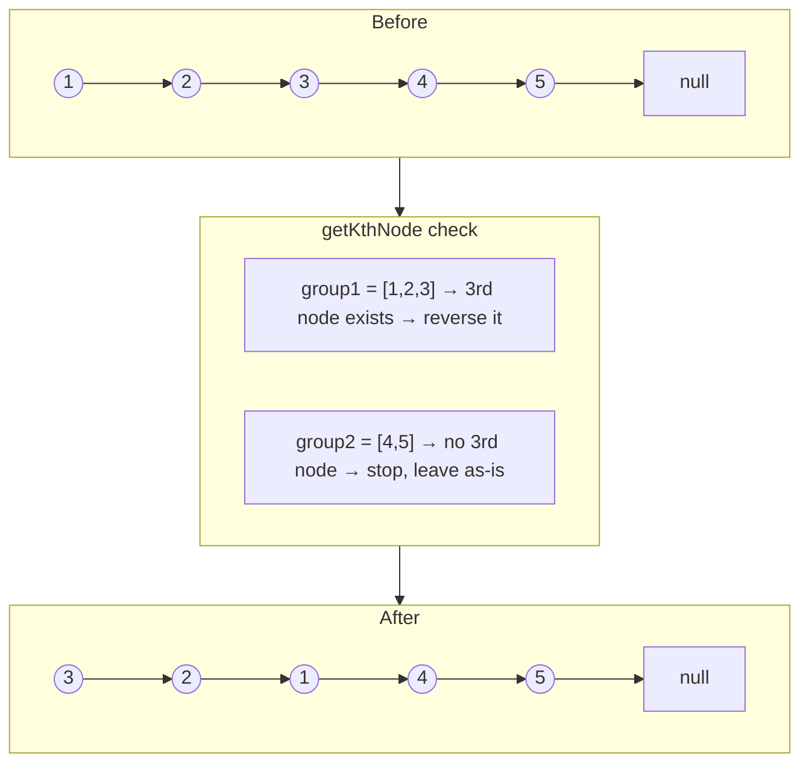

# 25. Reverse Nodes in k-Group
`Hard` · **Pattern:** Bounded reversal ([[Reverse Linked List (LeetCode #206)]], capped at k nodes) + group stitching

> [!question] Problem
> Given the head of a linked list, reverse the nodes of the list **`k` at a time**, and return the modified list.
> `k` is a positive integer `≤` the list length. If the number of nodes isn't a multiple of `k`, the **left-out nodes at the end stay as-is** (not reversed).
> You may not alter node **values** — only the nodes themselves may be rearranged.
>
> **Example 1:**
> ```
> Input: head = [1,2,3,4,5], k = 2
> Output: [2,1,4,3,5]
> ```
>
> **Example 2:**
> ```
> Input: head = [1,2,3,4,5], k = 3
> Output: [3,2,1,4,5]
> ```
>
> **Constraints:**
> - `1 <= k <= n <= 5000`
> - `0 <= Node.val <= 1000`
>
> **Follow-up:** can you solve it with **O(1) extra memory**?

---

## 🧩 Pattern this follows

> [!tip] It's [[Reverse Linked List (LeetCode #206)]] on repeat, with a "do I even have k nodes left?" guard
> Strip away the group-by-group looping and this is just the standard reversal from Chapter 206 — **capped to stop after exactly k nodes instead of running to the end**. The only genuinely new idea: before reversing a chunk, **check whether k nodes actually exist** starting there. If they don't (a trailing partial group), leave that tail untouched entirely — this is *why* the problem says leftover nodes stay as-is, and it's the detail most solutions get wrong first. Everything else is bookkeeping: reverse a bounded chunk, remember where it starts and ends, stitch the previous group's tail to this group's new head, repeat.

### 🖼️ Visualizing it

`head = [1,2,3,4,5]`, `k = 3` → `[3,2,1,4,5]`. Group 1 has a full 3 nodes and gets reversed; group 2 only has 2 nodes left (`< k`), so it's left untouched.



## 💻 My Solution (C++)

```cpp
class Solution {
public:
    ListNode* reverseLinkedList(ListNode* start, ListNode* kthNode) {
        if (!start) {
            return start;
        }
        ListNode* stop = (kthNode == nullptr) ? nullptr : kthNode->next;
        ListNode* prev = nullptr;
        while (start != stop) {
            ListNode* temp = start->next;
            start->next = prev;
            prev = start;
            start = temp;
        }

        return prev;
    }

    ListNode* getKthNode(ListNode* head, int k) {
        if (head == nullptr) {
            return head;
        }
        int i = 1;
        ListNode* startNode = head;
        while (startNode && i < k) {
            startNode = startNode->next;
            i++;
        }

        return startNode;
    }

    ListNode* reverseKGroup(ListNode* head, int k) {
        if (head == nullptr || head->next == nullptr || k < 2) {
            return head;
        }

        ListNode* prev = nullptr;
        ListNode* temp = head;
        ListNode* newHead = head;

        while (temp) {
            ListNode* kthNode = getKthNode(temp, k);
            if (kthNode == nullptr) {
                break;
            }

            ListNode* nextNode = kthNode->next;
            ListNode* revList = reverseLinkedList(temp, kthNode);
            if (prev == nullptr) {
                newHead = revList;
            } else {
                prev->next = revList;
            }

            prev = temp;
            temp->next = nextNode;
            temp = temp->next;
        }

        return newHead;
    }
};
```

## 🔍 Walkthrough

Three functions, each with one job:

**`getKthNode(head, k)`** — walks `k-1` steps forward from `head` and returns the `k`th node, **or `nullptr` if the list runs out before reaching it**. This is the "does a full group exist here?" check — nothing else in the algorithm needs to know list length up front.

**`reverseLinkedList(start, kthNode)`** — the familiar three-pointer reversal from [[Reverse Linked List (LeetCode #206)]], but bounded: `stop = kthNode->next` marks **one past the end of this group**, and the reversal loop runs `while (start != stop)` instead of `while (start != nullptr)`. This is the only change needed to turn "reverse everything" into "reverse just this chunk" — everything past `stop` is left completely alone, still correctly linked to whatever comes after (for now).

**`reverseKGroup(head, k)`** — the orchestrator:
1. `temp` walks group by group; `prev` remembers the **tail of the previously-reversed group** (which, after reversal, needs its `next` pointed at the *start* of the next reversed group).
2. For each group: find its `kthNode` via `getKthNode`. If `nullptr`, there aren't enough nodes left for a full group — **stop the loop immediately**, leaving this trailing partial segment untouched, exactly satisfying the problem's rule.
3. **Save `nextNode`** (`kthNode->next`) *before* reversing — reversal will scramble `temp`'s own `->next`, so the pointer to "whatever comes after this group" must be captured first.
4. Reverse the group: `revList = reverseLinkedList(temp, kthNode)` returns the **new head** of this now-reversed chunk (which was `kthNode`, the old tail).
5. **Stitch it in:** if this is the very first group (`prev == nullptr`), `revList` becomes the overall `newHead`. Otherwise, link the *previous* group's (old) head — which is now that group's *tail* post-reversal — to this group's new head: `prev->next = revList`.
6. **Critical bookkeeping:** `temp` was this group's original head, and after reversal it's become this group's **tail** — so `temp->next = nextNode` reconnects it forward to whatever comes next (the start of the next group, or the untouched leftover tail). Then `prev = temp` (this group's now-tail becomes the anchor for the *next* group's stitching), and `temp = temp->next` advances to the next group's starting point.

## ⏱️ Complexity

| | Complexity | Why |
|---|---|---|
| **Time** | O(n) | Every node is visited a constant number of times: once by `getKthNode`'s scan, once by the reversal |
| **Space** | O(1) | Pure pointer rewiring, no recursion, no extra data structures — satisfies the follow-up directly |

## 🚀 Tricks & Similar Problems

> [!bug] The trap: reversing a group *before* confirming it's full
> If you reverse first and check group size after, you'd have to **un-reverse** a partial trailing group — messy and easy to get wrong. `getKthNode` returning `nullptr` as an early, cheap "peek ahead" check is what keeps the logic clean: confirm the group is valid *before* committing to any pointer surgery on it.

> [!bug] `temp->next = nextNode` is easy to forget — and silently breaks the list
> After `reverseLinkedList` runs, `temp` (the group's original head) is now its **tail**, and its `->next` is whatever the reversal loop left it as (likely stale or `nullptr`). Forgetting to explicitly reconnect `temp->next = nextNode` either truncates the list early or leaves it pointing at garbage — this is the single most common bug when re-deriving this from memory.

> [!tip] Memory hook
> **Three jobs, three functions:** *"is there a full group here?"* (`getKthNode`) → *"reverse just this bounded chunk"* (`reverseLinkedList`, capped version of #206) → *"stitch this group's new head to the previous group's new tail, and reconnect this group's new tail forward"* (`reverseKGroup`'s loop body). Say those three jobs out loud and the code order falls out naturally.
> **Similar pattern:** [[Reverse Linked List (LeetCode #206)]] (the core subroutine, unbounded version), [[Reorder List (LeetCode #143)]] (another "reverse a piece, then stitch pieces back together" problem, though there it's whole-second-half reversal + interleave rather than repeated bounded groups).
