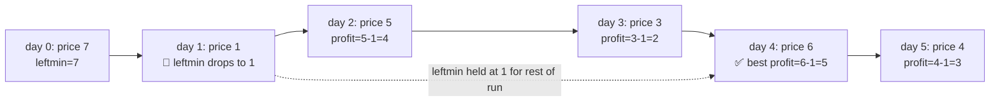

# 121. Best Time to Buy and Sell Stock
`Easy` · **Pattern:** Sliding Window (implicit — running min as the left edge)

> [!question] Problem
> You are given an array `prices` where `prices[i]` is the price of a given stock on the `i`th day.
> You want to maximize your profit by choosing a single day to **buy** one stock and choosing a different day **in the future** to **sell** that stock.
> Return the maximum profit you can achieve from this transaction. If you cannot achieve any profit, return `0`.
>
> **Example 1:**
> ```
> Input: prices = [7,1,5,3,6,4]
> Output: 5
> Explanation: Buy on day 2 (price = 1) and sell on day 5 (price = 6), profit = 6 - 1 = 5.
> ```
>
> **Example 2:**
> ```
> Input: prices = [7,6,4,3,1]
> Output: 0
> Explanation: No transaction is done — max profit = 0.
> ```

---

## 🧩 Pattern this follows

> [!tip] The window's "left edge" is just the cheapest price seen so far
> There's no explicit `left`/`right` pointer pair here, but it's the same sliding-window *spirit*: as `i` scans forward (the right edge), the window's implicit left edge is "the best day to have bought," which only ever needs to be **the minimum price seen so far** — you'd never buy on a day that's more expensive than an earlier day. So instead of checking every buy/sell pair (`O(n²)`), track the running minimum and, at each day, ask "what if I sold today, having bought at the cheapest point so far?"

### 🖼️ Visualizing it

`leftmin` only ever moves down; profit is checked against whatever it's holding at each day.



## 💻 My Solution (C++)

```cpp
class Solution {
public:
    int maxProfit(vector<int>& prices) {
        int profit = 0;
        int leftmin = prices[0];

        for (int i = 1; i < prices.size(); i++) {
            leftmin = min(leftmin, prices[i]);
            profit = max(profit, prices[i] - leftmin);
        }

        return profit;
    }
};
```

## 🔍 Walkthrough

1. `leftmin` starts as `prices[0]` — the only possible "buy day" before any scanning begins.
2. For each subsequent day `i`:
   - First update `leftmin` to the lowest price seen **up to and including today** — this represents the best possible buy day so far.
   - Then check: if I *sold* today at `prices[i]`, having bought at `leftmin`, what's the profit? Compare against the best `profit` found so far.
3. Note the order: `leftmin` is updated **before** computing today's profit, meaning day `i` could even become its own "buy day" if it's a new low — which correctly yields `prices[i] - prices[i] = 0`, never a false profit from buying and selling on the same day at a price that hasn't been beaten yet.
4. If prices only ever decrease, `profit` never rises above its initial `0`.

## ⏱️ Complexity

| | Complexity | Why |
|---|---|---|
| **Time** | O(n) | Single pass over `prices` |
| **Space** | O(1) | Two scalar variables |

## 🚀 Tricks & Similar Problems

> [!success] The general shape: "best result assuming today is the end"
> This is a mini dynamic-programming idea in disguise: at every index, compute the best outcome *if this were the last day considered*, using only information carried forward from earlier (`leftmin`), then take a running max. The same "carry forward the best-so-far, combine with today, track a running best" shape reappears in Maximum Subarray (Kadane's algorithm) and other single-pass optimization problems.
> **Note:** This is Buy-and-Sell-Stock with exactly **one transaction allowed** — the follow-up variants (II: unlimited transactions, III: at most two, with cooldown/fee) all build on this same running-min/running-profit core but add extra state.
