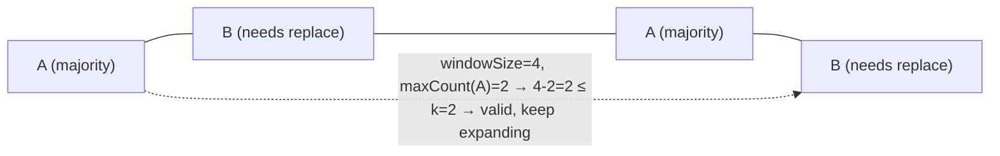

# 424. Longest Repeating Character Replacement
`Medium` · **Pattern:** Variable Sliding Window with a "budget" constraint

> [!question] Problem
> You are given a string `s` and an integer `k`. You can choose any character of the string and change it to any other **uppercase English character**. You can perform this operation **at most `k` times**.
> Return the length of the longest substring containing the same letter you can get after performing the above operations.
>
> **Example 1:**
> ```
> Input: s = "ABAB", k = 2
> Output: 4
> Explanation: Replace the two 'A's with two 'B's or vice versa.
> ```
>
> **Example 2:**
> ```
> Input: s = "AABABBA", k = 1
> Output: 4
> Explanation: Replace the one 'A' in the middle with 'B' to form "AABBBBA". The substring "BBBB" has length 4.
> ```

---

## 🧩 Pattern this follows

> [!tip] A window is "valid" if (window size − most frequent char count) ≤ k
> Reframe the problem: a window of length `L` can be turned into one repeated letter using at most `k` replacements **iff** `L - maxCount ≤ k`, where `maxCount` is the count of the *most frequent* character already in that window (everything else in the window is what needs replacing). Grow the window greedily; whenever it becomes invalid (needs more than `k` replacements), shrink from the left by exactly one. This "expand until invalid, then shrink by one" shape is the standard variable sliding-window template.

### 🖼️ Visualizing it

Window `"ABAB"` with `k=2`: `A` is the majority letter, the `B`s are what would need replacing.



## 💻 My Solution (C++)

```cpp
class Solution {
public:
    int characterReplacement(string s, int k) {
        if (s.size() == 1) {
            return 1;
        }

        vector<int> freq(26, 0);
        int maxCount = 0;

        int left = 0;
        int right = 0;

        int windowLen = 0;

        while (right < s.size()) {
            freq[s[right] - 'A']++;
            maxCount = max(maxCount, freq[s[right] - 'A']);

            if ((right - left + 1) - maxCount > k) {
                freq[s[left] - 'A']--;
                left++;
            }
            windowLen = max(windowLen, right - left + 1);
            right++;
        }

        return windowLen;
    }
};
```

## 🔍 Walkthrough

1. `freq[26]` counts each uppercase letter's occurrences **within the current window** `[left, right]`. `maxCount` tracks the highest frequency seen among any character, in any window state, throughout the whole run.
2. Expand the window by including `s[right]`: increment its frequency, and update `maxCount` if this character now has the highest count seen.
3. **Validity check:** `(right - left + 1) - maxCount` is "window size minus the most common letter's count" — i.e., how many characters in the window are *not* the majority letter, which is exactly how many replacements this window would need. If that exceeds `k`, the window is invalid — shrink it by decrementing `freq[s[left]]` and advancing `left` by exactly one (not a `while` loop — one shrink is always enough here, explained below).
4. After the (possible) shrink, record `windowLen = max(windowLen, right - left + 1)`.

> [!bug] Why `maxCount` is allowed to go stale, and why that's still correct
> Notice `maxCount` is **never decreased**, even after a shrink removes a character. That looks like a bug but isn't: `maxCount` only needs to represent "the best majority-count ever achieved *up to this point*" — the window size only ever grows to a new record (`windowLen`) when it's *valid*, and validity was already checked using the true (possibly stale-but-still-achievable) `maxCount`. A stale `maxCount` can only make the algorithm shrink one extra time in some later window rather than accept an invalid one — it can never cause an *invalid* window to be recorded as the answer. This is the single trickiest thing to explain about this solution in an interview.

## ⏱️ Complexity

| | Complexity | Why |
|---|---|---|
| **Time** | O(n) | `right` scans once; `left` only ever moves forward, never revisits |
| **Space** | O(1) | Fixed 26-slot frequency array |

## 🚀 Tricks & Similar Problems

> [!success] "Window size − dominant count ≤ budget" generalizes
> This exact validity condition — `windowSize - dominantFrequency ≤ budget` — is the template for any "at most k modifications to make a window uniform/valid" problem. Swap "most frequent character" for whatever the problem's "majority" concept is, and the rest of the sliding-window skeleton carries over unchanged.
> **Similar pattern:** [[Longest Substring Without Repeating Characters (LeetCode #3)]] (same expand/shrink skeleton, different validity rule), Max Consecutive Ones III (identical shape, applied to a binary array with a flip budget).
