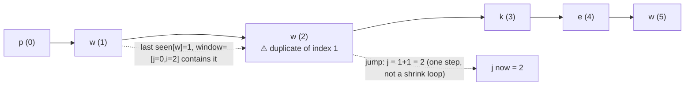

# 3. Longest Substring Without Repeating Characters
`Medium` · **Pattern:** Variable Sliding Window with last-seen-index jump

> [!question] Problem
> Given a string `s`, find the length of the **longest substring** without repeating characters.
>
> **Example 1:**
> ```
> Input: s = "abcabcbb"
> Output: 3
> Explanation: The answer is "abc", with the length of 3.
> ```
>
> **Example 2:**
> ```
> Input: s = "bbbbb"
> Output: 1
> ```
>
> **Example 3:**
> ```
> Input: s = "pwwkew"
> Output: 3
> Explanation: The answer is "wke", with the length of 3. Notice "pwke" is a subsequence, not a substring, and doesn't count.
> ```

---

## 🧩 Pattern this follows

> [!tip] Jump the window's left edge directly, instead of shrinking one step at a time
> The textbook sliding-window answer shrinks the window with a `while` loop, removing characters one at a time until the duplicate is gone. This solution does something faster: it stores the **last seen index of every character**, and the moment a repeat is found, jumps the window's left edge `j` **directly** to one past that character's last position — no inner loop needed. Same `O(n)` complexity as the textbook version, but with a smaller constant factor since every character position is visited only once, never revisited during a shrink.

### 🖼️ Visualizing it

Using `s = "pwwkew"`: at `i=2` the second `w` collides with the one last seen at index 1, inside the current window — `j` jumps straight past it instead of shrinking one step at a time.



## 💻 My Solution (C++)

```cpp
class Solution {
public:
    int lengthOfLongestSubstring(string s) {
        vector<int> characters(128, -1);

        int ans = 0;
        int j = 0;
        for (int i = 0; i < s.size(); i++) {
            if (characters[(int)s[i]] >= j) {
                j = characters[(int)s[i]] + 1;
            }
            characters[(int)s[i]] = i;
            ans = max(ans, i - j + 1);
        }
        return ans;
    }
};
```

## 🔍 Walkthrough

1. `characters[128]` maps each ASCII character to **the last index it was seen at** (`-1` meaning "not seen yet"). `j` is the window's left edge; `i` is the right edge, scanning forward.
2. For each character `s[i]`: check if it was last seen **inside the current window** (`characters[s[i]] >= j`). If so, that's a duplicate within the active window — jump `j` forward to **one past** that earlier occurrence, instantly excluding it. (If the last occurrence was *before* the window started, it's stale and irrelevant — no jump needed.)
3. Always update `characters[s[i]] = i` — record/refresh this character's most recent position.
4. Update `ans` with the current window size `i - j + 1`.
5. Because `j` only ever moves **forward** (never resets backward), each position in `s` is assigned to `j` at most once across the entire run — that's what keeps this `O(n)` despite looking like it could re-scan.

## ⏱️ Complexity

| | Complexity | Why |
|---|---|---|
| **Time** | O(n) | Single pass; `j` only moves forward, never revisits a position |
| **Space** | O(1) | Fixed 128-slot array, independent of input length (extended ASCII assumption) |

## 🚀 Tricks & Similar Problems

> [!success] "Last-seen index + jump" vs "shrink with a while loop" — know both
> Both solve this in `O(n)`, but the last-seen-index version is the more polished one to bring to an interview once you've shown you understand the basic shrinking-window version first. The underlying invariant is identical either way: **the window `[j, i]` never contains a duplicate character.**
> **Similar pattern:** [[Longest Repeating Character Replacement (LeetCode #424)]] and [[Minimum Window Substring (LeetCode #76)]] both use the more general "shrink with a `while` loop" form of variable sliding window — useful to contrast against this jump-based shortcut, which only works because "duplicate exists" is checkable via a single last-seen lookup rather than a frequency-count condition.
