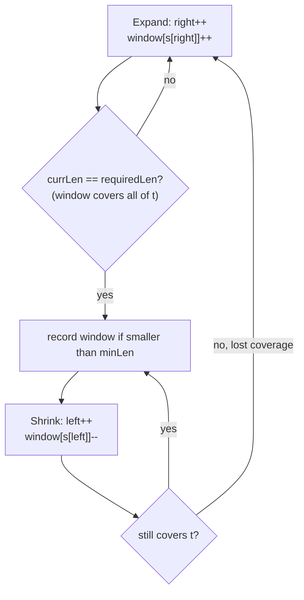

# 76. Minimum Window Substring
`Hard` · **Pattern:** Variable Sliding Window with a "coverage" counter

> [!question] Problem
> Given two strings `s` and `t` of lengths `m` and `n` respectively, return the **minimum window substring** of `s` such that every character in `t` (including duplicates) is included in the window. If there is no such substring, return the empty string `""`.
> The test cases are generated such that the answer is **unique**.
>
> **Example 1:**
> ```
> Input: s = "ADOBECODEBANC", t = "ABC"
> Output: "BANC"
> Explanation: The minimum window substring "BANC" includes 'A', 'B', and 'C' from t.
> ```
>
> **Example 2:**
> ```
> Input: s = "a", t = "a"
> Output: "a"
> ```
>
> **Example 3:**
> ```
> Input: s = "a", t = "aa"
> Output: ""
> Explanation: Both 'a's from t must be included. The largest window in s only has one 'a', so return "".
> ```

---

## 🧩 Pattern this follows

> [!tip] Expand until valid, then shrink as far as possible while staying valid
> This is the fullest form of the variable sliding-window template: grow `right` until the window **covers** every character `t` needs (with correct counts), then greedily shrink from `left` for as long as the window *stays* valid — recording the smallest valid window seen along the way. The key efficiency trick is not re-checking "does this window contain everything?" from scratch every time — instead, maintain a single **`currLen` counter** that tracks how many of `t`'s *distinct* characters are currently fully satisfied, updated incrementally as the window changes.

### 🖼️ Visualizing it

The two-phase shape: keep expanding until the window covers `t`, then shrink as far as possible while it still does, recording each valid window along the way.



## 💻 My Solution (C++)

```cpp
class Solution {
public:
    string minWindow(string s, string t) {
        vector<int> need(128, 0), window(128, 0);

        for (char c : t) {
            need[c]++;
        }

        int start = 0;
        int left = 0;
        int minLen = INT_MAX;
        int right = 0;
        int requiredLen = 0;
        for (int count : need) {
            if (count > 0) requiredLen++;
        }

        int currLen = 0;

        while (right < s.size()) {
            char c = s[right];
            window[c]++;

            if (need[c] > 0 && window[c] == need[c]) {
                currLen++;
            }

            while (currLen == requiredLen) {
                if (right - left + 1 < minLen) {
                    minLen = right - left + 1;
                    start = left;
                }

                char d = s[left];
                window[d]--;

                if (need[d] > 0 && window[d] < need[d]) {
                    currLen--;
                }

                left++;
            }

            right++;
        }

        return minLen != INT_MAX ? s.substr(start, minLen) : "";
    }
};
```

## 🔍 Walkthrough

1. `need[128]` = required count of each character, built from `t`. `window[128]` = current count of each character inside the sliding window `[left, right]`.
2. `requiredLen` = number of **distinct** characters `t` needs satisfied (not total character count) — computed once up front by counting non-zero entries in `need`.
3. `currLen` tracks how many of those distinct characters are **currently fully satisfied** in the window (i.e., `window[c] >= need[c]` for that specific character, checked incrementally rather than rescanned).
4. **Expand:** include `s[right]` into `window`. If this character is one `t` needs, and its count in the window **just reached exactly** `need[c]` (`window[c] == need[c]`), that's one more distinct requirement newly satisfied — increment `currLen`.
5. **Shrink while fully valid:** whenever `currLen == requiredLen` (the window currently covers everything `t` needs), that's a *candidate* answer — record it if it's the smallest seen (`minLen`, `start`). Then try to shrink further: remove `s[left]` from `window`; if that character was needed and its count just dropped **below** `need[d]`, the window is no longer fully covering that requirement — decrement `currLen`, which will end the inner `while` loop on the next check.
6. Advance `right` and repeat until the end of `s`.
7. Return the smallest recorded window, or `""` if `minLen` never left its `INT_MAX` sentinel (no valid window ever found).

## ⏱️ Complexity

| | Complexity | Why |
|---|---|---|
| **Time** | O(m + n) | `left` and `right` each traverse `s` at most once total (across the whole run, not per outer iteration); building `need` is `O(n)` |
| **Space** | O(1) | Fixed 128-slot arrays (ASCII), independent of input length |

## 🚀 Tricks & Similar Problems

> [!bug] Why `currLen` counts *distinct satisfied characters*, not total matched characters
> The `==`/`<` checks (`window[c] == need[c]` on increment, `window[d] < need[d]` on decrement) are what keep `currLen` an accurate **boolean-per-character** tally rather than a raw count. Without the strict `==` check on increment, a character appearing more times than `t` needs (e.g. extra `'C'`s beyond what `t` requires) would keep incrementing `currLen` past where it should stop — this exact-threshold-crossing check is the crux of the whole algorithm and the most common place to introduce a bug when re-deriving this from memory.
> **Similar pattern:** [[Permutation in String (LeetCode #567)]] (same frequency-coverage idea, but fixed window size instead of "shrink as far as possible"), [[Longest Repeating Character Replacement (LeetCode #424)]] (variable window, different validity condition).
