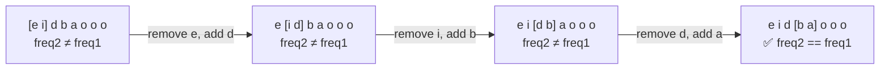

# 567. Permutation in String
`Medium` · **Pattern:** Fixed-Size Sliding Window + frequency comparison

> [!question] Problem
> Given two strings `s1` and `s2`, return `true` if `s2` contains a **permutation** of `s1`, or `false` otherwise.
> In other words, return `true` if one of `s1`'s permutations is a **substring** of `s2`.
>
> **Example 1:**
> ```
> Input: s1 = "ab", s2 = "eidbaooo"
> Output: true
> Explanation: s2 contains one permutation of s1 ("ba").
> ```
>
> **Example 2:**
> ```
> Input: s1 = "ab", s2 = "eidboaoo"
> Output: false
> ```
>
> **Constraints:**
> - `1 <= s1.length, s2.length <= 10^4`
> - `s1` and `s2` consist of lowercase English letters.

---

## 🧩 Pattern this follows

> [!tip] A permutation is just "same letters, same counts, any order"
> Checking whether `s2` contains *some rearrangement* of `s1` sounds like it needs trying every permutation — but it doesn't. A substring of `s2` is a permutation of `s1` **iff it has the exact same character-frequency signature as `s1`**. Since a permutation can't change length, the window size is fixed at `s1.size()` — slide it across `s2` one character at a time, and at each position just compare frequency arrays (constant-time-ish, since the alphabet is fixed at 26).

### 🖼️ Visualizing it

Fixed-size window over `s2 = "eidbaooo"` (`s1 = "ab"`, size 2), sliding one step at a time — one character leaves on the left, one enters on the right, `freq2` updated incrementally.



## 💻 My Solution (C++)

```cpp
class Solution {
public:
    bool checkInclusion(string s1, string s2) {
        int n = s1.size();
        int m = s2.size();

        if (n > m) {
            return false;
        }

        vector<int> freq1(26, 0);
        vector<int> freq2(26, 0);

        for (int i = 0; i < s1.size(); i++) {
            freq1[s1[i] - 'a']++;
        }

        int left = 0;
        int right = n;

        for (int i = 0; i < right; i++) {
            freq2[s2[i] - 'a']++;
        }

        if (freq1 == freq2) {
            return true;
        }

        for (int right = n; right < m; right++) {
            freq2[s2[left] - 'a']--;
            left++;
            freq2[s2[right] - 'a']++;
            if (freq1 == freq2) {
                return true;
            }
        }

        return false;
    }
};
```

## 🔍 Walkthrough

1. **Early exit:** if `s1` is longer than `s2`, no permutation of it can possibly fit — return `false` immediately.
2. Build `freq1` once — the fixed target frequency signature of `s1`.
3. Build `freq2` from the **first window** of `s2` — the first `n` characters (`right = n` used as the window's exclusive end here).
4. Check the very first window against `freq1` before entering the sliding loop — covers the case where the answer is found immediately at the start.
5. **Slide:** for each subsequent position, the window is fixed size `n`, so sliding it means removing the character leaving on the left (`s2[left]`) and adding the character entering on the right (`s2[right]`) — `freq2` is updated incrementally in `O(1)` rather than rebuilt from scratch. `left` advances alongside `right` to keep the window size constant at `n`.
6. After each slide, compare `freq1 == freq2` (C++'s `vector` equality does an element-wise comparison) — a match means the current window is a permutation of `s1`.

## ⏱️ Complexity

| | Complexity | Why |
|---|---|---|
| **Time** | O(m) | `n` for building initial frequencies, then `O(m - n)` slides, each `O(1)` update + `O(26)` comparison — dominates at `O(m)` overall |
| **Space** | O(1) | Two fixed 26-slot arrays |

## 🚀 Tricks & Similar Problems

> [!bug] Watch the `vector == vector` comparison cost
> `freq1 == freq2` on two `vector<int>` of size 26 is technically `O(26)`, not `O(1)` — constant, but not free. For very tight constraints this is sometimes replaced with a single running `int matches` counter (incremented/decremented as frequencies hit/leave equality with the target) to make each slide step truly `O(1)`. Worth mentioning as an optimization if asked "can you do better."
> **Similar pattern:** [[Longest Substring Without Repeating Characters (LeetCode #3)]] and [[Minimum Window Substring (LeetCode #76)]] both use frequency arrays too, but with a **variable**-size window instead of this problem's fixed size — comparing all three side by side is a great way to internalize when a window's size is fixed vs. driven by a validity condition.
