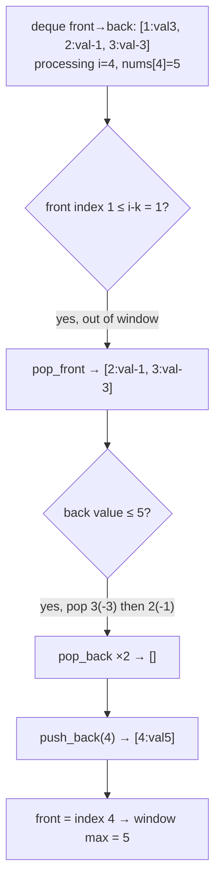

# 239. Sliding Window Maximum
`Hard` · **Pattern:** Fixed-Size Sliding Window + Monotonic Deque

> [!question] Problem
> You are given an array of integers `nums`. There is a sliding window of size `k` which moves from the very left of the array to the very right. You can only see the `k` numbers in the window at any moment. Each time the window moves right by one position.
> Return the **max sliding window** — an array containing the maximum of each window position.
>
> **Example:**
> ```
> Input: nums = [1,3,-1,-3,5,3,6,7], k = 3
> Output: [3,3,5,5,6,7]
> ```
> ```
> Window position                Max
> ---------------                -----
> [1  3  -1] -3  5  3  6  7        3
>  1 [3  -1  -3] 5  3  6  7        3
>  1  3 [-1  -3  5] 3  6  7        5
>  1  3  -1 [-3  5  3] 6  7        5
>  1  3  -1  -3 [5  3  6] 7        6
>  1  3  -1  -3  5 [3  6  7]       7
> ```
>
> **Constraints:**
> - `1 <= k <= nums.length <= 10^5`
> - `-10^4 <= nums[i] <= 10^4`

---

## 🧩 Pattern this follows

> [!tip] Keep the deque monotonically decreasing — the max is always at the front
> Recomputing the max of every window from scratch is `O(n·k)`. A **max-heap** could track the running max but can't cheaply remove elements that slide *out* of the window. The fix: a **deque of indices**, kept in **decreasing order of value** — whenever a new number arrives, pop off every smaller number from the back of the deque first, since they can *never* be the max again (the new, later, bigger number will always outlast and outvalue them). This keeps the deque's front always holding the index of the current window's maximum, and each index is pushed and popped **at most once** across the whole run.

### 🖼️ Visualizing it

The problem statement's trace above shows *window contents*; this shows the *deque's* internal mechanics at `i=4` (`nums[4]=5`) — front-evict what's out of window, then back-evict everything smaller than the incoming value.



## 💻 My Solution (C++)

```cpp
class Solution {
public:
    vector<int> maxSlidingWindow(vector<int>& nums, int k) {
        int n = nums.size();

        vector<int> ansWindow;
        deque<int> dq;

        for (int i = 0; i < n; i++) {
            if (!dq.empty() && dq.front() <= i - k) {
                dq.pop_front();
            }

            while (!dq.empty() && nums[dq.back()] <= nums[i]) {
                dq.pop_back();
            }
            dq.push_back(i);

            if (i >= k - 1) {
                ansWindow.push_back(nums[dq.front()]);
            }
        }

        return ansWindow;
    }
};
```

## 🔍 Walkthrough

The deque `dq` stores **indices** (not values) of `nums`, maintained so that the values at those indices are always in **decreasing order** from front to back.

1. **Evict out-of-window indices from the front:** `dq.front() <= i - k` means the index at the front has fallen outside the current window's left boundary (window is `[i-k+1, i]`) — pop it. Only ever checked/needed at the front, since indices are added in increasing order, so the oldest is always at the front.
2. **Maintain decreasing order from the back:** before adding `i`, pop every index off the **back** whose value is `<= nums[i]`. Those values can never be a future window's maximum once a later, equal-or-bigger number exists — they'd always lose to `nums[i]` for as long as both remain in range.
3. **Push `i`:** it's now guaranteed to be part of a decreasing sequence of values.
4. **Record the max once a full window exists:** once `i >= k - 1` (the window has reached size `k` for the first time), `dq.front()` holds the index of the current window's maximum — push `nums[dq.front()]` into the answer.

## ⏱️ Complexity

| | Complexity | Why |
|---|---|---|
| **Time** | O(n) | Every index is pushed onto the deque exactly once and popped at most once (from either end) across the entire run — amortized O(1) per element despite the inner `while` loop |
| **Space** | O(k) | The deque holds at most `k` indices at any time |

## 🚀 Tricks & Similar Problems

> [!success] Why storing indices (not values) is essential
> Storing values alone wouldn't let step 1 detect *which* entries have aged out of the window — you need the **index** to compare against `i - k`. This "store index, look up value via `nums[index]` when needed" trick is standard whenever a monotonic deque/stack needs to reason about *position* as well as value.
> **Similar pattern:** Next Greater Element / monotonic stack problems (same "pop everything that can never win again" logic, just without the fixed-size window eviction step). This is the canonical problem for the **monotonic deque** technique — recognize "sliding window + need the min/max fast" as the trigger for reaching for one.
