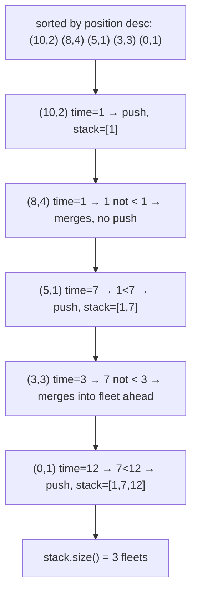

# 853. Car Fleet
`Medium` · **Pattern:** Sort by position + monotonic stack of arrival times

> [!question] Problem
> There are `n` cars traveling to a destination `target` (in miles). You're given `position[i]` (starting mile of car `i`) and `speed[i]` (its speed in mph).
> A car **cannot pass** another car ahead of it, but it *can* catch up and then travel at the **same speed** as the slower car in front — forming a **fleet**. A fleet's speed is the minimum speed of any car in it. A car that catches up to a fleet exactly at `target` still counts as joining that fleet.
> Return the number of car fleets that will arrive at `target`.
>
> **Example 1:**
> ```
> Input: target = 12, position = [10,8,0,5,3], speed = [2,4,1,1,3]
> Output: 3
> Explanation:
> The car starting at 10 (speed 2) and the car starting at 8 (speed 4) become a fleet, meeting each other at 12.
> The car starting at 0 (speed 1) doesn't catch up to any other car, so it's a fleet by itself.
> The cars starting at 5 (speed 1) and 3 (speed 3) become a fleet, meeting each other at 6.
> ```
>
> **Constraints:**
> - `n == position.length == speed.length`
> - `1 <= n <= 10^5`
> - `0 < target <= 10^6`
> - All positions are unique.

---

## 🧩 Pattern this follows

> [!tip] Compare arrival *times*, working from the car closest to the target backward
> The key reframe: instead of thinking about positions and speeds directly, compute **how long each car would take to reach `target` if nothing were in its way** — `time = (target - position) / speed`. Process cars **starting from the one closest to `target`** backward toward the one furthest away. A car merges into the fleet ahead of it **if and only if it would arrive sooner or at the same time** as that fleet — meaning it "catches up" before or exactly at the finish line. This turns car-following into a monotonic-stack problem over computed times instead of raw positions.

### 🖼️ Visualizing it

Example 1 (`target=12`), cars sorted closest-to-target first, with each one's solo arrival time — merges happen when a car's time doesn't exceed the fleet ahead of it.



## 💻 My Solution (C++)

```cpp
class Solution {
public:
    int carFleet(int target, vector<int>& position, vector<int>& speed) {
        vector<pair<int, int>> carData;
        for (int i = 0; i < position.size(); i++) {
            carData.push_back(make_pair(position[i], speed[i]));
        }

        sort(carData.begin(), carData.end(), greater<pair<int, int>>());

        stack<double> st;

        for (int i = 0; i < carData.size(); i++) {
            double time = (double)(target - carData[i].first) / carData[i].second;

            if (st.empty() || st.top() < time) {
                st.push(time);
            }
        }

        return st.size();
    }
};
```

## 🔍 Walkthrough

1. Pair each car's `(position, speed)` together, then **sort descending by position** — so the loop processes the car **closest to `target` first**, then works backward toward the cars furthest behind. This ordering is essential: a car can only ever be blocked by (or merge into) the fleet **ahead** of it, never one behind.
2. For each car (in that closest-to-farthest order), compute its **solo arrival time**: `(target - position) / speed` — how long it would take if no one were in front of it.
3. **Decision to form a new fleet vs merge:** compare this car's time against `st.top()` — the arrival time of the **most recently confirmed fleet** (which, since we're going front-to-back, is always the fleet immediately ahead of this car).
   - If the stack is empty, or this car's time is **strictly greater** than the fleet ahead (`st.top() < time`), this car arrives *later* than the car(s) in front — meaning it never catches up, and forms its **own new fleet**. Push its time.
   - Otherwise, this car's computed time is `<=` the fleet ahead's time, meaning it would reach that point at the same time or sooner — it **catches up and merges** into the fleet ahead, slowing to match it. Its own time is **not** pushed (it doesn't get to represent a fleet).
4. After processing every car, the stack holds exactly one entry **per surviving fleet** — its size is the answer.

## ⏱️ Complexity

| | Complexity | Why |
|---|---|---|
| **Time** | O(n log n) | Dominated by the sort; the single pass afterward is `O(n)` |
| **Space** | O(n) | `carData` array plus the stack, both up to size `n` |

## 🚀 Tricks & Similar Problems

> [!bug] Why sorting descending by position (not ascending) is essential
> If you sort ascending instead, by the time you reach a car you don't yet know the arrival time of the fleet **ahead** of it (that car hasn't been processed yet) — you'd have the causality backward. Processing from closest-to-target first guarantees that whenever you evaluate a car, every fleet that could possibly block it has already been resolved and sits on the stack.
> **Similar pattern:** [[Daily Temperatures (LeetCode #739)]] (same "monotonic stack, discard what's now irrelevant" shape, applied to values instead of computed times) — the general lesson here is that a monotonic stack doesn't have to operate on raw input values; it's just as valid over a **derived quantity** (arrival time) as long as you pick the right processing order.
