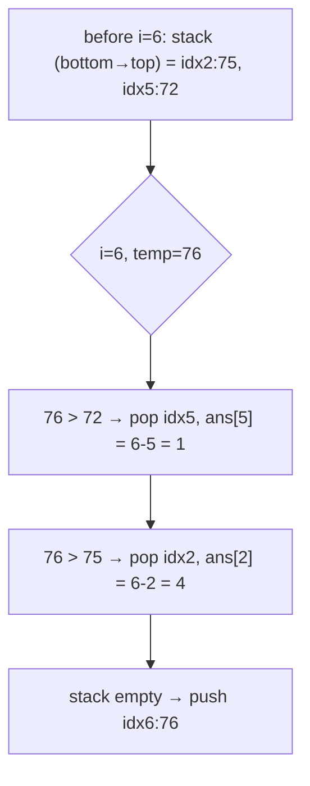

# 739. Daily Temperatures
`Medium` · **Pattern:** Monotonic (decreasing) Stack — "next greater element"

> [!question] Problem
> Given an array of integers `temperatures` representing daily temperatures, return an array `answer` such that `answer[i]` is the number of days you have to wait after day `i` to get a **warmer** temperature. If there is no future day for which this is possible, keep `answer[i] == 0` instead.
>
> **Example 1:**
> ```
> Input: temperatures = [73,74,75,71,69,72,76,73]
> Output: [1,1,4,2,1,1,0,0]
> ```
>
> **Example 2:**
> ```
> Input: temperatures = [30,40,50,60]
> Output: [1,1,1,0]
> ```
>
> **Example 3:**
> ```
> Input: temperatures = [30,60,90]
> Output: [1,1,0]
> ```
>
> **Constraints:**
> - `1 <= temperatures.length <= 10^5`
> - `30 <= temperatures[i] <= 100`

---

## 🧩 Pattern this follows

> [!tip] The textbook "Next Greater Element" problem
> This is the canonical use case for a **monotonic decreasing stack**: keep a stack of day-**indices** whose temperatures are still waiting for something warmer, always in decreasing order of temperature from bottom to top. When a new, warmer day arrives, it's the answer for every colder day still sitting on the stack — pop them all, recording the day-gap for each. This "find the next element to the right that's bigger/smaller" shape is one of the most frequently reused stack patterns in interviews.

### 🖼️ Visualizing it

The moment at `i=6` (`temp=76`) in Example 1 — one warm day pops two colder days off the stack in a row.



## 💻 My Solution (C++)

```cpp
class Solution {
public:
    vector<int> dailyTemperatures(vector<int>& temperatures) {
        int n = temperatures.size();
        vector<int> ans(n, 0);

        stack<int> st;

        for (int i = 0; i < n; i++) {
            while (!st.empty() && temperatures[st.top()] < temperatures[i]) {
                ans[st.top()] = i - st.top();
                st.pop();
            }

            st.push(i);
        }

        return ans;
    }
};
```

## 🔍 Walkthrough

1. `st` holds **indices** of days that are still "waiting" for a warmer day — kept in an order where the temperature at the top of the stack is always the **smallest** among what's stored (a monotonic decreasing stack, by temperature).
2. For each new day `i`: while the stack isn't empty and today's temperature beats the temperature at the index on top of the stack, that top day has **found its answer** — `i - st.top()` is exactly the number of days it waited. Record it, then pop that resolved day off.
3. Repeat the `while` for every earlier day this new, warmer temperature resolves — a single warm day can resolve multiple colder days waiting behind it (e.g. day 6 in Example 1 resolves days 3, 4, and 5 all at once).
4. Push `i` onto the stack — today is now itself waiting for a future warmer day.
5. Any index still on the stack when the loop ends never found a warmer day — its `ans[]` entry correctly stays at the initialized `0`.

## ⏱️ Complexity

| | Complexity | Why |
|---|---|---|
| **Time** | O(n) | Every index is pushed once and popped at most once across the entire run — the inner `while` looks expensive but is amortized `O(1)` per element overall |
| **Space** | O(n) | Worst case (strictly decreasing temperatures), every index sits on the stack at once |

## 🚀 Tricks & Similar Problems

> [!success] Recognize "wait for the next bigger/smaller X" as the trigger
> Any time a problem asks "how far until the next element that's bigger/smaller than me," reach for a monotonic stack before reaching for nested loops (`O(n²)`). The direction of monotonicity (increasing vs decreasing) flips depending on whether you're hunting for the next **greater** or next **smaller** element.
> **Similar pattern:** [[Car Fleet (LeetCode #853)]] (stack tracks "fleets," similar discard-if-dominated logic), [[Largest Rectangle in Histogram (LeetCode #84)]] (monotonic stack, but tracking the nearest **smaller** bar on each side instead of "next greater").
