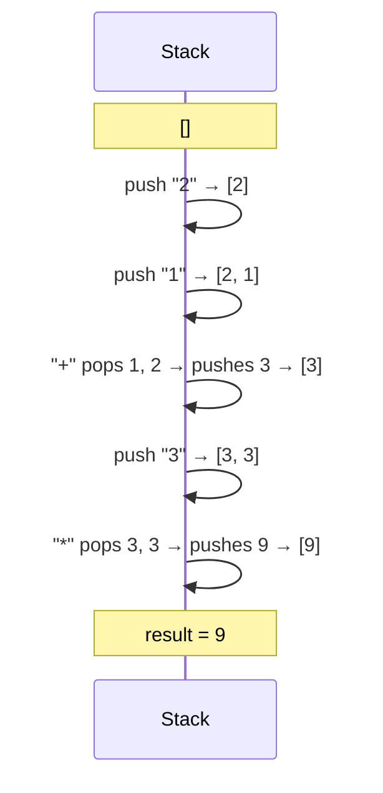

# 150. Evaluate Reverse Polish Notation
`Medium` · **Pattern:** Stack — evaluate operators against the two most recent operands

> [!question] Problem
> You are given an array of strings `tokens` that represents an arithmetic expression in **Reverse Polish Notation** (postfix notation). Evaluate the expression and return the resulting integer.
> Valid operators are `+`, `-`, `*`, `/`. Division between two integers always **truncates toward zero**. There will be no division by zero, and the answer plus every intermediate result fits in a 32-bit integer.
>
> **Example 1:**
> ```
> Input: tokens = ["2","1","+","3","*"]
> Output: 9
> Explanation: ((2 + 1) * 3) = 9
> ```
>
> **Example 2:**
> ```
> Input: tokens = ["4","13","5","/","+"]
> Output: 6
> Explanation: (4 + (13 / 5)) = 6
> ```
>
> **Example 3:**
> ```
> Input: tokens = ["10","6","9","3","+","-11","*","/","*","17","+","5","+"]
> Output: 22
> ```

---

## 🧩 Pattern this follows

> [!tip] Postfix notation is *built* for a stack
> In postfix (RPN), every operator comes **after** its two operands, meaning by the time you reach an operator, both numbers it needs are already the **two most recently seen values** — exactly what a stack's `top()`/`pop()` gives you for free. Scan left to right: push numbers, and whenever an operator appears, pop the top two, combine them, push the result back. No parsing of parentheses or operator precedence needed at all — that's the entire point of RPN as a representation.

### 🖼️ Visualizing it

Stack state as `["2","1","+","3","*"]` is processed token by token.



## 💻 My Solution (C++)

```cpp
class Solution {
public:
    int evalRPN(vector<string>& tokens) {
        stack<int> st;

        for (string str : tokens) {
            if (str == "*" || str == "/" || str == "+" || str == "-") {
                int a, b;
                if (!st.empty()) {
                    a = st.top();
                    st.pop();
                }
                if (!st.empty()) {
                    b = st.top();
                    st.pop();
                }
                int ans;
                if (str == "*") {
                    ans = b * a;
                } else if (str == "/") {
                    ans = b / a;
                } else if (str == "+") {
                    ans = b + a;
                } else {
                    ans = b - a;
                }
                st.push(ans);
            } else {
                int num = stoi(str);
                st.push(num);
            }
        }
        if (!st.empty()) {
            return st.top();
        }
        return -1;
    }
};
```

## 🔍 Walkthrough

1. Scan `tokens` left to right. Any token that's a plain number gets parsed with `stoi` and pushed.
2. On an **operator** token, pop twice: `a` is popped first (the **most recently pushed** operand — i.e., the *second* operand in the expression), `b` is popped second (the operand before it — the *first* operand).
3. **Order matters for `-` and `/`:** the expression means `b OP a` (first-popped-second, second-popped-first), which is why the code computes `b - a` and `b / a`, not `a - b`/`a / b`. Get this backwards and every subtraction/division in the result is wrong.
4. Push the computed result back onto the stack — it becomes an operand for a future operator, exactly like any other number would.
5. After all tokens are processed, exactly one value remains on the stack: the final answer.

## ⏱️ Complexity

| | Complexity | Why |
|---|---|---|
| **Time** | O(n) | Each token is pushed and popped a constant number of times |
| **Space** | O(n) | Worst case (all numbers, one trailing operator), the stack holds up to `n-1` operands |

## 🚀 Tricks & Similar Problems

> [!bug] The classic bug: swapping the pop order for non-commutative operators
> `+` and `*` are commutative, so `a op b == b op a` and getting the pop order "wrong" wouldn't even be noticeable. `-` and `/` are **not** commutative — this is exactly the kind of mistake that passes simple test cases like `["2","1","+","3","*"]` but silently fails on anything with subtraction or division. Always name which popped value is the "first" operand (popped *second*) before writing the operator logic.
> **Similar pattern:** any expression-evaluation problem — Basic Calculator (infix, needs a stack for parentheses + precedence too), and postfix/prefix conversion problems in general all lean on this same "stack = holding pen for pending operands" idea.
