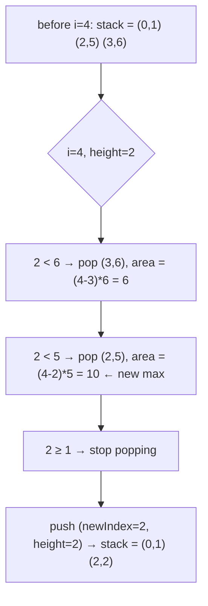

# 84. Largest Rectangle in Histogram
`Hard` · **Pattern:** Monotonic (increasing) Stack — expand each bar to its full valid width

> [!question] Problem
> Given an array of integers `heights` representing a histogram's bar heights, where each bar has width `1`, return the area of the **largest rectangle** in the histogram.
>
> **Example 1:**
> ```
> Input: heights = [2,1,5,6,2,3]
> Output: 10
> Explanation: The largest rectangle has area = 10 units — height 5, spanning the two bars at indices 2–3 (heights 5 and 6, capped at the shorter one, 5), width 2 → 5 × 2 = 10.
> ```
>
> 
>
> **Example 2:**
> ```
> Input: heights = [2,4]
> Output: 4
> ```
>
> 
>
> **Constraints:**
> - `1 <= heights.length <= 10^5`
> - `0 <= heights[i] <= 10^4`

---

## 🧩 Pattern this follows

> [!tip] Every bar is a *candidate height* — find how far it can stretch
> The brute-force framing: for every bar `i`, treat `heights[i]` as the rectangle's height, and find how far left and right that rectangle could extend before hitting a **shorter** bar (a shorter bar would break the rectangle, since a rectangle's height is capped by its shortest member). Checking this for every bar directly is `O(n²)`. The stack optimization: maintain a stack of bars in **increasing height order** — the moment a new, **shorter** bar arrives, every taller bar sitting on the stack has just found its **right boundary** (this new short bar), and its **left boundary** was already implicitly known (whatever's left on the stack below it, or the start of the array). Pop and finalize each of those bars' rectangles right then.

### 🖼️ Visualizing it

The algorithm mechanics, not the problem setup (see the two images above for that) — the pop-and-compute moment at `i=4` in Example 1 that produces the winning area of 10.



## 💻 My Solution (C++)

```cpp
class Solution {
public:
    int largestRectangleArea(vector<int>& heights) {
        stack<pair<int, int>> st;
        int maxArea = 0;

        for (int i = 0; i < heights.size(); i++) {
            int newIndex = i;
            while (!st.empty() && heights[i] < st.top().second) {
                newIndex = st.top().first;
                int height = st.top().second;
                maxArea = max(maxArea, (i - newIndex) * height);
                st.pop();
            }

            st.push({newIndex, heights[i]});
        }

        int n = heights.size();
        while (!st.empty()) {
            int height = st.top().second;
            int index = st.top().first;

            maxArea = max(maxArea, ((n - index) * height));
            st.pop();
        }

        return maxArea;
    }
};
```

## 🔍 Walkthrough

`st` holds `pair<startIndex, height>` — bars still "active," in increasing height order, where `startIndex` is the **leftmost** index this bar's height could validly extend back to (accounting for equal-height merges, explained below).

**Main loop (finding right boundaries):**
1. For each new bar `i`, `newIndex` defaults to `i` itself — assume for now this bar doesn't extend left into anything.
2. While the stack isn't empty and today's bar is **shorter** than the bar on top of the stack, that top bar has just hit its right wall — it can't extend any further right than `i`. Pop it, and finalize its rectangle: width = `i - newIndex` (distance from where *that* bar's valid range started to today), height = its own height. Update `maxArea`.
3. **Critically:** `newIndex` gets overwritten to the popped bar's `startIndex` each time through this `while` loop — so when the *current* bar `i` is finally pushed, it inherits the leftmost start index of every shorter-or-equal bar it just "absorbed." This is what correctly merges equal-height runs and lets a short bar's left boundary reach back through everything taller that got popped in front of it.
4. Push `{newIndex, heights[i]}` — bar `i` is now active, remembering how far left its effective range starts.

**Cleanup loop (bars that never found a shorter bar to their right):**
5. After the main scan, anything still on the stack extends all the way to the **end of the array** (`n`) — nothing shorter ever appeared after them. Pop each and finalize with width `n - index`.

## ⏱️ Complexity

| | Complexity | Why |
|---|---|---|
| **Time** | O(n) | Each index is pushed once and popped at most once, across both loops combined |
| **Space** | O(n) | Worst case (strictly increasing heights), every bar sits on the stack at once |

## 🚀 Tricks & Similar Problems

> [!bug] The two loops are answering two different questions — don't merge them by accident
> The **main loop** finds every bar's rectangle when a strictly shorter bar appears to its right (a real right boundary). The **cleanup loop** handles bars that were *never* beaten — their right boundary is simply "the end of the array." Forgetting the cleanup loop is the single most common bug: it silently drops the answer for any histogram that ends on its tallest run (e.g. `[2,4]` — nothing ever pops `4` inside the main loop; only the cleanup pass catches it).
> **Similar pattern:** [[Daily Temperatures (LeetCode #739)]] (same monotonic-stack skeleton, simpler goal), **Maximal Rectangle** (LeetCode 85 — repeatedly apply this exact algorithm to each row of a binary matrix treated as a histogram). This problem is widely considered the hardest "standard" monotonic-stack problem — once this one is solid, most other stack problems feel easy by comparison.
