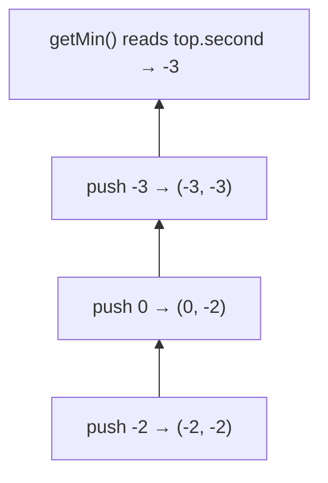

# 155. Min Stack
`Medium` · **Pattern:** Stack of pairs — carry the running min alongside each value

> [!question] Problem
> Design a stack that supports `push`, `pop`, `top`, and retrieving the **minimum element** in **constant time**, for every operation.
> Implement the `MinStack` class:
> - `MinStack()` initializes the stack object.
> - `void push(int val)` pushes the element `val` onto the stack.
> - `void pop()` removes the element on top of the stack.
> - `int top()` gets the top element of the stack.
> - `int getMin()` retrieves the minimum element in the stack.
>
> **Example:**
> ```
> Input:
> ["MinStack","push","push","push","getMin","pop","top","getMin"]
> [[],[-2],[0],[-3],[],[],[],[]]
>
> Output:
> [null,null,null,null,-3,null,0,-2]
>
> Explanation:
> MinStack minStack = new MinStack();
> minStack.push(-2);
> minStack.push(0);
> minStack.push(-3);
> minStack.getMin(); // return -3
> minStack.pop();
> minStack.top();    // return 0
> minStack.getMin(); // return -2
> ```
>
> **Constraints:**
> - `-2^31 <= val <= 2^31 - 1`
> - `pop`, `top`, `getMin` are always called on a non-empty stack.
> - At most `3 * 10^4` calls total to `push`, `pop`, `top`, `getMin`.

---

## 🧩 Pattern this follows

> [!tip] Every element remembers the min *as of when it was pushed*
> The naive idea — track a single running `min` variable — breaks the moment you `pop()` the element that *was* the minimum: what's the new min? You'd have to rescan the whole stack, killing the `O(1)` requirement. The fix: store, alongside **every** value, "what was the minimum of the stack including this element, at the moment it was pushed." That min never needs recalculating — when an element is popped, whatever min it was carrying disappears with it, and the element now on top already has *its own* correct min baked in.

### 🖼️ Visualizing it

Each pushed pair carries `(value, minSoFar)` — the second element never needs recomputing on pop.



## 💻 My Solution (C++)

```cpp
class MinStack {
public:
    stack<pair<int, int>> st;

    MinStack() {
    }

    void push(int value) {
        if (st.empty()) {
            st.push({value, value});
        } else {
            pair<int, int> temp;
            temp = st.top();
            st.push({value, min(temp.second, value)});
        }
    }

    void pop() {
        if (!st.empty()) {
            st.pop();
        }
    }

    int top() {
        if (!st.empty()) {
            return st.top().first;
        }
        return -1;
    }

    int getMin() {
        if (!st.empty()) {
            return st.top().second;
        }
        return -1;
    }
};
```

## 🔍 Walkthrough

`st` holds `pair<value, minSoFar>` — every entry carries **two** numbers: the value actually pushed, and the minimum of the entire stack **up to and including that value**.

- **`push(value)`:** if the stack is empty, `value` is trivially both the value and the current min — push `{value, value}`. Otherwise, look at `st.top().second` (the previous min) and push `{value, min(previousMin, value)}` — the new entry's min is either the old min (if `value` isn't a new low) or `value` itself (if it is).
- **`pop()`:** just remove the top pair. Since every entry independently carries its own correct historical min, nothing needs recalculating — the pair now on top already has the right `.second` for "min of what remains."
- **`top()`:** return `.first` of the top pair — the actual value.
- **`getMin()`:** return `.second` of the top pair — the running min, already precomputed.

## ⏱️ Complexity

| | Complexity | Why |
|---|---|---|
| **Time** | O(1) per operation | Every method does a fixed, constant amount of work — no scanning |
| **Space** | O(n) | Each of the `n` pushed elements stores one extra `int` (the min) alongside it |

## 🚀 Tricks & Similar Problems

> [!success] Alternative: two parallel stacks instead of a stack of pairs
> A common variant stores the values in one stack and maintains a **second stack of minimums**, pushing a new min onto the second stack only when a value ties-or-beats the current min, and popping from both in lockstep. Same `O(1)`/`O(n)` complexity — the pair-based version here is just a more compact single-stack way to express the same idea. Worth knowing both, since interviewers sometimes explicitly ask for the two-stack version.
> **Similar pattern:** "track a running aggregate that must survive removals" — Max Stack (same idea, track max instead), and more generally any design problem where naive recomputation after removal would break an `O(1)` requirement.
